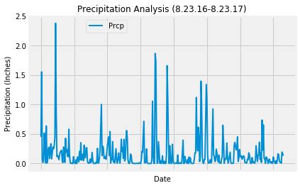
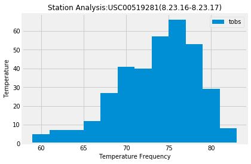
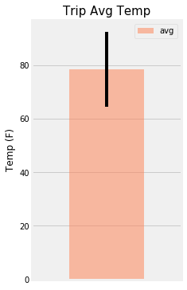
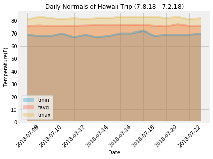

# Climate Analysis and Exploration


```python
# %matplotlib notebook
from matplotlib import style
style.use('fivethirtyeight')
import matplotlib.pyplot as plt
```


```python
import numpy as np
import pandas as pd
```


```python
import datetime as dt
from datetime import date, timedelta
```


```python
from functools import reduce
```

## Reflect Tables into SQLAlchemy ORM


```python
# Python SQL toolkit and Object Relational Mapper
import sqlalchemy
from sqlalchemy.ext.automap import automap_base
from sqlalchemy.orm import Session
from sqlalchemy import create_engine, inspect, func
```


```python
engine = create_engine('sqlite:///hawaii.sqlite')
```


```python
# reflect an existing database into ORM classes
Base = automap_base()
Base.prepare(engine, reflect=True)
Base.classes.keys()
```


    ['measurements', 'stations']


```python
# Save references to each table
Measurement = Base.classes.measurements
Station = Base.classes.stations
```


```python
# Create session (link) from Python to the DB
session = Session(engine)
```

## Precipitation Analysis

###### Retrieve the last 12 months of precipitation data and plot the results


```python
# the last date in the dataframe
last_date = session.query(Measurement.date).order_by(Measurement.date.desc()).first()
last_date
```


    ('2017-08-23')


```python
# Last date year ago
last_date_YA = dt.date(2017, 8, 23) - dt.timedelta(days=365)
last_date_YA
```


    datetime.date(2016, 8, 23)


```python
# Perform a query to retrieve the data and precipitation scores
precipitation = session.query(Measurement.date, func.avg(Measurement.prcp)).\
                    filter(Measurement.date >= last_date_YA).\
                    group_by(Measurement.date).all()
#precipitation
```


```python
# Save the query results as a Pandas DataFrame and set the index to the date column
# Sort Dataframe by Date
precipitation_df = pd.DataFrame(precipitation, columns=['Date', 'Prcp'])
precipitation_df.set_index('Date', inplace=True)
precipitation_df.head()
```


<div>
<style scoped>
    .dataframe tbody tr th:only-of-type {
        vertical-align: middle;
    }

    .dataframe tbody tr th {
        vertical-align: top;
    }

    .dataframe thead th {
        text-align: right;
    }
</style>
<table border="1" class="dataframe">
  <thead>
    <tr style="text-align: right;">
      <th></th>
      <th>Prcp</th>
    </tr>
    <tr>
      <th>Date</th>
      <th></th>
    </tr>
  </thead>
  <tbody>
    <tr>
      <th>2016-08-23</th>
      <td>0.451667</td>
    </tr>
    <tr>
      <th>2016-08-24</th>
      <td>1.555000</td>
    </tr>
    <tr>
      <th>2016-08-25</th>
      <td>0.077143</td>
    </tr>
    <tr>
      <th>2016-08-26</th>
      <td>0.016667</td>
    </tr>
    <tr>
      <th>2016-08-27</th>
      <td>0.064000</td>
    </tr>
  </tbody>
</table>
</div>


```python
# Use Pandas Plotting with Matplotlib to plot the data
precipitation_df.plot(kind='line', linewidth=2)

plt.legend(bbox_to_anchor=(0.2,1), fontsize='10')
plt.title('Precipitation Analysis (8.23.16-8.23.17)', size=12)
plt.ylabel('Precipitation (Inches)', size=10)
plt.xlabel('Date', size=10)

plt.savefig('Output/Precipitation Analysis.png')
plt.show
```


    <function matplotlib.pyplot.show>





```python
# Use Pandas to calcualte the summary statistics for the precipitation data
precipitation_df.describe()
```


<div>
<style scoped>
    .dataframe tbody tr th:only-of-type {
        vertical-align: middle;
    }

    .dataframe tbody tr th {
        vertical-align: top;
    }

    .dataframe thead th {
        text-align: right;
    }
</style>
<table border="1" class="dataframe">
  <thead>
    <tr style="text-align: right;">
      <th></th>
      <th>Prcp</th>
    </tr>
  </thead>
  <tbody>
    <tr>
      <th>count</th>
      <td>366.000000</td>
    </tr>
    <tr>
      <th>mean</th>
      <td>0.170757</td>
    </tr>
    <tr>
      <th>std</th>
      <td>0.295683</td>
    </tr>
    <tr>
      <th>min</th>
      <td>0.000000</td>
    </tr>
    <tr>
      <th>25%</th>
      <td>0.008571</td>
    </tr>
    <tr>
      <th>50%</th>
      <td>0.070000</td>
    </tr>
    <tr>
      <th>75%</th>
      <td>0.191667</td>
    </tr>
    <tr>
      <th>max</th>
      <td>2.380000</td>
    </tr>
  </tbody>
</table>
</div>


## Station Analysis


```python
# How many stations are available in this dataset?
station_count = session.query(Station.station).count()
station_count
```


    9


```python
# What are the most active stations?
# List the stations and the counts in descending order.

active_stations = session.query(Measurement.station, func.count(Measurement.tobs)).\
            group_by(Measurement.station).\
            order_by(func.count(Measurement.tobs).desc()).all()
active_stations
```


    [('USC00519281', 2772),
     ('USC00513117', 2696),
     ('USC00519397', 2685),
     ('USC00519523', 2572),
     ('USC00516128', 2484),
     ('USC00514830', 1937),
     ('USC00511918', 1932),
     ('USC00517948', 683),
     ('USC00518838', 342)]


```python
# Using the station id from the previous query, calculate the lowest temperature recorded, 
# highest temperature recorded, and average temperature most active station?

most_active_station = active_stations[0][0]

session.query(func.min(Measurement.tobs), func.max(Measurement.tobs), func.avg(Measurement.tobs)).\
             filter(Measurement.station == most_active_station).all()

```


    [(54, 85, 71.66378066378067)]


```python
# Choose the station with the highest number of temperature observations.
most_active_station
```


    'USC00519281'


```python
# Query the last 12 months of temperature observation data for this station
tobs_active = session.query(Measurement.date, Measurement.tobs).\
                filter(Measurement.station == most_active_station).\
                filter(Measurement.date >= last_date_YA).all()
        

tobs_active_df = pd.DataFrame(tobs_active)
tobs_active_df .set_index('date', inplace=True)
tobs_active_df .head()
```


<div>
<style scoped>
    .dataframe tbody tr th:only-of-type {
        vertical-align: middle;
    }

    .dataframe tbody tr th {
        vertical-align: top;
    }

    .dataframe thead th {
        text-align: right;
    }
</style>
<table border="1" class="dataframe">
  <thead>
    <tr style="text-align: right;">
      <th></th>
      <th>tobs</th>
    </tr>
    <tr>
      <th>date</th>
      <th></th>
    </tr>
  </thead>
  <tbody>
    <tr>
      <th>2016-08-23</th>
      <td>77</td>
    </tr>
    <tr>
      <th>2016-08-24</th>
      <td>77</td>
    </tr>
    <tr>
      <th>2016-08-25</th>
      <td>80</td>
    </tr>
    <tr>
      <th>2016-08-26</th>
      <td>80</td>
    </tr>
    <tr>
      <th>2016-08-27</th>
      <td>75</td>
    </tr>
  </tbody>
</table>
</div>


```python
# Plot the results as a histogram
tobs_active_df.plot.hist(bins=12)


plt.title("Station Analysis:" + most_active_station+ '(8.23.16-8.23.17)', fontsize=12)
plt.xlabel("Temperature Frequency", fontsize=10)
plt.ylabel("Temperature", fontsize=10)
plt.savefig("Output/Station Analysis.png")
plt.show

```


    <function matplotlib.pyplot.show>





## Temperature Analysis

###### Planning Trip from date 7.8.2018-7.23.2018


```python
# Write a function called `calc_temps` that will accept start date and end date in the format '%Y-%m-%d' 
# and return the minimum, average, and maximum temperatures for that range of dates
def calc_temps(start_date, end_date):
    """TMIN, TAVG, and TMAX for a list of dates.
    
    Args:
        start_date (string): A date string in the format %Y-%m-%d
        end_date (string): A date string in the format %Y-%m-%d
        
    Returns:
        TMIN, TAVE, and TMAX
    """
    
    return session.query(func.min(Measurement.tobs), func.avg(Measurement.tobs), func.max(Measurement.tobs)).\
        filter(Measurement.date >= start_date).filter(Measurement.date <= end_date).all()
```


```python
# Use your previous function `calc_temps` to calculate the tmin, tavg, and tmax 
# for your trip using the previous year's data for those same dates.
trip_tobs = calc_temps('2017-07-08', '2017-07-23')
trip_tobs
```


    [(69, 78.28571428571429, 83)]


```python
# Plot the results from your previous query as a bar chart. 
# Use "Trip Avg Temp" as your Title
# Use the average temperature for the y value
# Use the peak-to-peak (tmax-tmin) value as the y error bar (yerr)

avg_temp_df = pd.DataFrame(trip_tobs, columns=['min', 'avg', 'max'])

avg_temp_df = avg_temp_df['avg']

avg_temp_df.plot(kind='bar', yerr=(trip_tobs[0][2]-trip_tobs[0][0]), alpha=0.5, color='coral',figsize=(3,6))

plt.title('Trip Avg Temp', fontsize=15)
plt.ylabel('Temp (F)')
plt.xticks([])
plt.legend()

plt.savefig('Output/Temperature Analysis.png')
plt.show()

```





```python
# Calculate the rainfall per weather station for your trip dates using the previous year's matching dates.
# Sort this in descending order by precipitation amount 
def calc_prcp(start_date, end_date):
    """TMIN, TAVG, and TMAX for a list of dates.
    
    Args:
        start_date (string): A date string in the format %Y-%m-%d
        end_date (string): A date string in the format %Y-%m-%d
        
    Returns:
        TMIN, TAVE, and TMAX
    """
    
    return session.query(Measurement.station,Measurement.prcp, Station.name, Station.latitude,Station.longitude, Station.elevation).\
           filter(Measurement.station==Station.station).\
           filter(Measurement.date >= start_date).filter(Measurement.date <= end_date).\
           group_by(Measurement.station).\
           order_by((Measurement.prcp).desc()).all()

trip_prcp = calc_prcp('2017-07-08', '2017-07-23')
trip_prcp

```


    [('USC00516128',
      0.8,
      'MANOA LYON ARBO 785.2, HI US',
      21.3331,
      -157.8025,
      152.4),
     ('USC00519281',
      0.2,
      'WAIHEE 837.5, HI US',
      21.45167,
      -157.84888999999995,
      32.9),
     ('USC00514830',
      0.07,
      'KUALOA RANCH HEADQUARTERS 886.9, HI US',
      21.5213,
      -157.8374,
      7.0),
     ('USC00513117', 0.06, 'KANEOHE 838.1, HI US', 21.4234, -157.8015, 14.6),
     ('USC00517948', 0.0, 'PEARL CITY, HI US', 21.3934, -157.9751, 11.9),
     ('USC00519397', 0.0, 'WAIKIKI 717.2, HI US', 21.2716, -157.8168, 3.0),
     ('USC00519523',
      0.0,
      'WAIMANALO EXPERIMENTAL FARM, HI US',
      21.33556,
      -157.71139,
      19.5)]


## Daily Normals Analysis


```python
# Create a query that will calculate the daily normals 
# (i.e. the averages for tmin, tmax, and tavg for all historic data matching a specific month and day)
def daily_normals(date):
    """Daily Normals.
    
    Args:
        date (str): A date string in the format '%m-%d'
        
    Returns:
        A list of tuples containing the daily normals, tmin, tavg, and tmax
    
    """
    
    sel = [func.min(Measurement.tobs), func.avg(Measurement.tobs), func.max(Measurement.tobs)]
    return session.query(*sel).filter(func.strftime("%m-%d", Measurement.date) == date).all()
    
daily_normals("01-01")
```


    [(62, 69.06, 77)]


###### Calculate the daily normals for my trip (7.8 - 7.23)


```python
# push each tuple of calculations into a list called `normals`
trip_dates = []
normals = []

# Set the start and end date of the trip
start_date = dt.date(2018, 7, 8)
end_date = dt.date(2018, 7, 23)

# Use the start and end date to create a range of dates
delta = end_date - start_date
for i in range(delta.days + 1):
    trip_dates.append(start_date + timedelta(i))

# Stip off the year and save a list of %m-%d strings
# Loop through the list of %m-%d strings and calculate the normals for each date

for trip_date in trip_dates:  
    results = daily_normals(trip_date.strftime('%m-%d'))
    normals.append(results)

normals = reduce(lambda x,y: x+y, normals)
normals
```


    [(69, 75.6, 81),
     (68, 76.09433962264151, 83),
     (68, 75.50943396226415, 82),
     (70, 75.47058823529412, 81),
     (67, 75.76923076923077, 82),
     (69, 76.11764705882354, 81),
     (67, 76.36538461538461, 82),
     (68, 76.21818181818182, 82),
     (70, 76.28571428571429, 83),
     (70, 76.3921568627451, 83),
     (72, 76.62745098039215, 83),
     (68, 75.83018867924528, 83),
     (69, 75.32692307692308, 82),
     (69, 76.9795918367347, 83),
     (69, 75.75510204081633, 81),
     (70, 75.94, 82)]


```python
# Load the previous query results into a Pandas DataFrame and \
# add the `trip_dates` range as the `date` index

normals_df = pd.DataFrame(normals, columns = ['tmin', 'tavg', 'tmax'])
normals_df['Date'] = trip_dates
normals_df = normals_df.set_index('Date')

normals_df
```


<div>
<style scoped>
    .dataframe tbody tr th:only-of-type {
        vertical-align: middle;
    }

    .dataframe tbody tr th {
        vertical-align: top;
    }

    .dataframe thead th {
        text-align: right;
    }
</style>
<table border="1" class="dataframe">
  <thead>
    <tr style="text-align: right;">
      <th></th>
      <th>tmin</th>
      <th>tavg</th>
      <th>tmax</th>
    </tr>
    <tr>
      <th>Date</th>
      <th></th>
      <th></th>
      <th></th>
    </tr>
  </thead>
  <tbody>
    <tr>
      <th>2018-07-08</th>
      <td>69</td>
      <td>75.600000</td>
      <td>81</td>
    </tr>
    <tr>
      <th>2018-07-09</th>
      <td>68</td>
      <td>76.094340</td>
      <td>83</td>
    </tr>
    <tr>
      <th>2018-07-10</th>
      <td>68</td>
      <td>75.509434</td>
      <td>82</td>
    </tr>
    <tr>
      <th>2018-07-11</th>
      <td>70</td>
      <td>75.470588</td>
      <td>81</td>
    </tr>
    <tr>
      <th>2018-07-12</th>
      <td>67</td>
      <td>75.769231</td>
      <td>82</td>
    </tr>
    <tr>
      <th>2018-07-13</th>
      <td>69</td>
      <td>76.117647</td>
      <td>81</td>
    </tr>
    <tr>
      <th>2018-07-14</th>
      <td>67</td>
      <td>76.365385</td>
      <td>82</td>
    </tr>
    <tr>
      <th>2018-07-15</th>
      <td>68</td>
      <td>76.218182</td>
      <td>82</td>
    </tr>
    <tr>
      <th>2018-07-16</th>
      <td>70</td>
      <td>76.285714</td>
      <td>83</td>
    </tr>
    <tr>
      <th>2018-07-17</th>
      <td>70</td>
      <td>76.392157</td>
      <td>83</td>
    </tr>
    <tr>
      <th>2018-07-18</th>
      <td>72</td>
      <td>76.627451</td>
      <td>83</td>
    </tr>
    <tr>
      <th>2018-07-19</th>
      <td>68</td>
      <td>75.830189</td>
      <td>83</td>
    </tr>
    <tr>
      <th>2018-07-20</th>
      <td>69</td>
      <td>75.326923</td>
      <td>82</td>
    </tr>
    <tr>
      <th>2018-07-21</th>
      <td>69</td>
      <td>76.979592</td>
      <td>83</td>
    </tr>
    <tr>
      <th>2018-07-22</th>
      <td>69</td>
      <td>75.755102</td>
      <td>81</td>
    </tr>
    <tr>
      <th>2018-07-23</th>
      <td>70</td>
      <td>75.940000</td>
      <td>82</td>
    </tr>
  </tbody>
</table>
</div>


```python
# Plot the daily normals as an area plot with `stacked=False`

normals_df.plot(kind='area',stacked=False,alpha=0.3)

plt.xlabel("Date",fontsize=10)
plt.ylabel("Temperature(F)",fontsize=10)
plt.title("Daily Normals of Hawaii Trip (7.8.18 - 7.2.18)", fontsize=12)
plt.xticks(rotation=45, fontsize=10)
plt.yticks(fontsize=10)

plt.savefig("Output/Daily Normals Analysis.png")
plt.show
```


    <function matplotlib.pyplot.show>




