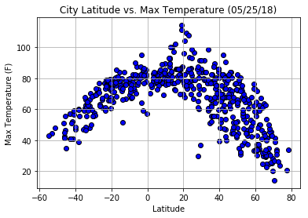
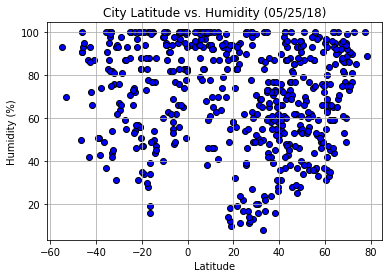
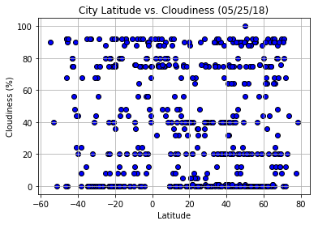
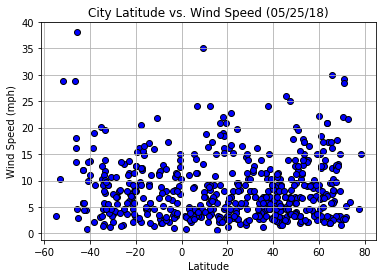

# WeatherPy


```python
# Dependencies
import matplotlib.pyplot as plt
import random
import requests
import urllib
import pandas as pd
import numpy as np
import openweathermapy.core as owm
from config import api_key
from citipy import citipy
```

## Generate Cities List


```python
# As latitudes ranged from -90 to 90, longitudes from -180 to 180,list the numbers in between them by o.1 difference.  

lat_range = list(np.arange(-90,90,0.1))
lon_range = list(np.arange(-180,180,0.2))
    #len(lat_range)

# select 1500 random samples to make sure my city samples > 500
latitude = random.sample(lat_range,1500)
longitude = random.sample(lon_range,1500)

coordinates = zip(latitude, longitude)

# use citypy to determine the name of the nearest city of the lat & lon provided
cities = []
for coordinate_pair in coordinates:
    lat, lon = coordinate_pair
    cities.append(citipy.nearest_city(lat, lon))
    
city_names = []
for city in cities:
    city_names.append(city.city_name)

# remove dublicate city names
city_names = list(set(city_names))

# make sure I have at least 500 city samples
len(city_names)
```


    610


## Perform API Calls


```python
settings = {"units": "imperial", "appid": api_key}
```


```python
# set up lists to hold reponse info
name = []
country = []
lat = []
lon = []
max_temp = []
humidity = []
clouds = []
wind_speed =[]

print("Beginning Data Retrieval")
print("-"*30)

# Loop through the list of city_names and perform a request for data on city name
city_number = 0

for i in city_names:
    city_number +=1
    try:
        print(f"Processing Record {city_number} | {i}")
  
        query_url = f"http://api.openweathermap.org/data/2.5/weather?appid={api_key}&units=imperial&q="
        print(f"{query_url}{i}")
        
        response = owm.get_current(i, **settings)
        
        name.append(response['name'])
        country.append(response['sys']['country'])
        lat.append(response['coord']['lat'])
        lon.append(response['coord']['lon'])
        max_temp.append(response['main']['temp_max'])
        humidity.append(response['main']['humidity'])
        clouds.append(response['clouds']['all'])
        wind_speed.append(response['wind']['speed'])

    except:
        
        print(f"No record for city:{i}")
        continue
        
        
        
print("-"*30)        
print("Data Retrieval Complete")
print("-"*30)

```

    Beginning Data Retrieval
    ------------------------------
    Processing Record 1 | cam ranh
    http://api.openweathermap.org/data/2.5/weather?appid=a412e057dbaa5b5779d43d4e78580b64&units=imperial&q=cam ranh
    Processing Record 2 | syracuse
    http://api.openweathermap.org/data/2.5/weather?appid=a412e057dbaa5b5779d43d4e78580b64&units=imperial&q=syracuse
    Processing Record 3 | itarema
    http://api.openweathermap.org/data/2.5/weather?appid=a412e057dbaa5b5779d43d4e78580b64&units=imperial&q=itarema
    Processing Record 4 | progreso
    http://api.openweathermap.org/data/2.5/weather?appid=a412e057dbaa5b5779d43d4e78580b64&units=imperial&q=progreso
    Processing Record 5 | samarai
    http://api.openweathermap.org/data/2.5/weather?appid=a412e057dbaa5b5779d43d4e78580b64&units=imperial&q=samarai
    Processing Record 6 | oranjestad
    http://api.openweathermap.org/data/2.5/weather?appid=a412e057dbaa5b5779d43d4e78580b64&units=imperial&q=oranjestad
    Processing Record 7 | gallup
    http://api.openweathermap.org/data/2.5/weather?appid=a412e057dbaa5b5779d43d4e78580b64&units=imperial&q=gallup
    Processing Record 8 | bredasdorp
    http://api.openweathermap.org/data/2.5/weather?appid=a412e057dbaa5b5779d43d4e78580b64&units=imperial&q=bredasdorp
    Processing Record 9 | bafra
    http://api.openweathermap.org/data/2.5/weather?appid=a412e057dbaa5b5779d43d4e78580b64&units=imperial&q=bafra
    No record for city:bafra
    Processing Record 10 | flin flon
    http://api.openweathermap.org/data/2.5/weather?appid=a412e057dbaa5b5779d43d4e78580b64&units=imperial&q=flin flon
    Processing Record 11 | miquelon
    http://api.openweathermap.org/data/2.5/weather?appid=a412e057dbaa5b5779d43d4e78580b64&units=imperial&q=miquelon
    Processing Record 12 | liberal
    http://api.openweathermap.org/data/2.5/weather?appid=a412e057dbaa5b5779d43d4e78580b64&units=imperial&q=liberal
    Processing Record 13 | camopi
    http://api.openweathermap.org/data/2.5/weather?appid=a412e057dbaa5b5779d43d4e78580b64&units=imperial&q=camopi
    Processing Record 14 | taltal
    http://api.openweathermap.org/data/2.5/weather?appid=a412e057dbaa5b5779d43d4e78580b64&units=imperial&q=taltal
    Processing Record 15 | bondoukou
    http://api.openweathermap.org/data/2.5/weather?appid=a412e057dbaa5b5779d43d4e78580b64&units=imperial&q=bondoukou
    Processing Record 16 | rabaul
    http://api.openweathermap.org/data/2.5/weather?appid=a412e057dbaa5b5779d43d4e78580b64&units=imperial&q=rabaul
    Processing Record 17 | saint-francois
    http://api.openweathermap.org/data/2.5/weather?appid=a412e057dbaa5b5779d43d4e78580b64&units=imperial&q=saint-francois
    Processing Record 18 | trelew
    http://api.openweathermap.org/data/2.5/weather?appid=a412e057dbaa5b5779d43d4e78580b64&units=imperial&q=trelew
    Processing Record 19 | arlit
    http://api.openweathermap.org/data/2.5/weather?appid=a412e057dbaa5b5779d43d4e78580b64&units=imperial&q=arlit
    Processing Record 20 | fairbanks
    http://api.openweathermap.org/data/2.5/weather?appid=a412e057dbaa5b5779d43d4e78580b64&units=imperial&q=fairbanks
    Processing Record 21 | chastyye
    http://api.openweathermap.org/data/2.5/weather?appid=a412e057dbaa5b5779d43d4e78580b64&units=imperial&q=chastyye
    Processing Record 22 | sambava
    http://api.openweathermap.org/data/2.5/weather?appid=a412e057dbaa5b5779d43d4e78580b64&units=imperial&q=sambava
    Processing Record 23 | otane
    http://api.openweathermap.org/data/2.5/weather?appid=a412e057dbaa5b5779d43d4e78580b64&units=imperial&q=otane
    Processing Record 24 | bom jesus
    http://api.openweathermap.org/data/2.5/weather?appid=a412e057dbaa5b5779d43d4e78580b64&units=imperial&q=bom jesus
    Processing Record 25 | airai
    http://api.openweathermap.org/data/2.5/weather?appid=a412e057dbaa5b5779d43d4e78580b64&units=imperial&q=airai
    Processing Record 26 | sorvag
    http://api.openweathermap.org/data/2.5/weather?appid=a412e057dbaa5b5779d43d4e78580b64&units=imperial&q=sorvag
    No record for city:sorvag
    Processing Record 27 | tigil
    http://api.openweathermap.org/data/2.5/weather?appid=a412e057dbaa5b5779d43d4e78580b64&units=imperial&q=tigil
    Processing Record 28 | rawson
    http://api.openweathermap.org/data/2.5/weather?appid=a412e057dbaa5b5779d43d4e78580b64&units=imperial&q=rawson
    Processing Record 29 | mumbwa
    http://api.openweathermap.org/data/2.5/weather?appid=a412e057dbaa5b5779d43d4e78580b64&units=imperial&q=mumbwa
    Processing Record 30 | waverley
    http://api.openweathermap.org/data/2.5/weather?appid=a412e057dbaa5b5779d43d4e78580b64&units=imperial&q=waverley
    Processing Record 31 | yar-sale
    http://api.openweathermap.org/data/2.5/weather?appid=a412e057dbaa5b5779d43d4e78580b64&units=imperial&q=yar-sale
    Processing Record 32 | kalmar
    http://api.openweathermap.org/data/2.5/weather?appid=a412e057dbaa5b5779d43d4e78580b64&units=imperial&q=kalmar
    Processing Record 33 | mys shmidta
    http://api.openweathermap.org/data/2.5/weather?appid=a412e057dbaa5b5779d43d4e78580b64&units=imperial&q=mys shmidta
    No record for city:mys shmidta
    Processing Record 34 | saskylakh
    http://api.openweathermap.org/data/2.5/weather?appid=a412e057dbaa5b5779d43d4e78580b64&units=imperial&q=saskylakh
    Processing Record 35 | vondrozo
    http://api.openweathermap.org/data/2.5/weather?appid=a412e057dbaa5b5779d43d4e78580b64&units=imperial&q=vondrozo
    Processing Record 36 | brae
    http://api.openweathermap.org/data/2.5/weather?appid=a412e057dbaa5b5779d43d4e78580b64&units=imperial&q=brae
    Processing Record 37 | papayal
    http://api.openweathermap.org/data/2.5/weather?appid=a412e057dbaa5b5779d43d4e78580b64&units=imperial&q=papayal
    Processing Record 38 | leningradskiy
    http://api.openweathermap.org/data/2.5/weather?appid=a412e057dbaa5b5779d43d4e78580b64&units=imperial&q=leningradskiy
    Processing Record 39 | bethel
    http://api.openweathermap.org/data/2.5/weather?appid=a412e057dbaa5b5779d43d4e78580b64&units=imperial&q=bethel
    Processing Record 40 | tawau
    http://api.openweathermap.org/data/2.5/weather?appid=a412e057dbaa5b5779d43d4e78580b64&units=imperial&q=tawau
    Processing Record 41 | peniche
    http://api.openweathermap.org/data/2.5/weather?appid=a412e057dbaa5b5779d43d4e78580b64&units=imperial&q=peniche
    Processing Record 42 | punta arenas
    http://api.openweathermap.org/data/2.5/weather?appid=a412e057dbaa5b5779d43d4e78580b64&units=imperial&q=punta arenas
    Processing Record 43 | zhanaozen
    http://api.openweathermap.org/data/2.5/weather?appid=a412e057dbaa5b5779d43d4e78580b64&units=imperial&q=zhanaozen
    Processing Record 44 | durazno
    http://api.openweathermap.org/data/2.5/weather?appid=a412e057dbaa5b5779d43d4e78580b64&units=imperial&q=durazno
    Processing Record 45 | saint-leu
    http://api.openweathermap.org/data/2.5/weather?appid=a412e057dbaa5b5779d43d4e78580b64&units=imperial&q=saint-leu
    Processing Record 46 | katsuura
    http://api.openweathermap.org/data/2.5/weather?appid=a412e057dbaa5b5779d43d4e78580b64&units=imperial&q=katsuura
    Processing Record 47 | hobart
    http://api.openweathermap.org/data/2.5/weather?appid=a412e057dbaa5b5779d43d4e78580b64&units=imperial&q=hobart
    Processing Record 48 | esperance
    http://api.openweathermap.org/data/2.5/weather?appid=a412e057dbaa5b5779d43d4e78580b64&units=imperial&q=esperance
    Processing Record 49 | avarua
    http://api.openweathermap.org/data/2.5/weather?appid=a412e057dbaa5b5779d43d4e78580b64&units=imperial&q=avarua
    Processing Record 50 | cuiaba
    http://api.openweathermap.org/data/2.5/weather?appid=a412e057dbaa5b5779d43d4e78580b64&units=imperial&q=cuiaba
    Processing Record 51 | phangnga
    http://api.openweathermap.org/data/2.5/weather?appid=a412e057dbaa5b5779d43d4e78580b64&units=imperial&q=phangnga
    Processing Record 52 | kilindoni
    http://api.openweathermap.org/data/2.5/weather?appid=a412e057dbaa5b5779d43d4e78580b64&units=imperial&q=kilindoni
    Processing Record 53 | chulman
    http://api.openweathermap.org/data/2.5/weather?appid=a412e057dbaa5b5779d43d4e78580b64&units=imperial&q=chulman
    Processing Record 54 | bulawayo
    http://api.openweathermap.org/data/2.5/weather?appid=a412e057dbaa5b5779d43d4e78580b64&units=imperial&q=bulawayo
    Processing Record 55 | barrow
    http://api.openweathermap.org/data/2.5/weather?appid=a412e057dbaa5b5779d43d4e78580b64&units=imperial&q=barrow
    Processing Record 56 | khatanga
    http://api.openweathermap.org/data/2.5/weather?appid=a412e057dbaa5b5779d43d4e78580b64&units=imperial&q=khatanga
    Processing Record 57 | zlynka
    http://api.openweathermap.org/data/2.5/weather?appid=a412e057dbaa5b5779d43d4e78580b64&units=imperial&q=zlynka
    Processing Record 58 | lethem
    http://api.openweathermap.org/data/2.5/weather?appid=a412e057dbaa5b5779d43d4e78580b64&units=imperial&q=lethem
    Processing Record 59 | toronto
    http://api.openweathermap.org/data/2.5/weather?appid=a412e057dbaa5b5779d43d4e78580b64&units=imperial&q=toronto
    Processing Record 60 | mananjary
    http://api.openweathermap.org/data/2.5/weather?appid=a412e057dbaa5b5779d43d4e78580b64&units=imperial&q=mananjary
    Processing Record 61 | tres passos
    http://api.openweathermap.org/data/2.5/weather?appid=a412e057dbaa5b5779d43d4e78580b64&units=imperial&q=tres passos
    Processing Record 62 | banjar
    http://api.openweathermap.org/data/2.5/weather?appid=a412e057dbaa5b5779d43d4e78580b64&units=imperial&q=banjar
    Processing Record 63 | vanimo
    http://api.openweathermap.org/data/2.5/weather?appid=a412e057dbaa5b5779d43d4e78580b64&units=imperial&q=vanimo
    Processing Record 64 | north bend
    http://api.openweathermap.org/data/2.5/weather?appid=a412e057dbaa5b5779d43d4e78580b64&units=imperial&q=north bend
    Processing Record 65 | port alfred
    http://api.openweathermap.org/data/2.5/weather?appid=a412e057dbaa5b5779d43d4e78580b64&units=imperial&q=port alfred
    Processing Record 66 | alto araguaia
    http://api.openweathermap.org/data/2.5/weather?appid=a412e057dbaa5b5779d43d4e78580b64&units=imperial&q=alto araguaia
    Processing Record 67 | burica
    http://api.openweathermap.org/data/2.5/weather?appid=a412e057dbaa5b5779d43d4e78580b64&units=imperial&q=burica
    No record for city:burica
    Processing Record 68 | digras
    http://api.openweathermap.org/data/2.5/weather?appid=a412e057dbaa5b5779d43d4e78580b64&units=imperial&q=digras
    Processing Record 69 | upata
    http://api.openweathermap.org/data/2.5/weather?appid=a412e057dbaa5b5779d43d4e78580b64&units=imperial&q=upata
    Processing Record 70 | sentyabrskiy
    http://api.openweathermap.org/data/2.5/weather?appid=a412e057dbaa5b5779d43d4e78580b64&units=imperial&q=sentyabrskiy
    No record for city:sentyabrskiy
    Processing Record 71 | severo-kurilsk
    http://api.openweathermap.org/data/2.5/weather?appid=a412e057dbaa5b5779d43d4e78580b64&units=imperial&q=severo-kurilsk
    Processing Record 72 | zhangjiakou
    http://api.openweathermap.org/data/2.5/weather?appid=a412e057dbaa5b5779d43d4e78580b64&units=imperial&q=zhangjiakou
    Processing Record 73 | nemuro
    http://api.openweathermap.org/data/2.5/weather?appid=a412e057dbaa5b5779d43d4e78580b64&units=imperial&q=nemuro
    Processing Record 74 | baykit
    http://api.openweathermap.org/data/2.5/weather?appid=a412e057dbaa5b5779d43d4e78580b64&units=imperial&q=baykit
    Processing Record 75 | meulaboh
    http://api.openweathermap.org/data/2.5/weather?appid=a412e057dbaa5b5779d43d4e78580b64&units=imperial&q=meulaboh
    Processing Record 76 | aras
    http://api.openweathermap.org/data/2.5/weather?appid=a412e057dbaa5b5779d43d4e78580b64&units=imperial&q=aras
    Processing Record 77 | grafton
    http://api.openweathermap.org/data/2.5/weather?appid=a412e057dbaa5b5779d43d4e78580b64&units=imperial&q=grafton
    Processing Record 78 | tamandare
    http://api.openweathermap.org/data/2.5/weather?appid=a412e057dbaa5b5779d43d4e78580b64&units=imperial&q=tamandare
    Processing Record 79 | timizart
    http://api.openweathermap.org/data/2.5/weather?appid=a412e057dbaa5b5779d43d4e78580b64&units=imperial&q=timizart
    Processing Record 80 | hami
    http://api.openweathermap.org/data/2.5/weather?appid=a412e057dbaa5b5779d43d4e78580b64&units=imperial&q=hami
    Processing Record 81 | ballina
    http://api.openweathermap.org/data/2.5/weather?appid=a412e057dbaa5b5779d43d4e78580b64&units=imperial&q=ballina
    Processing Record 82 | sokolo
    http://api.openweathermap.org/data/2.5/weather?appid=a412e057dbaa5b5779d43d4e78580b64&units=imperial&q=sokolo
    Processing Record 83 | fukue
    http://api.openweathermap.org/data/2.5/weather?appid=a412e057dbaa5b5779d43d4e78580b64&units=imperial&q=fukue
    Processing Record 84 | barmer
    http://api.openweathermap.org/data/2.5/weather?appid=a412e057dbaa5b5779d43d4e78580b64&units=imperial&q=barmer
    Processing Record 85 | leshukonskoye
    http://api.openweathermap.org/data/2.5/weather?appid=a412e057dbaa5b5779d43d4e78580b64&units=imperial&q=leshukonskoye
    Processing Record 86 | isla vista
    http://api.openweathermap.org/data/2.5/weather?appid=a412e057dbaa5b5779d43d4e78580b64&units=imperial&q=isla vista
    Processing Record 87 | ushuaia
    http://api.openweathermap.org/data/2.5/weather?appid=a412e057dbaa5b5779d43d4e78580b64&units=imperial&q=ushuaia
    Processing Record 88 | ust-nera
    http://api.openweathermap.org/data/2.5/weather?appid=a412e057dbaa5b5779d43d4e78580b64&units=imperial&q=ust-nera
    Processing Record 89 | sehithwa
    http://api.openweathermap.org/data/2.5/weather?appid=a412e057dbaa5b5779d43d4e78580b64&units=imperial&q=sehithwa
    Processing Record 90 | grobina
    http://api.openweathermap.org/data/2.5/weather?appid=a412e057dbaa5b5779d43d4e78580b64&units=imperial&q=grobina
    Processing Record 91 | attawapiskat
    http://api.openweathermap.org/data/2.5/weather?appid=a412e057dbaa5b5779d43d4e78580b64&units=imperial&q=attawapiskat
    No record for city:attawapiskat
    Processing Record 92 | lavrentiya
    http://api.openweathermap.org/data/2.5/weather?appid=a412e057dbaa5b5779d43d4e78580b64&units=imperial&q=lavrentiya
    Processing Record 93 | kilmallock
    http://api.openweathermap.org/data/2.5/weather?appid=a412e057dbaa5b5779d43d4e78580b64&units=imperial&q=kilmallock
    Processing Record 94 | pensacola
    http://api.openweathermap.org/data/2.5/weather?appid=a412e057dbaa5b5779d43d4e78580b64&units=imperial&q=pensacola
    Processing Record 95 | marcona
    http://api.openweathermap.org/data/2.5/weather?appid=a412e057dbaa5b5779d43d4e78580b64&units=imperial&q=marcona
    No record for city:marcona
    Processing Record 96 | comodoro rivadavia
    http://api.openweathermap.org/data/2.5/weather?appid=a412e057dbaa5b5779d43d4e78580b64&units=imperial&q=comodoro rivadavia
    Processing Record 97 | valisoara
    http://api.openweathermap.org/data/2.5/weather?appid=a412e057dbaa5b5779d43d4e78580b64&units=imperial&q=valisoara
    Processing Record 98 | katangli
    http://api.openweathermap.org/data/2.5/weather?appid=a412e057dbaa5b5779d43d4e78580b64&units=imperial&q=katangli
    Processing Record 99 | cidreira
    http://api.openweathermap.org/data/2.5/weather?appid=a412e057dbaa5b5779d43d4e78580b64&units=imperial&q=cidreira
    Processing Record 100 | mecca
    http://api.openweathermap.org/data/2.5/weather?appid=a412e057dbaa5b5779d43d4e78580b64&units=imperial&q=mecca
    Processing Record 101 | coquimbo
    http://api.openweathermap.org/data/2.5/weather?appid=a412e057dbaa5b5779d43d4e78580b64&units=imperial&q=coquimbo
    Processing Record 102 | abashiri
    http://api.openweathermap.org/data/2.5/weather?appid=a412e057dbaa5b5779d43d4e78580b64&units=imperial&q=abashiri
    Processing Record 103 | saint-georges
    http://api.openweathermap.org/data/2.5/weather?appid=a412e057dbaa5b5779d43d4e78580b64&units=imperial&q=saint-georges
    Processing Record 104 | vardo
    http://api.openweathermap.org/data/2.5/weather?appid=a412e057dbaa5b5779d43d4e78580b64&units=imperial&q=vardo
    Processing Record 105 | beipiao
    http://api.openweathermap.org/data/2.5/weather?appid=a412e057dbaa5b5779d43d4e78580b64&units=imperial&q=beipiao
    Processing Record 106 | mataura
    http://api.openweathermap.org/data/2.5/weather?appid=a412e057dbaa5b5779d43d4e78580b64&units=imperial&q=mataura
    Processing Record 107 | mathbaria
    http://api.openweathermap.org/data/2.5/weather?appid=a412e057dbaa5b5779d43d4e78580b64&units=imperial&q=mathbaria
    Processing Record 108 | whitehorse
    http://api.openweathermap.org/data/2.5/weather?appid=a412e057dbaa5b5779d43d4e78580b64&units=imperial&q=whitehorse
    Processing Record 109 | fevralsk
    http://api.openweathermap.org/data/2.5/weather?appid=a412e057dbaa5b5779d43d4e78580b64&units=imperial&q=fevralsk
    No record for city:fevralsk
    Processing Record 110 | ponta do sol
    http://api.openweathermap.org/data/2.5/weather?appid=a412e057dbaa5b5779d43d4e78580b64&units=imperial&q=ponta do sol
    Processing Record 111 | charleville-mezieres
    http://api.openweathermap.org/data/2.5/weather?appid=a412e057dbaa5b5779d43d4e78580b64&units=imperial&q=charleville-mezieres
    Processing Record 112 | burgos
    http://api.openweathermap.org/data/2.5/weather?appid=a412e057dbaa5b5779d43d4e78580b64&units=imperial&q=burgos
    Processing Record 113 | kamyshin
    http://api.openweathermap.org/data/2.5/weather?appid=a412e057dbaa5b5779d43d4e78580b64&units=imperial&q=kamyshin
    Processing Record 114 | namibe
    http://api.openweathermap.org/data/2.5/weather?appid=a412e057dbaa5b5779d43d4e78580b64&units=imperial&q=namibe
    Processing Record 115 | araouane
    http://api.openweathermap.org/data/2.5/weather?appid=a412e057dbaa5b5779d43d4e78580b64&units=imperial&q=araouane
    Processing Record 116 | rio gallegos
    http://api.openweathermap.org/data/2.5/weather?appid=a412e057dbaa5b5779d43d4e78580b64&units=imperial&q=rio gallegos
    Processing Record 117 | lipari
    http://api.openweathermap.org/data/2.5/weather?appid=a412e057dbaa5b5779d43d4e78580b64&units=imperial&q=lipari
    Processing Record 118 | tuktoyaktuk
    http://api.openweathermap.org/data/2.5/weather?appid=a412e057dbaa5b5779d43d4e78580b64&units=imperial&q=tuktoyaktuk
    Processing Record 119 | san pedro
    http://api.openweathermap.org/data/2.5/weather?appid=a412e057dbaa5b5779d43d4e78580b64&units=imperial&q=san pedro
    Processing Record 120 | itacare
    http://api.openweathermap.org/data/2.5/weather?appid=a412e057dbaa5b5779d43d4e78580b64&units=imperial&q=itacare
    Processing Record 121 | zarubino
    http://api.openweathermap.org/data/2.5/weather?appid=a412e057dbaa5b5779d43d4e78580b64&units=imperial&q=zarubino
    Processing Record 122 | nome
    http://api.openweathermap.org/data/2.5/weather?appid=a412e057dbaa5b5779d43d4e78580b64&units=imperial&q=nome
    Processing Record 123 | nusaybin
    http://api.openweathermap.org/data/2.5/weather?appid=a412e057dbaa5b5779d43d4e78580b64&units=imperial&q=nusaybin
    Processing Record 124 | tautira
    http://api.openweathermap.org/data/2.5/weather?appid=a412e057dbaa5b5779d43d4e78580b64&units=imperial&q=tautira
    Processing Record 125 | georgetown
    http://api.openweathermap.org/data/2.5/weather?appid=a412e057dbaa5b5779d43d4e78580b64&units=imperial&q=georgetown
    Processing Record 126 | nago
    http://api.openweathermap.org/data/2.5/weather?appid=a412e057dbaa5b5779d43d4e78580b64&units=imperial&q=nago
    Processing Record 127 | chapais
    http://api.openweathermap.org/data/2.5/weather?appid=a412e057dbaa5b5779d43d4e78580b64&units=imperial&q=chapais
    Processing Record 128 | leninskoye
    http://api.openweathermap.org/data/2.5/weather?appid=a412e057dbaa5b5779d43d4e78580b64&units=imperial&q=leninskoye
    Processing Record 129 | duz
    http://api.openweathermap.org/data/2.5/weather?appid=a412e057dbaa5b5779d43d4e78580b64&units=imperial&q=duz
    No record for city:duz
    Processing Record 130 | bachaquero
    http://api.openweathermap.org/data/2.5/weather?appid=a412e057dbaa5b5779d43d4e78580b64&units=imperial&q=bachaquero
    Processing Record 131 | katiola
    http://api.openweathermap.org/data/2.5/weather?appid=a412e057dbaa5b5779d43d4e78580b64&units=imperial&q=katiola
    Processing Record 132 | erzin
    http://api.openweathermap.org/data/2.5/weather?appid=a412e057dbaa5b5779d43d4e78580b64&units=imperial&q=erzin
    Processing Record 133 | provideniya
    http://api.openweathermap.org/data/2.5/weather?appid=a412e057dbaa5b5779d43d4e78580b64&units=imperial&q=provideniya
    Processing Record 134 | xunchang
    http://api.openweathermap.org/data/2.5/weather?appid=a412e057dbaa5b5779d43d4e78580b64&units=imperial&q=xunchang
    Processing Record 135 | codrington
    http://api.openweathermap.org/data/2.5/weather?appid=a412e057dbaa5b5779d43d4e78580b64&units=imperial&q=codrington
    Processing Record 136 | roma
    http://api.openweathermap.org/data/2.5/weather?appid=a412e057dbaa5b5779d43d4e78580b64&units=imperial&q=roma
    Processing Record 137 | moroni
    http://api.openweathermap.org/data/2.5/weather?appid=a412e057dbaa5b5779d43d4e78580b64&units=imperial&q=moroni
    Processing Record 138 | along
    http://api.openweathermap.org/data/2.5/weather?appid=a412e057dbaa5b5779d43d4e78580b64&units=imperial&q=along
    Processing Record 139 | stillwater
    http://api.openweathermap.org/data/2.5/weather?appid=a412e057dbaa5b5779d43d4e78580b64&units=imperial&q=stillwater
    Processing Record 140 | chara
    http://api.openweathermap.org/data/2.5/weather?appid=a412e057dbaa5b5779d43d4e78580b64&units=imperial&q=chara
    Processing Record 141 | sinkat
    http://api.openweathermap.org/data/2.5/weather?appid=a412e057dbaa5b5779d43d4e78580b64&units=imperial&q=sinkat
    No record for city:sinkat
    Processing Record 142 | marsa matruh
    http://api.openweathermap.org/data/2.5/weather?appid=a412e057dbaa5b5779d43d4e78580b64&units=imperial&q=marsa matruh
    Processing Record 143 | inhambane
    http://api.openweathermap.org/data/2.5/weather?appid=a412e057dbaa5b5779d43d4e78580b64&units=imperial&q=inhambane
    Processing Record 144 | nadym
    http://api.openweathermap.org/data/2.5/weather?appid=a412e057dbaa5b5779d43d4e78580b64&units=imperial&q=nadym
    Processing Record 145 | puerto ayora
    http://api.openweathermap.org/data/2.5/weather?appid=a412e057dbaa5b5779d43d4e78580b64&units=imperial&q=puerto ayora
    Processing Record 146 | udachnyy
    http://api.openweathermap.org/data/2.5/weather?appid=a412e057dbaa5b5779d43d4e78580b64&units=imperial&q=udachnyy
    Processing Record 147 | waipawa
    http://api.openweathermap.org/data/2.5/weather?appid=a412e057dbaa5b5779d43d4e78580b64&units=imperial&q=waipawa
    Processing Record 148 | westport
    http://api.openweathermap.org/data/2.5/weather?appid=a412e057dbaa5b5779d43d4e78580b64&units=imperial&q=westport
    Processing Record 149 | andros
    http://api.openweathermap.org/data/2.5/weather?appid=a412e057dbaa5b5779d43d4e78580b64&units=imperial&q=andros
    Processing Record 150 | north platte
    http://api.openweathermap.org/data/2.5/weather?appid=a412e057dbaa5b5779d43d4e78580b64&units=imperial&q=north platte
    Processing Record 151 | haines junction
    http://api.openweathermap.org/data/2.5/weather?appid=a412e057dbaa5b5779d43d4e78580b64&units=imperial&q=haines junction
    Processing Record 152 | bourail
    http://api.openweathermap.org/data/2.5/weather?appid=a412e057dbaa5b5779d43d4e78580b64&units=imperial&q=bourail
    Processing Record 153 | cape town
    http://api.openweathermap.org/data/2.5/weather?appid=a412e057dbaa5b5779d43d4e78580b64&units=imperial&q=cape town
    Processing Record 154 | asfi
    http://api.openweathermap.org/data/2.5/weather?appid=a412e057dbaa5b5779d43d4e78580b64&units=imperial&q=asfi
    No record for city:asfi
    Processing Record 155 | vaovai
    http://api.openweathermap.org/data/2.5/weather?appid=a412e057dbaa5b5779d43d4e78580b64&units=imperial&q=vaovai
    No record for city:vaovai
    Processing Record 156 | stornoway
    http://api.openweathermap.org/data/2.5/weather?appid=a412e057dbaa5b5779d43d4e78580b64&units=imperial&q=stornoway
    No record for city:stornoway
    Processing Record 157 | vicuna
    http://api.openweathermap.org/data/2.5/weather?appid=a412e057dbaa5b5779d43d4e78580b64&units=imperial&q=vicuna
    No record for city:vicuna
    Processing Record 158 | angamacutiro
    http://api.openweathermap.org/data/2.5/weather?appid=a412e057dbaa5b5779d43d4e78580b64&units=imperial&q=angamacutiro
    No record for city:angamacutiro
    Processing Record 159 | maningrida
    http://api.openweathermap.org/data/2.5/weather?appid=a412e057dbaa5b5779d43d4e78580b64&units=imperial&q=maningrida
    Processing Record 160 | burevestnik
    http://api.openweathermap.org/data/2.5/weather?appid=a412e057dbaa5b5779d43d4e78580b64&units=imperial&q=burevestnik
    Processing Record 161 | sao filipe
    http://api.openweathermap.org/data/2.5/weather?appid=a412e057dbaa5b5779d43d4e78580b64&units=imperial&q=sao filipe
    Processing Record 162 | guerrero negro
    http://api.openweathermap.org/data/2.5/weather?appid=a412e057dbaa5b5779d43d4e78580b64&units=imperial&q=guerrero negro
    Processing Record 163 | honningsvag
    http://api.openweathermap.org/data/2.5/weather?appid=a412e057dbaa5b5779d43d4e78580b64&units=imperial&q=honningsvag
    Processing Record 164 | vokhma
    http://api.openweathermap.org/data/2.5/weather?appid=a412e057dbaa5b5779d43d4e78580b64&units=imperial&q=vokhma
    Processing Record 165 | minna
    http://api.openweathermap.org/data/2.5/weather?appid=a412e057dbaa5b5779d43d4e78580b64&units=imperial&q=minna
    Processing Record 166 | sao luiz gonzaga
    http://api.openweathermap.org/data/2.5/weather?appid=a412e057dbaa5b5779d43d4e78580b64&units=imperial&q=sao luiz gonzaga
    Processing Record 167 | san luis
    http://api.openweathermap.org/data/2.5/weather?appid=a412e057dbaa5b5779d43d4e78580b64&units=imperial&q=san luis
    Processing Record 168 | nikolskoye
    http://api.openweathermap.org/data/2.5/weather?appid=a412e057dbaa5b5779d43d4e78580b64&units=imperial&q=nikolskoye
    Processing Record 169 | armacao dos buzios
    http://api.openweathermap.org/data/2.5/weather?appid=a412e057dbaa5b5779d43d4e78580b64&units=imperial&q=armacao dos buzios
    No record for city:armacao dos buzios
    Processing Record 170 | kapaa
    http://api.openweathermap.org/data/2.5/weather?appid=a412e057dbaa5b5779d43d4e78580b64&units=imperial&q=kapaa
    Processing Record 171 | bandarbeyla
    http://api.openweathermap.org/data/2.5/weather?appid=a412e057dbaa5b5779d43d4e78580b64&units=imperial&q=bandarbeyla
    Processing Record 172 | salinopolis
    http://api.openweathermap.org/data/2.5/weather?appid=a412e057dbaa5b5779d43d4e78580b64&units=imperial&q=salinopolis
    Processing Record 173 | burnie
    http://api.openweathermap.org/data/2.5/weather?appid=a412e057dbaa5b5779d43d4e78580b64&units=imperial&q=burnie
    Processing Record 174 | bartica
    http://api.openweathermap.org/data/2.5/weather?appid=a412e057dbaa5b5779d43d4e78580b64&units=imperial&q=bartica
    Processing Record 175 | sawtell
    http://api.openweathermap.org/data/2.5/weather?appid=a412e057dbaa5b5779d43d4e78580b64&units=imperial&q=sawtell
    Processing Record 176 | mananara
    http://api.openweathermap.org/data/2.5/weather?appid=a412e057dbaa5b5779d43d4e78580b64&units=imperial&q=mananara
    No record for city:mananara
    Processing Record 177 | yulara
    http://api.openweathermap.org/data/2.5/weather?appid=a412e057dbaa5b5779d43d4e78580b64&units=imperial&q=yulara
    Processing Record 178 | ribeira grande
    http://api.openweathermap.org/data/2.5/weather?appid=a412e057dbaa5b5779d43d4e78580b64&units=imperial&q=ribeira grande
    Processing Record 179 | vredendal
    http://api.openweathermap.org/data/2.5/weather?appid=a412e057dbaa5b5779d43d4e78580b64&units=imperial&q=vredendal
    Processing Record 180 | roald
    http://api.openweathermap.org/data/2.5/weather?appid=a412e057dbaa5b5779d43d4e78580b64&units=imperial&q=roald
    Processing Record 181 | aykhal
    http://api.openweathermap.org/data/2.5/weather?appid=a412e057dbaa5b5779d43d4e78580b64&units=imperial&q=aykhal
    Processing Record 182 | mayo
    http://api.openweathermap.org/data/2.5/weather?appid=a412e057dbaa5b5779d43d4e78580b64&units=imperial&q=mayo
    Processing Record 183 | robertson
    http://api.openweathermap.org/data/2.5/weather?appid=a412e057dbaa5b5779d43d4e78580b64&units=imperial&q=robertson
    Processing Record 184 | jorpeland
    http://api.openweathermap.org/data/2.5/weather?appid=a412e057dbaa5b5779d43d4e78580b64&units=imperial&q=jorpeland
    Processing Record 185 | lima
    http://api.openweathermap.org/data/2.5/weather?appid=a412e057dbaa5b5779d43d4e78580b64&units=imperial&q=lima
    Processing Record 186 | turayf
    http://api.openweathermap.org/data/2.5/weather?appid=a412e057dbaa5b5779d43d4e78580b64&units=imperial&q=turayf
    Processing Record 187 | olafsvik
    http://api.openweathermap.org/data/2.5/weather?appid=a412e057dbaa5b5779d43d4e78580b64&units=imperial&q=olafsvik
    No record for city:olafsvik
    Processing Record 188 | gairatganj
    http://api.openweathermap.org/data/2.5/weather?appid=a412e057dbaa5b5779d43d4e78580b64&units=imperial&q=gairatganj
    Processing Record 189 | coihaique
    http://api.openweathermap.org/data/2.5/weather?appid=a412e057dbaa5b5779d43d4e78580b64&units=imperial&q=coihaique
    Processing Record 190 | kutum
    http://api.openweathermap.org/data/2.5/weather?appid=a412e057dbaa5b5779d43d4e78580b64&units=imperial&q=kutum
    Processing Record 191 | padang
    http://api.openweathermap.org/data/2.5/weather?appid=a412e057dbaa5b5779d43d4e78580b64&units=imperial&q=padang
    Processing Record 192 | babanusah
    http://api.openweathermap.org/data/2.5/weather?appid=a412e057dbaa5b5779d43d4e78580b64&units=imperial&q=babanusah
    No record for city:babanusah
    Processing Record 193 | carnarvon
    http://api.openweathermap.org/data/2.5/weather?appid=a412e057dbaa5b5779d43d4e78580b64&units=imperial&q=carnarvon
    Processing Record 194 | kyren
    http://api.openweathermap.org/data/2.5/weather?appid=a412e057dbaa5b5779d43d4e78580b64&units=imperial&q=kyren
    Processing Record 195 | qasigiannguit
    http://api.openweathermap.org/data/2.5/weather?appid=a412e057dbaa5b5779d43d4e78580b64&units=imperial&q=qasigiannguit
    Processing Record 196 | boralday
    http://api.openweathermap.org/data/2.5/weather?appid=a412e057dbaa5b5779d43d4e78580b64&units=imperial&q=boralday
    Processing Record 197 | albany
    http://api.openweathermap.org/data/2.5/weather?appid=a412e057dbaa5b5779d43d4e78580b64&units=imperial&q=albany
    Processing Record 198 | dauriya
    http://api.openweathermap.org/data/2.5/weather?appid=a412e057dbaa5b5779d43d4e78580b64&units=imperial&q=dauriya
    Processing Record 199 | kahului
    http://api.openweathermap.org/data/2.5/weather?appid=a412e057dbaa5b5779d43d4e78580b64&units=imperial&q=kahului
    Processing Record 200 | liwonde
    http://api.openweathermap.org/data/2.5/weather?appid=a412e057dbaa5b5779d43d4e78580b64&units=imperial&q=liwonde
    Processing Record 201 | rio grande
    http://api.openweathermap.org/data/2.5/weather?appid=a412e057dbaa5b5779d43d4e78580b64&units=imperial&q=rio grande
    Processing Record 202 | fallon
    http://api.openweathermap.org/data/2.5/weather?appid=a412e057dbaa5b5779d43d4e78580b64&units=imperial&q=fallon
    Processing Record 203 | oussouye
    http://api.openweathermap.org/data/2.5/weather?appid=a412e057dbaa5b5779d43d4e78580b64&units=imperial&q=oussouye
    Processing Record 204 | los llanos de aridane
    http://api.openweathermap.org/data/2.5/weather?appid=a412e057dbaa5b5779d43d4e78580b64&units=imperial&q=los llanos de aridane
    Processing Record 205 | zinder
    http://api.openweathermap.org/data/2.5/weather?appid=a412e057dbaa5b5779d43d4e78580b64&units=imperial&q=zinder
    Processing Record 206 | puerto escondido
    http://api.openweathermap.org/data/2.5/weather?appid=a412e057dbaa5b5779d43d4e78580b64&units=imperial&q=puerto escondido
    Processing Record 207 | nishihara
    http://api.openweathermap.org/data/2.5/weather?appid=a412e057dbaa5b5779d43d4e78580b64&units=imperial&q=nishihara
    Processing Record 208 | beidao
    http://api.openweathermap.org/data/2.5/weather?appid=a412e057dbaa5b5779d43d4e78580b64&units=imperial&q=beidao
    Processing Record 209 | utiroa
    http://api.openweathermap.org/data/2.5/weather?appid=a412e057dbaa5b5779d43d4e78580b64&units=imperial&q=utiroa
    No record for city:utiroa
    Processing Record 210 | arkhangelskoye
    http://api.openweathermap.org/data/2.5/weather?appid=a412e057dbaa5b5779d43d4e78580b64&units=imperial&q=arkhangelskoye
    Processing Record 211 | mindelo
    http://api.openweathermap.org/data/2.5/weather?appid=a412e057dbaa5b5779d43d4e78580b64&units=imperial&q=mindelo
    Processing Record 212 | gamba
    http://api.openweathermap.org/data/2.5/weather?appid=a412e057dbaa5b5779d43d4e78580b64&units=imperial&q=gamba
    Processing Record 213 | tari
    http://api.openweathermap.org/data/2.5/weather?appid=a412e057dbaa5b5779d43d4e78580b64&units=imperial&q=tari
    Processing Record 214 | honiara
    http://api.openweathermap.org/data/2.5/weather?appid=a412e057dbaa5b5779d43d4e78580b64&units=imperial&q=honiara
    Processing Record 215 | paamiut
    http://api.openweathermap.org/data/2.5/weather?appid=a412e057dbaa5b5779d43d4e78580b64&units=imperial&q=paamiut
    Processing Record 216 | hilo
    http://api.openweathermap.org/data/2.5/weather?appid=a412e057dbaa5b5779d43d4e78580b64&units=imperial&q=hilo
    Processing Record 217 | keti bandar
    http://api.openweathermap.org/data/2.5/weather?appid=a412e057dbaa5b5779d43d4e78580b64&units=imperial&q=keti bandar
    Processing Record 218 | moerai
    http://api.openweathermap.org/data/2.5/weather?appid=a412e057dbaa5b5779d43d4e78580b64&units=imperial&q=moerai
    Processing Record 219 | hermanus
    http://api.openweathermap.org/data/2.5/weather?appid=a412e057dbaa5b5779d43d4e78580b64&units=imperial&q=hermanus
    Processing Record 220 | pevek
    http://api.openweathermap.org/data/2.5/weather?appid=a412e057dbaa5b5779d43d4e78580b64&units=imperial&q=pevek
    Processing Record 221 | dubbo
    http://api.openweathermap.org/data/2.5/weather?appid=a412e057dbaa5b5779d43d4e78580b64&units=imperial&q=dubbo
    Processing Record 222 | karatau
    http://api.openweathermap.org/data/2.5/weather?appid=a412e057dbaa5b5779d43d4e78580b64&units=imperial&q=karatau
    Processing Record 223 | hervey bay
    http://api.openweathermap.org/data/2.5/weather?appid=a412e057dbaa5b5779d43d4e78580b64&units=imperial&q=hervey bay
    Processing Record 224 | tomatlan
    http://api.openweathermap.org/data/2.5/weather?appid=a412e057dbaa5b5779d43d4e78580b64&units=imperial&q=tomatlan
    Processing Record 225 | ancud
    http://api.openweathermap.org/data/2.5/weather?appid=a412e057dbaa5b5779d43d4e78580b64&units=imperial&q=ancud
    Processing Record 226 | tazovskiy
    http://api.openweathermap.org/data/2.5/weather?appid=a412e057dbaa5b5779d43d4e78580b64&units=imperial&q=tazovskiy
    Processing Record 227 | pangnirtung
    http://api.openweathermap.org/data/2.5/weather?appid=a412e057dbaa5b5779d43d4e78580b64&units=imperial&q=pangnirtung
    Processing Record 228 | gizo
    http://api.openweathermap.org/data/2.5/weather?appid=a412e057dbaa5b5779d43d4e78580b64&units=imperial&q=gizo
    Processing Record 229 | bowen
    http://api.openweathermap.org/data/2.5/weather?appid=a412e057dbaa5b5779d43d4e78580b64&units=imperial&q=bowen
    Processing Record 230 | yoichi
    http://api.openweathermap.org/data/2.5/weather?appid=a412e057dbaa5b5779d43d4e78580b64&units=imperial&q=yoichi
    Processing Record 231 | arrecife
    http://api.openweathermap.org/data/2.5/weather?appid=a412e057dbaa5b5779d43d4e78580b64&units=imperial&q=arrecife
    No record for city:arrecife
    Processing Record 232 | aksu
    http://api.openweathermap.org/data/2.5/weather?appid=a412e057dbaa5b5779d43d4e78580b64&units=imperial&q=aksu
    Processing Record 233 | vestmannaeyjar
    http://api.openweathermap.org/data/2.5/weather?appid=a412e057dbaa5b5779d43d4e78580b64&units=imperial&q=vestmannaeyjar
    Processing Record 234 | camacupa
    http://api.openweathermap.org/data/2.5/weather?appid=a412e057dbaa5b5779d43d4e78580b64&units=imperial&q=camacupa
    Processing Record 235 | ossora
    http://api.openweathermap.org/data/2.5/weather?appid=a412e057dbaa5b5779d43d4e78580b64&units=imperial&q=ossora
    Processing Record 236 | salalah
    http://api.openweathermap.org/data/2.5/weather?appid=a412e057dbaa5b5779d43d4e78580b64&units=imperial&q=salalah
    Processing Record 237 | butaritari
    http://api.openweathermap.org/data/2.5/weather?appid=a412e057dbaa5b5779d43d4e78580b64&units=imperial&q=butaritari
    Processing Record 238 | san cristobal
    http://api.openweathermap.org/data/2.5/weather?appid=a412e057dbaa5b5779d43d4e78580b64&units=imperial&q=san cristobal
    Processing Record 239 | triesen
    http://api.openweathermap.org/data/2.5/weather?appid=a412e057dbaa5b5779d43d4e78580b64&units=imperial&q=triesen
    Processing Record 240 | kruisfontein
    http://api.openweathermap.org/data/2.5/weather?appid=a412e057dbaa5b5779d43d4e78580b64&units=imperial&q=kruisfontein
    Processing Record 241 | viedma
    http://api.openweathermap.org/data/2.5/weather?appid=a412e057dbaa5b5779d43d4e78580b64&units=imperial&q=viedma
    Processing Record 242 | belushya guba
    http://api.openweathermap.org/data/2.5/weather?appid=a412e057dbaa5b5779d43d4e78580b64&units=imperial&q=belushya guba
    No record for city:belushya guba
    Processing Record 243 | chuy
    http://api.openweathermap.org/data/2.5/weather?appid=a412e057dbaa5b5779d43d4e78580b64&units=imperial&q=chuy
    Processing Record 244 | tsihombe
    http://api.openweathermap.org/data/2.5/weather?appid=a412e057dbaa5b5779d43d4e78580b64&units=imperial&q=tsihombe
    No record for city:tsihombe
    Processing Record 245 | ahuimanu
    http://api.openweathermap.org/data/2.5/weather?appid=a412e057dbaa5b5779d43d4e78580b64&units=imperial&q=ahuimanu
    Processing Record 246 | mackay
    http://api.openweathermap.org/data/2.5/weather?appid=a412e057dbaa5b5779d43d4e78580b64&units=imperial&q=mackay
    Processing Record 247 | irbit
    http://api.openweathermap.org/data/2.5/weather?appid=a412e057dbaa5b5779d43d4e78580b64&units=imperial&q=irbit
    Processing Record 248 | dingle
    http://api.openweathermap.org/data/2.5/weather?appid=a412e057dbaa5b5779d43d4e78580b64&units=imperial&q=dingle
    Processing Record 249 | nouakchott
    http://api.openweathermap.org/data/2.5/weather?appid=a412e057dbaa5b5779d43d4e78580b64&units=imperial&q=nouakchott
    Processing Record 250 | bogorodskoye
    http://api.openweathermap.org/data/2.5/weather?appid=a412e057dbaa5b5779d43d4e78580b64&units=imperial&q=bogorodskoye
    Processing Record 251 | magomeni
    http://api.openweathermap.org/data/2.5/weather?appid=a412e057dbaa5b5779d43d4e78580b64&units=imperial&q=magomeni
    Processing Record 252 | bongandanga
    http://api.openweathermap.org/data/2.5/weather?appid=a412e057dbaa5b5779d43d4e78580b64&units=imperial&q=bongandanga
    Processing Record 253 | pisco
    http://api.openweathermap.org/data/2.5/weather?appid=a412e057dbaa5b5779d43d4e78580b64&units=imperial&q=pisco
    Processing Record 254 | turmalina
    http://api.openweathermap.org/data/2.5/weather?appid=a412e057dbaa5b5779d43d4e78580b64&units=imperial&q=turmalina
    Processing Record 255 | arraial do cabo
    http://api.openweathermap.org/data/2.5/weather?appid=a412e057dbaa5b5779d43d4e78580b64&units=imperial&q=arraial do cabo
    Processing Record 256 | gualaquiza
    http://api.openweathermap.org/data/2.5/weather?appid=a412e057dbaa5b5779d43d4e78580b64&units=imperial&q=gualaquiza
    Processing Record 257 | port macquarie
    http://api.openweathermap.org/data/2.5/weather?appid=a412e057dbaa5b5779d43d4e78580b64&units=imperial&q=port macquarie
    Processing Record 258 | rianxo
    http://api.openweathermap.org/data/2.5/weather?appid=a412e057dbaa5b5779d43d4e78580b64&units=imperial&q=rianxo
    Processing Record 259 | imbituba
    http://api.openweathermap.org/data/2.5/weather?appid=a412e057dbaa5b5779d43d4e78580b64&units=imperial&q=imbituba
    Processing Record 260 | wamba
    http://api.openweathermap.org/data/2.5/weather?appid=a412e057dbaa5b5779d43d4e78580b64&units=imperial&q=wamba
    Processing Record 261 | mao
    http://api.openweathermap.org/data/2.5/weather?appid=a412e057dbaa5b5779d43d4e78580b64&units=imperial&q=mao
    Processing Record 262 | tala
    http://api.openweathermap.org/data/2.5/weather?appid=a412e057dbaa5b5779d43d4e78580b64&units=imperial&q=tala
    Processing Record 263 | lukulu
    http://api.openweathermap.org/data/2.5/weather?appid=a412e057dbaa5b5779d43d4e78580b64&units=imperial&q=lukulu
    Processing Record 264 | karlskrona
    http://api.openweathermap.org/data/2.5/weather?appid=a412e057dbaa5b5779d43d4e78580b64&units=imperial&q=karlskrona
    Processing Record 265 | ciudad dario
    http://api.openweathermap.org/data/2.5/weather?appid=a412e057dbaa5b5779d43d4e78580b64&units=imperial&q=ciudad dario
    Processing Record 266 | hasaki
    http://api.openweathermap.org/data/2.5/weather?appid=a412e057dbaa5b5779d43d4e78580b64&units=imperial&q=hasaki
    Processing Record 267 | fortuna
    http://api.openweathermap.org/data/2.5/weather?appid=a412e057dbaa5b5779d43d4e78580b64&units=imperial&q=fortuna
    Processing Record 268 | morwell
    http://api.openweathermap.org/data/2.5/weather?appid=a412e057dbaa5b5779d43d4e78580b64&units=imperial&q=morwell
    Processing Record 269 | yumen
    http://api.openweathermap.org/data/2.5/weather?appid=a412e057dbaa5b5779d43d4e78580b64&units=imperial&q=yumen
    Processing Record 270 | nuuk
    http://api.openweathermap.org/data/2.5/weather?appid=a412e057dbaa5b5779d43d4e78580b64&units=imperial&q=nuuk
    Processing Record 271 | akdepe
    http://api.openweathermap.org/data/2.5/weather?appid=a412e057dbaa5b5779d43d4e78580b64&units=imperial&q=akdepe
    Processing Record 272 | sirajganj
    http://api.openweathermap.org/data/2.5/weather?appid=a412e057dbaa5b5779d43d4e78580b64&units=imperial&q=sirajganj
    Processing Record 273 | tuatapere
    http://api.openweathermap.org/data/2.5/weather?appid=a412e057dbaa5b5779d43d4e78580b64&units=imperial&q=tuatapere
    Processing Record 274 | shaunavon
    http://api.openweathermap.org/data/2.5/weather?appid=a412e057dbaa5b5779d43d4e78580b64&units=imperial&q=shaunavon
    Processing Record 275 | longyearbyen
    http://api.openweathermap.org/data/2.5/weather?appid=a412e057dbaa5b5779d43d4e78580b64&units=imperial&q=longyearbyen
    Processing Record 276 | port-gentil
    http://api.openweathermap.org/data/2.5/weather?appid=a412e057dbaa5b5779d43d4e78580b64&units=imperial&q=port-gentil
    Processing Record 277 | beeville
    http://api.openweathermap.org/data/2.5/weather?appid=a412e057dbaa5b5779d43d4e78580b64&units=imperial&q=beeville
    Processing Record 278 | hrubieszow
    http://api.openweathermap.org/data/2.5/weather?appid=a412e057dbaa5b5779d43d4e78580b64&units=imperial&q=hrubieszow
    Processing Record 279 | ust-maya
    http://api.openweathermap.org/data/2.5/weather?appid=a412e057dbaa5b5779d43d4e78580b64&units=imperial&q=ust-maya
    Processing Record 280 | leeton
    http://api.openweathermap.org/data/2.5/weather?appid=a412e057dbaa5b5779d43d4e78580b64&units=imperial&q=leeton
    Processing Record 281 | bluff
    http://api.openweathermap.org/data/2.5/weather?appid=a412e057dbaa5b5779d43d4e78580b64&units=imperial&q=bluff
    Processing Record 282 | chit baragaon
    http://api.openweathermap.org/data/2.5/weather?appid=a412e057dbaa5b5779d43d4e78580b64&units=imperial&q=chit baragaon
    No record for city:chit baragaon
    Processing Record 283 | renqiu
    http://api.openweathermap.org/data/2.5/weather?appid=a412e057dbaa5b5779d43d4e78580b64&units=imperial&q=renqiu
    Processing Record 284 | cabra
    http://api.openweathermap.org/data/2.5/weather?appid=a412e057dbaa5b5779d43d4e78580b64&units=imperial&q=cabra
    Processing Record 285 | margate
    http://api.openweathermap.org/data/2.5/weather?appid=a412e057dbaa5b5779d43d4e78580b64&units=imperial&q=margate
    Processing Record 286 | eureka
    http://api.openweathermap.org/data/2.5/weather?appid=a412e057dbaa5b5779d43d4e78580b64&units=imperial&q=eureka
    Processing Record 287 | ridgecrest
    http://api.openweathermap.org/data/2.5/weather?appid=a412e057dbaa5b5779d43d4e78580b64&units=imperial&q=ridgecrest
    Processing Record 288 | mount gambier
    http://api.openweathermap.org/data/2.5/weather?appid=a412e057dbaa5b5779d43d4e78580b64&units=imperial&q=mount gambier
    Processing Record 289 | sakakah
    http://api.openweathermap.org/data/2.5/weather?appid=a412e057dbaa5b5779d43d4e78580b64&units=imperial&q=sakakah
    No record for city:sakakah
    Processing Record 290 | kidodi
    http://api.openweathermap.org/data/2.5/weather?appid=a412e057dbaa5b5779d43d4e78580b64&units=imperial&q=kidodi
    Processing Record 291 | elk city
    http://api.openweathermap.org/data/2.5/weather?appid=a412e057dbaa5b5779d43d4e78580b64&units=imperial&q=elk city
    Processing Record 292 | arroio grande
    http://api.openweathermap.org/data/2.5/weather?appid=a412e057dbaa5b5779d43d4e78580b64&units=imperial&q=arroio grande
    Processing Record 293 | lodeynoye pole
    http://api.openweathermap.org/data/2.5/weather?appid=a412e057dbaa5b5779d43d4e78580b64&units=imperial&q=lodeynoye pole
    Processing Record 294 | launceston
    http://api.openweathermap.org/data/2.5/weather?appid=a412e057dbaa5b5779d43d4e78580b64&units=imperial&q=launceston
    Processing Record 295 | hit
    http://api.openweathermap.org/data/2.5/weather?appid=a412e057dbaa5b5779d43d4e78580b64&units=imperial&q=hit
    Processing Record 296 | berlevag
    http://api.openweathermap.org/data/2.5/weather?appid=a412e057dbaa5b5779d43d4e78580b64&units=imperial&q=berlevag
    Processing Record 297 | hithadhoo
    http://api.openweathermap.org/data/2.5/weather?appid=a412e057dbaa5b5779d43d4e78580b64&units=imperial&q=hithadhoo
    Processing Record 298 | farafangana
    http://api.openweathermap.org/data/2.5/weather?appid=a412e057dbaa5b5779d43d4e78580b64&units=imperial&q=farafangana
    Processing Record 299 | hamilton
    http://api.openweathermap.org/data/2.5/weather?appid=a412e057dbaa5b5779d43d4e78580b64&units=imperial&q=hamilton
    Processing Record 300 | karauzyak
    http://api.openweathermap.org/data/2.5/weather?appid=a412e057dbaa5b5779d43d4e78580b64&units=imperial&q=karauzyak
    No record for city:karauzyak
    Processing Record 301 | lompoc
    http://api.openweathermap.org/data/2.5/weather?appid=a412e057dbaa5b5779d43d4e78580b64&units=imperial&q=lompoc
    Processing Record 302 | saldanha
    http://api.openweathermap.org/data/2.5/weather?appid=a412e057dbaa5b5779d43d4e78580b64&units=imperial&q=saldanha
    Processing Record 303 | port shepstone
    http://api.openweathermap.org/data/2.5/weather?appid=a412e057dbaa5b5779d43d4e78580b64&units=imperial&q=port shepstone
    Processing Record 304 | port hedland
    http://api.openweathermap.org/data/2.5/weather?appid=a412e057dbaa5b5779d43d4e78580b64&units=imperial&q=port hedland
    Processing Record 305 | bucerias
    http://api.openweathermap.org/data/2.5/weather?appid=a412e057dbaa5b5779d43d4e78580b64&units=imperial&q=bucerias
    Processing Record 306 | kloulklubed
    http://api.openweathermap.org/data/2.5/weather?appid=a412e057dbaa5b5779d43d4e78580b64&units=imperial&q=kloulklubed
    Processing Record 307 | atasu
    http://api.openweathermap.org/data/2.5/weather?appid=a412e057dbaa5b5779d43d4e78580b64&units=imperial&q=atasu
    Processing Record 308 | poum
    http://api.openweathermap.org/data/2.5/weather?appid=a412e057dbaa5b5779d43d4e78580b64&units=imperial&q=poum
    Processing Record 309 | shenyang
    http://api.openweathermap.org/data/2.5/weather?appid=a412e057dbaa5b5779d43d4e78580b64&units=imperial&q=shenyang
    Processing Record 310 | torrox
    http://api.openweathermap.org/data/2.5/weather?appid=a412e057dbaa5b5779d43d4e78580b64&units=imperial&q=torrox
    Processing Record 311 | karratha
    http://api.openweathermap.org/data/2.5/weather?appid=a412e057dbaa5b5779d43d4e78580b64&units=imperial&q=karratha
    Processing Record 312 | tevriz
    http://api.openweathermap.org/data/2.5/weather?appid=a412e057dbaa5b5779d43d4e78580b64&units=imperial&q=tevriz
    Processing Record 313 | mocuba
    http://api.openweathermap.org/data/2.5/weather?appid=a412e057dbaa5b5779d43d4e78580b64&units=imperial&q=mocuba
    Processing Record 314 | maceio
    http://api.openweathermap.org/data/2.5/weather?appid=a412e057dbaa5b5779d43d4e78580b64&units=imperial&q=maceio
    Processing Record 315 | ahipara
    http://api.openweathermap.org/data/2.5/weather?appid=a412e057dbaa5b5779d43d4e78580b64&units=imperial&q=ahipara
    Processing Record 316 | stokmarknes
    http://api.openweathermap.org/data/2.5/weather?appid=a412e057dbaa5b5779d43d4e78580b64&units=imperial&q=stokmarknes
    Processing Record 317 | lebu
    http://api.openweathermap.org/data/2.5/weather?appid=a412e057dbaa5b5779d43d4e78580b64&units=imperial&q=lebu
    Processing Record 318 | mar del plata
    http://api.openweathermap.org/data/2.5/weather?appid=a412e057dbaa5b5779d43d4e78580b64&units=imperial&q=mar del plata
    Processing Record 319 | kavieng
    http://api.openweathermap.org/data/2.5/weather?appid=a412e057dbaa5b5779d43d4e78580b64&units=imperial&q=kavieng
    Processing Record 320 | thompson
    http://api.openweathermap.org/data/2.5/weather?appid=a412e057dbaa5b5779d43d4e78580b64&units=imperial&q=thompson
    Processing Record 321 | tura
    http://api.openweathermap.org/data/2.5/weather?appid=a412e057dbaa5b5779d43d4e78580b64&units=imperial&q=tura
    Processing Record 322 | abu zabad
    http://api.openweathermap.org/data/2.5/weather?appid=a412e057dbaa5b5779d43d4e78580b64&units=imperial&q=abu zabad
    Processing Record 323 | bay roberts
    http://api.openweathermap.org/data/2.5/weather?appid=a412e057dbaa5b5779d43d4e78580b64&units=imperial&q=bay roberts
    Processing Record 324 | lufilufi
    http://api.openweathermap.org/data/2.5/weather?appid=a412e057dbaa5b5779d43d4e78580b64&units=imperial&q=lufilufi
    Processing Record 325 | ketchikan
    http://api.openweathermap.org/data/2.5/weather?appid=a412e057dbaa5b5779d43d4e78580b64&units=imperial&q=ketchikan
    Processing Record 326 | keningau
    http://api.openweathermap.org/data/2.5/weather?appid=a412e057dbaa5b5779d43d4e78580b64&units=imperial&q=keningau
    Processing Record 327 | palmer
    http://api.openweathermap.org/data/2.5/weather?appid=a412e057dbaa5b5779d43d4e78580b64&units=imperial&q=palmer
    Processing Record 328 | sinnamary
    http://api.openweathermap.org/data/2.5/weather?appid=a412e057dbaa5b5779d43d4e78580b64&units=imperial&q=sinnamary
    Processing Record 329 | linxi
    http://api.openweathermap.org/data/2.5/weather?appid=a412e057dbaa5b5779d43d4e78580b64&units=imperial&q=linxi
    Processing Record 330 | huarmey
    http://api.openweathermap.org/data/2.5/weather?appid=a412e057dbaa5b5779d43d4e78580b64&units=imperial&q=huarmey
    Processing Record 331 | conceicao da barra
    http://api.openweathermap.org/data/2.5/weather?appid=a412e057dbaa5b5779d43d4e78580b64&units=imperial&q=conceicao da barra
    Processing Record 332 | laguna
    http://api.openweathermap.org/data/2.5/weather?appid=a412e057dbaa5b5779d43d4e78580b64&units=imperial&q=laguna
    Processing Record 333 | vila franca do campo
    http://api.openweathermap.org/data/2.5/weather?appid=a412e057dbaa5b5779d43d4e78580b64&units=imperial&q=vila franca do campo
    Processing Record 334 | lazaro cardenas
    http://api.openweathermap.org/data/2.5/weather?appid=a412e057dbaa5b5779d43d4e78580b64&units=imperial&q=lazaro cardenas
    Processing Record 335 | pimentel
    http://api.openweathermap.org/data/2.5/weather?appid=a412e057dbaa5b5779d43d4e78580b64&units=imperial&q=pimentel
    Processing Record 336 | la romana
    http://api.openweathermap.org/data/2.5/weather?appid=a412e057dbaa5b5779d43d4e78580b64&units=imperial&q=la romana
    Processing Record 337 | grand gaube
    http://api.openweathermap.org/data/2.5/weather?appid=a412e057dbaa5b5779d43d4e78580b64&units=imperial&q=grand gaube
    Processing Record 338 | sorland
    http://api.openweathermap.org/data/2.5/weather?appid=a412e057dbaa5b5779d43d4e78580b64&units=imperial&q=sorland
    Processing Record 339 | cherskiy
    http://api.openweathermap.org/data/2.5/weather?appid=a412e057dbaa5b5779d43d4e78580b64&units=imperial&q=cherskiy
    Processing Record 340 | aflu
    http://api.openweathermap.org/data/2.5/weather?appid=a412e057dbaa5b5779d43d4e78580b64&units=imperial&q=aflu
    No record for city:aflu
    Processing Record 341 | souillac
    http://api.openweathermap.org/data/2.5/weather?appid=a412e057dbaa5b5779d43d4e78580b64&units=imperial&q=souillac
    Processing Record 342 | las juntas
    http://api.openweathermap.org/data/2.5/weather?appid=a412e057dbaa5b5779d43d4e78580b64&units=imperial&q=las juntas
    Processing Record 343 | husavik
    http://api.openweathermap.org/data/2.5/weather?appid=a412e057dbaa5b5779d43d4e78580b64&units=imperial&q=husavik
    Processing Record 344 | oskemen
    http://api.openweathermap.org/data/2.5/weather?appid=a412e057dbaa5b5779d43d4e78580b64&units=imperial&q=oskemen
    Processing Record 345 | jadu
    http://api.openweathermap.org/data/2.5/weather?appid=a412e057dbaa5b5779d43d4e78580b64&units=imperial&q=jadu
    Processing Record 346 | floriano
    http://api.openweathermap.org/data/2.5/weather?appid=a412e057dbaa5b5779d43d4e78580b64&units=imperial&q=floriano
    Processing Record 347 | namwala
    http://api.openweathermap.org/data/2.5/weather?appid=a412e057dbaa5b5779d43d4e78580b64&units=imperial&q=namwala
    Processing Record 348 | skagastrond
    http://api.openweathermap.org/data/2.5/weather?appid=a412e057dbaa5b5779d43d4e78580b64&units=imperial&q=skagastrond
    No record for city:skagastrond
    Processing Record 349 | auki
    http://api.openweathermap.org/data/2.5/weather?appid=a412e057dbaa5b5779d43d4e78580b64&units=imperial&q=auki
    Processing Record 350 | klaksvik
    http://api.openweathermap.org/data/2.5/weather?appid=a412e057dbaa5b5779d43d4e78580b64&units=imperial&q=klaksvik
    Processing Record 351 | mauswagon
    http://api.openweathermap.org/data/2.5/weather?appid=a412e057dbaa5b5779d43d4e78580b64&units=imperial&q=mauswagon
    No record for city:mauswagon
    Processing Record 352 | sault sainte marie
    http://api.openweathermap.org/data/2.5/weather?appid=a412e057dbaa5b5779d43d4e78580b64&units=imperial&q=sault sainte marie
    Processing Record 353 | ilulissat
    http://api.openweathermap.org/data/2.5/weather?appid=a412e057dbaa5b5779d43d4e78580b64&units=imperial&q=ilulissat
    Processing Record 354 | diego de almagro
    http://api.openweathermap.org/data/2.5/weather?appid=a412e057dbaa5b5779d43d4e78580b64&units=imperial&q=diego de almagro
    Processing Record 355 | voznesenka
    http://api.openweathermap.org/data/2.5/weather?appid=a412e057dbaa5b5779d43d4e78580b64&units=imperial&q=voznesenka
    Processing Record 356 | zhanakorgan
    http://api.openweathermap.org/data/2.5/weather?appid=a412e057dbaa5b5779d43d4e78580b64&units=imperial&q=zhanakorgan
    Processing Record 357 | pinyug
    http://api.openweathermap.org/data/2.5/weather?appid=a412e057dbaa5b5779d43d4e78580b64&units=imperial&q=pinyug
    Processing Record 358 | surt
    http://api.openweathermap.org/data/2.5/weather?appid=a412e057dbaa5b5779d43d4e78580b64&units=imperial&q=surt
    Processing Record 359 | novyy urengoy
    http://api.openweathermap.org/data/2.5/weather?appid=a412e057dbaa5b5779d43d4e78580b64&units=imperial&q=novyy urengoy
    Processing Record 360 | cururupu
    http://api.openweathermap.org/data/2.5/weather?appid=a412e057dbaa5b5779d43d4e78580b64&units=imperial&q=cururupu
    Processing Record 361 | isangel
    http://api.openweathermap.org/data/2.5/weather?appid=a412e057dbaa5b5779d43d4e78580b64&units=imperial&q=isangel
    Processing Record 362 | matara
    http://api.openweathermap.org/data/2.5/weather?appid=a412e057dbaa5b5779d43d4e78580b64&units=imperial&q=matara
    Processing Record 363 | krasnoselkup
    http://api.openweathermap.org/data/2.5/weather?appid=a412e057dbaa5b5779d43d4e78580b64&units=imperial&q=krasnoselkup
    No record for city:krasnoselkup
    Processing Record 364 | nanakuli
    http://api.openweathermap.org/data/2.5/weather?appid=a412e057dbaa5b5779d43d4e78580b64&units=imperial&q=nanakuli
    Processing Record 365 | tanggu
    http://api.openweathermap.org/data/2.5/weather?appid=a412e057dbaa5b5779d43d4e78580b64&units=imperial&q=tanggu
    No record for city:tanggu
    Processing Record 366 | ambilobe
    http://api.openweathermap.org/data/2.5/weather?appid=a412e057dbaa5b5779d43d4e78580b64&units=imperial&q=ambilobe
    Processing Record 367 | san patricio
    http://api.openweathermap.org/data/2.5/weather?appid=a412e057dbaa5b5779d43d4e78580b64&units=imperial&q=san patricio
    Processing Record 368 | ambulu
    http://api.openweathermap.org/data/2.5/weather?appid=a412e057dbaa5b5779d43d4e78580b64&units=imperial&q=ambulu
    Processing Record 369 | naze
    http://api.openweathermap.org/data/2.5/weather?appid=a412e057dbaa5b5779d43d4e78580b64&units=imperial&q=naze
    Processing Record 370 | tatawin
    http://api.openweathermap.org/data/2.5/weather?appid=a412e057dbaa5b5779d43d4e78580b64&units=imperial&q=tatawin
    No record for city:tatawin
    Processing Record 371 | chokurdakh
    http://api.openweathermap.org/data/2.5/weather?appid=a412e057dbaa5b5779d43d4e78580b64&units=imperial&q=chokurdakh
    Processing Record 372 | eldikan
    http://api.openweathermap.org/data/2.5/weather?appid=a412e057dbaa5b5779d43d4e78580b64&units=imperial&q=eldikan
    No record for city:eldikan
    Processing Record 373 | opobo
    http://api.openweathermap.org/data/2.5/weather?appid=a412e057dbaa5b5779d43d4e78580b64&units=imperial&q=opobo
    No record for city:opobo
    Processing Record 374 | champerico
    http://api.openweathermap.org/data/2.5/weather?appid=a412e057dbaa5b5779d43d4e78580b64&units=imperial&q=champerico
    Processing Record 375 | sayyan
    http://api.openweathermap.org/data/2.5/weather?appid=a412e057dbaa5b5779d43d4e78580b64&units=imperial&q=sayyan
    Processing Record 376 | yuanping
    http://api.openweathermap.org/data/2.5/weather?appid=a412e057dbaa5b5779d43d4e78580b64&units=imperial&q=yuanping
    Processing Record 377 | eatonton
    http://api.openweathermap.org/data/2.5/weather?appid=a412e057dbaa5b5779d43d4e78580b64&units=imperial&q=eatonton
    Processing Record 378 | victoria
    http://api.openweathermap.org/data/2.5/weather?appid=a412e057dbaa5b5779d43d4e78580b64&units=imperial&q=victoria
    Processing Record 379 | makaleng
    http://api.openweathermap.org/data/2.5/weather?appid=a412e057dbaa5b5779d43d4e78580b64&units=imperial&q=makaleng
    Processing Record 380 | te anau
    http://api.openweathermap.org/data/2.5/weather?appid=a412e057dbaa5b5779d43d4e78580b64&units=imperial&q=te anau
    Processing Record 381 | dikson
    http://api.openweathermap.org/data/2.5/weather?appid=a412e057dbaa5b5779d43d4e78580b64&units=imperial&q=dikson
    Processing Record 382 | dossor
    http://api.openweathermap.org/data/2.5/weather?appid=a412e057dbaa5b5779d43d4e78580b64&units=imperial&q=dossor
    Processing Record 383 | fuyu
    http://api.openweathermap.org/data/2.5/weather?appid=a412e057dbaa5b5779d43d4e78580b64&units=imperial&q=fuyu
    Processing Record 384 | lesnoy
    http://api.openweathermap.org/data/2.5/weather?appid=a412e057dbaa5b5779d43d4e78580b64&units=imperial&q=lesnoy
    Processing Record 385 | orel-izumrud
    http://api.openweathermap.org/data/2.5/weather?appid=a412e057dbaa5b5779d43d4e78580b64&units=imperial&q=orel-izumrud
    Processing Record 386 | vaini
    http://api.openweathermap.org/data/2.5/weather?appid=a412e057dbaa5b5779d43d4e78580b64&units=imperial&q=vaini
    Processing Record 387 | lagoa
    http://api.openweathermap.org/data/2.5/weather?appid=a412e057dbaa5b5779d43d4e78580b64&units=imperial&q=lagoa
    Processing Record 388 | awjilah
    http://api.openweathermap.org/data/2.5/weather?appid=a412e057dbaa5b5779d43d4e78580b64&units=imperial&q=awjilah
    Processing Record 389 | asau
    http://api.openweathermap.org/data/2.5/weather?appid=a412e057dbaa5b5779d43d4e78580b64&units=imperial&q=asau
    No record for city:asau
    Processing Record 390 | new norfolk
    http://api.openweathermap.org/data/2.5/weather?appid=a412e057dbaa5b5779d43d4e78580b64&units=imperial&q=new norfolk
    Processing Record 391 | popondetta
    http://api.openweathermap.org/data/2.5/weather?appid=a412e057dbaa5b5779d43d4e78580b64&units=imperial&q=popondetta
    Processing Record 392 | vaitape
    http://api.openweathermap.org/data/2.5/weather?appid=a412e057dbaa5b5779d43d4e78580b64&units=imperial&q=vaitape
    Processing Record 393 | cao bang
    http://api.openweathermap.org/data/2.5/weather?appid=a412e057dbaa5b5779d43d4e78580b64&units=imperial&q=cao bang
    Processing Record 394 | hailun
    http://api.openweathermap.org/data/2.5/weather?appid=a412e057dbaa5b5779d43d4e78580b64&units=imperial&q=hailun
    Processing Record 395 | bardiyah
    http://api.openweathermap.org/data/2.5/weather?appid=a412e057dbaa5b5779d43d4e78580b64&units=imperial&q=bardiyah
    No record for city:bardiyah
    Processing Record 396 | port elizabeth
    http://api.openweathermap.org/data/2.5/weather?appid=a412e057dbaa5b5779d43d4e78580b64&units=imperial&q=port elizabeth
    Processing Record 397 | hay river
    http://api.openweathermap.org/data/2.5/weather?appid=a412e057dbaa5b5779d43d4e78580b64&units=imperial&q=hay river
    Processing Record 398 | barranco
    http://api.openweathermap.org/data/2.5/weather?appid=a412e057dbaa5b5779d43d4e78580b64&units=imperial&q=barranco
    Processing Record 399 | srednekolymsk
    http://api.openweathermap.org/data/2.5/weather?appid=a412e057dbaa5b5779d43d4e78580b64&units=imperial&q=srednekolymsk
    Processing Record 400 | raga
    http://api.openweathermap.org/data/2.5/weather?appid=a412e057dbaa5b5779d43d4e78580b64&units=imperial&q=raga
    No record for city:raga
    Processing Record 401 | mae sai
    http://api.openweathermap.org/data/2.5/weather?appid=a412e057dbaa5b5779d43d4e78580b64&units=imperial&q=mae sai
    Processing Record 402 | schoningen
    http://api.openweathermap.org/data/2.5/weather?appid=a412e057dbaa5b5779d43d4e78580b64&units=imperial&q=schoningen
    Processing Record 403 | anzio
    http://api.openweathermap.org/data/2.5/weather?appid=a412e057dbaa5b5779d43d4e78580b64&units=imperial&q=anzio
    Processing Record 404 | bathsheba
    http://api.openweathermap.org/data/2.5/weather?appid=a412e057dbaa5b5779d43d4e78580b64&units=imperial&q=bathsheba
    Processing Record 405 | ha tinh
    http://api.openweathermap.org/data/2.5/weather?appid=a412e057dbaa5b5779d43d4e78580b64&units=imperial&q=ha tinh
    Processing Record 406 | sao paulo de olivenca
    http://api.openweathermap.org/data/2.5/weather?appid=a412e057dbaa5b5779d43d4e78580b64&units=imperial&q=sao paulo de olivenca
    Processing Record 407 | teguise
    http://api.openweathermap.org/data/2.5/weather?appid=a412e057dbaa5b5779d43d4e78580b64&units=imperial&q=teguise
    Processing Record 408 | udagamandalam
    http://api.openweathermap.org/data/2.5/weather?appid=a412e057dbaa5b5779d43d4e78580b64&units=imperial&q=udagamandalam
    No record for city:udagamandalam
    Processing Record 409 | ostrovnoy
    http://api.openweathermap.org/data/2.5/weather?appid=a412e057dbaa5b5779d43d4e78580b64&units=imperial&q=ostrovnoy
    Processing Record 410 | kano
    http://api.openweathermap.org/data/2.5/weather?appid=a412e057dbaa5b5779d43d4e78580b64&units=imperial&q=kano
    Processing Record 411 | grand centre
    http://api.openweathermap.org/data/2.5/weather?appid=a412e057dbaa5b5779d43d4e78580b64&units=imperial&q=grand centre
    No record for city:grand centre
    Processing Record 412 | yellowknife
    http://api.openweathermap.org/data/2.5/weather?appid=a412e057dbaa5b5779d43d4e78580b64&units=imperial&q=yellowknife
    Processing Record 413 | goleniow
    http://api.openweathermap.org/data/2.5/weather?appid=a412e057dbaa5b5779d43d4e78580b64&units=imperial&q=goleniow
    Processing Record 414 | nizhneyansk
    http://api.openweathermap.org/data/2.5/weather?appid=a412e057dbaa5b5779d43d4e78580b64&units=imperial&q=nizhneyansk
    No record for city:nizhneyansk
    Processing Record 415 | jiuquan
    http://api.openweathermap.org/data/2.5/weather?appid=a412e057dbaa5b5779d43d4e78580b64&units=imperial&q=jiuquan
    Processing Record 416 | pacific grove
    http://api.openweathermap.org/data/2.5/weather?appid=a412e057dbaa5b5779d43d4e78580b64&units=imperial&q=pacific grove
    Processing Record 417 | raudeberg
    http://api.openweathermap.org/data/2.5/weather?appid=a412e057dbaa5b5779d43d4e78580b64&units=imperial&q=raudeberg
    Processing Record 418 | maple creek
    http://api.openweathermap.org/data/2.5/weather?appid=a412e057dbaa5b5779d43d4e78580b64&units=imperial&q=maple creek
    Processing Record 419 | mbaiki
    http://api.openweathermap.org/data/2.5/weather?appid=a412e057dbaa5b5779d43d4e78580b64&units=imperial&q=mbaiki
    Processing Record 420 | surgut
    http://api.openweathermap.org/data/2.5/weather?appid=a412e057dbaa5b5779d43d4e78580b64&units=imperial&q=surgut
    Processing Record 421 | shimoda
    http://api.openweathermap.org/data/2.5/weather?appid=a412e057dbaa5b5779d43d4e78580b64&units=imperial&q=shimoda
    Processing Record 422 | vaitupu
    http://api.openweathermap.org/data/2.5/weather?appid=a412e057dbaa5b5779d43d4e78580b64&units=imperial&q=vaitupu
    No record for city:vaitupu
    Processing Record 423 | bengkulu
    http://api.openweathermap.org/data/2.5/weather?appid=a412e057dbaa5b5779d43d4e78580b64&units=imperial&q=bengkulu
    No record for city:bengkulu
    Processing Record 424 | richards bay
    http://api.openweathermap.org/data/2.5/weather?appid=a412e057dbaa5b5779d43d4e78580b64&units=imperial&q=richards bay
    Processing Record 425 | la ronge
    http://api.openweathermap.org/data/2.5/weather?appid=a412e057dbaa5b5779d43d4e78580b64&units=imperial&q=la ronge
    Processing Record 426 | copacabana
    http://api.openweathermap.org/data/2.5/weather?appid=a412e057dbaa5b5779d43d4e78580b64&units=imperial&q=copacabana
    Processing Record 427 | puerto del rosario
    http://api.openweathermap.org/data/2.5/weather?appid=a412e057dbaa5b5779d43d4e78580b64&units=imperial&q=puerto del rosario
    Processing Record 428 | samara
    http://api.openweathermap.org/data/2.5/weather?appid=a412e057dbaa5b5779d43d4e78580b64&units=imperial&q=samara
    Processing Record 429 | yerbogachen
    http://api.openweathermap.org/data/2.5/weather?appid=a412e057dbaa5b5779d43d4e78580b64&units=imperial&q=yerbogachen
    Processing Record 430 | nyurba
    http://api.openweathermap.org/data/2.5/weather?appid=a412e057dbaa5b5779d43d4e78580b64&units=imperial&q=nyurba
    Processing Record 431 | avera
    http://api.openweathermap.org/data/2.5/weather?appid=a412e057dbaa5b5779d43d4e78580b64&units=imperial&q=avera
    Processing Record 432 | phek
    http://api.openweathermap.org/data/2.5/weather?appid=a412e057dbaa5b5779d43d4e78580b64&units=imperial&q=phek
    Processing Record 433 | khartoum
    http://api.openweathermap.org/data/2.5/weather?appid=a412e057dbaa5b5779d43d4e78580b64&units=imperial&q=khartoum
    Processing Record 434 | sitka
    http://api.openweathermap.org/data/2.5/weather?appid=a412e057dbaa5b5779d43d4e78580b64&units=imperial&q=sitka
    Processing Record 435 | pringsewu
    http://api.openweathermap.org/data/2.5/weather?appid=a412e057dbaa5b5779d43d4e78580b64&units=imperial&q=pringsewu
    Processing Record 436 | deniliquin
    http://api.openweathermap.org/data/2.5/weather?appid=a412e057dbaa5b5779d43d4e78580b64&units=imperial&q=deniliquin
    Processing Record 437 | zhireken
    http://api.openweathermap.org/data/2.5/weather?appid=a412e057dbaa5b5779d43d4e78580b64&units=imperial&q=zhireken
    Processing Record 438 | nguiu
    http://api.openweathermap.org/data/2.5/weather?appid=a412e057dbaa5b5779d43d4e78580b64&units=imperial&q=nguiu
    No record for city:nguiu
    Processing Record 439 | kazalinsk
    http://api.openweathermap.org/data/2.5/weather?appid=a412e057dbaa5b5779d43d4e78580b64&units=imperial&q=kazalinsk
    No record for city:kazalinsk
    Processing Record 440 | longlac
    http://api.openweathermap.org/data/2.5/weather?appid=a412e057dbaa5b5779d43d4e78580b64&units=imperial&q=longlac
    No record for city:longlac
    Processing Record 441 | masvingo
    http://api.openweathermap.org/data/2.5/weather?appid=a412e057dbaa5b5779d43d4e78580b64&units=imperial&q=masvingo
    Processing Record 442 | xingyi
    http://api.openweathermap.org/data/2.5/weather?appid=a412e057dbaa5b5779d43d4e78580b64&units=imperial&q=xingyi
    Processing Record 443 | kaitangata
    http://api.openweathermap.org/data/2.5/weather?appid=a412e057dbaa5b5779d43d4e78580b64&units=imperial&q=kaitangata
    Processing Record 444 | muros
    http://api.openweathermap.org/data/2.5/weather?appid=a412e057dbaa5b5779d43d4e78580b64&units=imperial&q=muros
    Processing Record 445 | gashua
    http://api.openweathermap.org/data/2.5/weather?appid=a412e057dbaa5b5779d43d4e78580b64&units=imperial&q=gashua
    Processing Record 446 | porto novo
    http://api.openweathermap.org/data/2.5/weather?appid=a412e057dbaa5b5779d43d4e78580b64&units=imperial&q=porto novo
    Processing Record 447 | santa cruz
    http://api.openweathermap.org/data/2.5/weather?appid=a412e057dbaa5b5779d43d4e78580b64&units=imperial&q=santa cruz
    Processing Record 448 | vila velha
    http://api.openweathermap.org/data/2.5/weather?appid=a412e057dbaa5b5779d43d4e78580b64&units=imperial&q=vila velha
    Processing Record 449 | dhidhdhoo
    http://api.openweathermap.org/data/2.5/weather?appid=a412e057dbaa5b5779d43d4e78580b64&units=imperial&q=dhidhdhoo
    Processing Record 450 | sept-iles
    http://api.openweathermap.org/data/2.5/weather?appid=a412e057dbaa5b5779d43d4e78580b64&units=imperial&q=sept-iles
    Processing Record 451 | kamenka
    http://api.openweathermap.org/data/2.5/weather?appid=a412e057dbaa5b5779d43d4e78580b64&units=imperial&q=kamenka
    Processing Record 452 | constitucion
    http://api.openweathermap.org/data/2.5/weather?appid=a412e057dbaa5b5779d43d4e78580b64&units=imperial&q=constitucion
    Processing Record 453 | turukhansk
    http://api.openweathermap.org/data/2.5/weather?appid=a412e057dbaa5b5779d43d4e78580b64&units=imperial&q=turukhansk
    Processing Record 454 | samusu
    http://api.openweathermap.org/data/2.5/weather?appid=a412e057dbaa5b5779d43d4e78580b64&units=imperial&q=samusu
    No record for city:samusu
    Processing Record 455 | luderitz
    http://api.openweathermap.org/data/2.5/weather?appid=a412e057dbaa5b5779d43d4e78580b64&units=imperial&q=luderitz
    Processing Record 456 | east london
    http://api.openweathermap.org/data/2.5/weather?appid=a412e057dbaa5b5779d43d4e78580b64&units=imperial&q=east london
    Processing Record 457 | torbay
    http://api.openweathermap.org/data/2.5/weather?appid=a412e057dbaa5b5779d43d4e78580b64&units=imperial&q=torbay
    Processing Record 458 | kalemie
    http://api.openweathermap.org/data/2.5/weather?appid=a412e057dbaa5b5779d43d4e78580b64&units=imperial&q=kalemie
    Processing Record 459 | presidencia roque saenz pena
    http://api.openweathermap.org/data/2.5/weather?appid=a412e057dbaa5b5779d43d4e78580b64&units=imperial&q=presidencia roque saenz pena
    Processing Record 460 | quebrangulo
    http://api.openweathermap.org/data/2.5/weather?appid=a412e057dbaa5b5779d43d4e78580b64&units=imperial&q=quebrangulo
    Processing Record 461 | mahebourg
    http://api.openweathermap.org/data/2.5/weather?appid=a412e057dbaa5b5779d43d4e78580b64&units=imperial&q=mahebourg
    Processing Record 462 | pinheiro
    http://api.openweathermap.org/data/2.5/weather?appid=a412e057dbaa5b5779d43d4e78580b64&units=imperial&q=pinheiro
    Processing Record 463 | novoagansk
    http://api.openweathermap.org/data/2.5/weather?appid=a412e057dbaa5b5779d43d4e78580b64&units=imperial&q=novoagansk
    Processing Record 464 | ishigaki
    http://api.openweathermap.org/data/2.5/weather?appid=a412e057dbaa5b5779d43d4e78580b64&units=imperial&q=ishigaki
    Processing Record 465 | ayagoz
    http://api.openweathermap.org/data/2.5/weather?appid=a412e057dbaa5b5779d43d4e78580b64&units=imperial&q=ayagoz
    Processing Record 466 | saleaula
    http://api.openweathermap.org/data/2.5/weather?appid=a412e057dbaa5b5779d43d4e78580b64&units=imperial&q=saleaula
    No record for city:saleaula
    Processing Record 467 | shakawe
    http://api.openweathermap.org/data/2.5/weather?appid=a412e057dbaa5b5779d43d4e78580b64&units=imperial&q=shakawe
    Processing Record 468 | bang rakam
    http://api.openweathermap.org/data/2.5/weather?appid=a412e057dbaa5b5779d43d4e78580b64&units=imperial&q=bang rakam
    Processing Record 469 | weyburn
    http://api.openweathermap.org/data/2.5/weather?appid=a412e057dbaa5b5779d43d4e78580b64&units=imperial&q=weyburn
    Processing Record 470 | jamestown
    http://api.openweathermap.org/data/2.5/weather?appid=a412e057dbaa5b5779d43d4e78580b64&units=imperial&q=jamestown
    Processing Record 471 | qaanaaq
    http://api.openweathermap.org/data/2.5/weather?appid=a412e057dbaa5b5779d43d4e78580b64&units=imperial&q=qaanaaq
    Processing Record 472 | kodiak
    http://api.openweathermap.org/data/2.5/weather?appid=a412e057dbaa5b5779d43d4e78580b64&units=imperial&q=kodiak
    Processing Record 473 | martaban
    http://api.openweathermap.org/data/2.5/weather?appid=a412e057dbaa5b5779d43d4e78580b64&units=imperial&q=martaban
    Processing Record 474 | bandundu
    http://api.openweathermap.org/data/2.5/weather?appid=a412e057dbaa5b5779d43d4e78580b64&units=imperial&q=bandundu
    Processing Record 475 | broome
    http://api.openweathermap.org/data/2.5/weather?appid=a412e057dbaa5b5779d43d4e78580b64&units=imperial&q=broome
    Processing Record 476 | vilyuysk
    http://api.openweathermap.org/data/2.5/weather?appid=a412e057dbaa5b5779d43d4e78580b64&units=imperial&q=vilyuysk
    Processing Record 477 | takoradi
    http://api.openweathermap.org/data/2.5/weather?appid=a412e057dbaa5b5779d43d4e78580b64&units=imperial&q=takoradi
    Processing Record 478 | conakry
    http://api.openweathermap.org/data/2.5/weather?appid=a412e057dbaa5b5779d43d4e78580b64&units=imperial&q=conakry
    Processing Record 479 | egvekinot
    http://api.openweathermap.org/data/2.5/weather?appid=a412e057dbaa5b5779d43d4e78580b64&units=imperial&q=egvekinot
    Processing Record 480 | vila
    http://api.openweathermap.org/data/2.5/weather?appid=a412e057dbaa5b5779d43d4e78580b64&units=imperial&q=vila
    Processing Record 481 | tonj
    http://api.openweathermap.org/data/2.5/weather?appid=a412e057dbaa5b5779d43d4e78580b64&units=imperial&q=tonj
    No record for city:tonj
    Processing Record 482 | tevaitoa
    http://api.openweathermap.org/data/2.5/weather?appid=a412e057dbaa5b5779d43d4e78580b64&units=imperial&q=tevaitoa
    Processing Record 483 | camacha
    http://api.openweathermap.org/data/2.5/weather?appid=a412e057dbaa5b5779d43d4e78580b64&units=imperial&q=camacha
    Processing Record 484 | licheng
    http://api.openweathermap.org/data/2.5/weather?appid=a412e057dbaa5b5779d43d4e78580b64&units=imperial&q=licheng
    Processing Record 485 | temaraia
    http://api.openweathermap.org/data/2.5/weather?appid=a412e057dbaa5b5779d43d4e78580b64&units=imperial&q=temaraia
    No record for city:temaraia
    Processing Record 486 | manta
    http://api.openweathermap.org/data/2.5/weather?appid=a412e057dbaa5b5779d43d4e78580b64&units=imperial&q=manta
    Processing Record 487 | pangai
    http://api.openweathermap.org/data/2.5/weather?appid=a412e057dbaa5b5779d43d4e78580b64&units=imperial&q=pangai
    Processing Record 488 | oxford
    http://api.openweathermap.org/data/2.5/weather?appid=a412e057dbaa5b5779d43d4e78580b64&units=imperial&q=oxford
    Processing Record 489 | faya
    http://api.openweathermap.org/data/2.5/weather?appid=a412e057dbaa5b5779d43d4e78580b64&units=imperial&q=faya
    Processing Record 490 | boden
    http://api.openweathermap.org/data/2.5/weather?appid=a412e057dbaa5b5779d43d4e78580b64&units=imperial&q=boden
    Processing Record 491 | hambantota
    http://api.openweathermap.org/data/2.5/weather?appid=a412e057dbaa5b5779d43d4e78580b64&units=imperial&q=hambantota
    Processing Record 492 | sterlibashevo
    http://api.openweathermap.org/data/2.5/weather?appid=a412e057dbaa5b5779d43d4e78580b64&units=imperial&q=sterlibashevo
    Processing Record 493 | atuona
    http://api.openweathermap.org/data/2.5/weather?appid=a412e057dbaa5b5779d43d4e78580b64&units=imperial&q=atuona
    Processing Record 494 | rikitea
    http://api.openweathermap.org/data/2.5/weather?appid=a412e057dbaa5b5779d43d4e78580b64&units=imperial&q=rikitea
    Processing Record 495 | saint-philippe
    http://api.openweathermap.org/data/2.5/weather?appid=a412e057dbaa5b5779d43d4e78580b64&units=imperial&q=saint-philippe
    Processing Record 496 | sao joao da barra
    http://api.openweathermap.org/data/2.5/weather?appid=a412e057dbaa5b5779d43d4e78580b64&units=imperial&q=sao joao da barra
    Processing Record 497 | acapulco
    http://api.openweathermap.org/data/2.5/weather?appid=a412e057dbaa5b5779d43d4e78580b64&units=imperial&q=acapulco
    Processing Record 498 | ryde
    http://api.openweathermap.org/data/2.5/weather?appid=a412e057dbaa5b5779d43d4e78580b64&units=imperial&q=ryde
    Processing Record 499 | kirovsk
    http://api.openweathermap.org/data/2.5/weather?appid=a412e057dbaa5b5779d43d4e78580b64&units=imperial&q=kirovsk
    Processing Record 500 | flinders
    http://api.openweathermap.org/data/2.5/weather?appid=a412e057dbaa5b5779d43d4e78580b64&units=imperial&q=flinders
    Processing Record 501 | areosa
    http://api.openweathermap.org/data/2.5/weather?appid=a412e057dbaa5b5779d43d4e78580b64&units=imperial&q=areosa
    Processing Record 502 | wakefield
    http://api.openweathermap.org/data/2.5/weather?appid=a412e057dbaa5b5779d43d4e78580b64&units=imperial&q=wakefield
    Processing Record 503 | lakewood
    http://api.openweathermap.org/data/2.5/weather?appid=a412e057dbaa5b5779d43d4e78580b64&units=imperial&q=lakewood
    Processing Record 504 | amderma
    http://api.openweathermap.org/data/2.5/weather?appid=a412e057dbaa5b5779d43d4e78580b64&units=imperial&q=amderma
    No record for city:amderma
    Processing Record 505 | kachug
    http://api.openweathermap.org/data/2.5/weather?appid=a412e057dbaa5b5779d43d4e78580b64&units=imperial&q=kachug
    Processing Record 506 | olinda
    http://api.openweathermap.org/data/2.5/weather?appid=a412e057dbaa5b5779d43d4e78580b64&units=imperial&q=olinda
    Processing Record 507 | monte alegre
    http://api.openweathermap.org/data/2.5/weather?appid=a412e057dbaa5b5779d43d4e78580b64&units=imperial&q=monte alegre
    Processing Record 508 | san policarpo
    http://api.openweathermap.org/data/2.5/weather?appid=a412e057dbaa5b5779d43d4e78580b64&units=imperial&q=san policarpo
    Processing Record 509 | maragogi
    http://api.openweathermap.org/data/2.5/weather?appid=a412e057dbaa5b5779d43d4e78580b64&units=imperial&q=maragogi
    Processing Record 510 | chiredzi
    http://api.openweathermap.org/data/2.5/weather?appid=a412e057dbaa5b5779d43d4e78580b64&units=imperial&q=chiredzi
    Processing Record 511 | fort nelson
    http://api.openweathermap.org/data/2.5/weather?appid=a412e057dbaa5b5779d43d4e78580b64&units=imperial&q=fort nelson
    Processing Record 512 | castro
    http://api.openweathermap.org/data/2.5/weather?appid=a412e057dbaa5b5779d43d4e78580b64&units=imperial&q=castro
    Processing Record 513 | college
    http://api.openweathermap.org/data/2.5/weather?appid=a412e057dbaa5b5779d43d4e78580b64&units=imperial&q=college
    Processing Record 514 | barentsburg
    http://api.openweathermap.org/data/2.5/weather?appid=a412e057dbaa5b5779d43d4e78580b64&units=imperial&q=barentsburg
    No record for city:barentsburg
    Processing Record 515 | bolungarvik
    http://api.openweathermap.org/data/2.5/weather?appid=a412e057dbaa5b5779d43d4e78580b64&units=imperial&q=bolungarvik
    No record for city:bolungarvik
    Processing Record 516 | norman wells
    http://api.openweathermap.org/data/2.5/weather?appid=a412e057dbaa5b5779d43d4e78580b64&units=imperial&q=norman wells
    Processing Record 517 | sandnessjoen
    http://api.openweathermap.org/data/2.5/weather?appid=a412e057dbaa5b5779d43d4e78580b64&units=imperial&q=sandnessjoen
    Processing Record 518 | chinna salem
    http://api.openweathermap.org/data/2.5/weather?appid=a412e057dbaa5b5779d43d4e78580b64&units=imperial&q=chinna salem
    Processing Record 519 | atar
    http://api.openweathermap.org/data/2.5/weather?appid=a412e057dbaa5b5779d43d4e78580b64&units=imperial&q=atar
    Processing Record 520 | caravelas
    http://api.openweathermap.org/data/2.5/weather?appid=a412e057dbaa5b5779d43d4e78580b64&units=imperial&q=caravelas
    Processing Record 521 | picota
    http://api.openweathermap.org/data/2.5/weather?appid=a412e057dbaa5b5779d43d4e78580b64&units=imperial&q=picota
    Processing Record 522 | houma
    http://api.openweathermap.org/data/2.5/weather?appid=a412e057dbaa5b5779d43d4e78580b64&units=imperial&q=houma
    Processing Record 523 | komsomolskiy
    http://api.openweathermap.org/data/2.5/weather?appid=a412e057dbaa5b5779d43d4e78580b64&units=imperial&q=komsomolskiy
    Processing Record 524 | palabuhanratu
    http://api.openweathermap.org/data/2.5/weather?appid=a412e057dbaa5b5779d43d4e78580b64&units=imperial&q=palabuhanratu
    No record for city:palabuhanratu
    Processing Record 525 | dipkarpaz
    http://api.openweathermap.org/data/2.5/weather?appid=a412e057dbaa5b5779d43d4e78580b64&units=imperial&q=dipkarpaz
    No record for city:dipkarpaz
    Processing Record 526 | lorengau
    http://api.openweathermap.org/data/2.5/weather?appid=a412e057dbaa5b5779d43d4e78580b64&units=imperial&q=lorengau
    Processing Record 527 | clyde river
    http://api.openweathermap.org/data/2.5/weather?appid=a412e057dbaa5b5779d43d4e78580b64&units=imperial&q=clyde river
    Processing Record 528 | tiksi
    http://api.openweathermap.org/data/2.5/weather?appid=a412e057dbaa5b5779d43d4e78580b64&units=imperial&q=tiksi
    Processing Record 529 | cabo san lucas
    http://api.openweathermap.org/data/2.5/weather?appid=a412e057dbaa5b5779d43d4e78580b64&units=imperial&q=cabo san lucas
    Processing Record 530 | tsiroanomandidy
    http://api.openweathermap.org/data/2.5/weather?appid=a412e057dbaa5b5779d43d4e78580b64&units=imperial&q=tsiroanomandidy
    Processing Record 531 | sioux lookout
    http://api.openweathermap.org/data/2.5/weather?appid=a412e057dbaa5b5779d43d4e78580b64&units=imperial&q=sioux lookout
    Processing Record 532 | illoqqortoormiut
    http://api.openweathermap.org/data/2.5/weather?appid=a412e057dbaa5b5779d43d4e78580b64&units=imperial&q=illoqqortoormiut
    No record for city:illoqqortoormiut
    Processing Record 533 | beitbridge
    http://api.openweathermap.org/data/2.5/weather?appid=a412e057dbaa5b5779d43d4e78580b64&units=imperial&q=beitbridge
    Processing Record 534 | aklavik
    http://api.openweathermap.org/data/2.5/weather?appid=a412e057dbaa5b5779d43d4e78580b64&units=imperial&q=aklavik
    Processing Record 535 | cayenne
    http://api.openweathermap.org/data/2.5/weather?appid=a412e057dbaa5b5779d43d4e78580b64&units=imperial&q=cayenne
    Processing Record 536 | busselton
    http://api.openweathermap.org/data/2.5/weather?appid=a412e057dbaa5b5779d43d4e78580b64&units=imperial&q=busselton
    Processing Record 537 | port antonio
    http://api.openweathermap.org/data/2.5/weather?appid=a412e057dbaa5b5779d43d4e78580b64&units=imperial&q=port antonio
    Processing Record 538 | bintulu
    http://api.openweathermap.org/data/2.5/weather?appid=a412e057dbaa5b5779d43d4e78580b64&units=imperial&q=bintulu
    Processing Record 539 | zaysan
    http://api.openweathermap.org/data/2.5/weather?appid=a412e057dbaa5b5779d43d4e78580b64&units=imperial&q=zaysan
    Processing Record 540 | saint-pierre
    http://api.openweathermap.org/data/2.5/weather?appid=a412e057dbaa5b5779d43d4e78580b64&units=imperial&q=saint-pierre
    Processing Record 541 | quelimane
    http://api.openweathermap.org/data/2.5/weather?appid=a412e057dbaa5b5779d43d4e78580b64&units=imperial&q=quelimane
    Processing Record 542 | nogliki
    http://api.openweathermap.org/data/2.5/weather?appid=a412e057dbaa5b5779d43d4e78580b64&units=imperial&q=nogliki
    Processing Record 543 | taoudenni
    http://api.openweathermap.org/data/2.5/weather?appid=a412e057dbaa5b5779d43d4e78580b64&units=imperial&q=taoudenni
    Processing Record 544 | boshnyakovo
    http://api.openweathermap.org/data/2.5/weather?appid=a412e057dbaa5b5779d43d4e78580b64&units=imperial&q=boshnyakovo
    Processing Record 545 | jumla
    http://api.openweathermap.org/data/2.5/weather?appid=a412e057dbaa5b5779d43d4e78580b64&units=imperial&q=jumla
    Processing Record 546 | madinat sittah uktubar
    http://api.openweathermap.org/data/2.5/weather?appid=a412e057dbaa5b5779d43d4e78580b64&units=imperial&q=madinat sittah uktubar
    Processing Record 547 | mbalmayo
    http://api.openweathermap.org/data/2.5/weather?appid=a412e057dbaa5b5779d43d4e78580b64&units=imperial&q=mbalmayo
    Processing Record 548 | youhao
    http://api.openweathermap.org/data/2.5/weather?appid=a412e057dbaa5b5779d43d4e78580b64&units=imperial&q=youhao
    Processing Record 549 | la palma
    http://api.openweathermap.org/data/2.5/weather?appid=a412e057dbaa5b5779d43d4e78580b64&units=imperial&q=la palma
    Processing Record 550 | yarmouth
    http://api.openweathermap.org/data/2.5/weather?appid=a412e057dbaa5b5779d43d4e78580b64&units=imperial&q=yarmouth
    Processing Record 551 | maniitsoq
    http://api.openweathermap.org/data/2.5/weather?appid=a412e057dbaa5b5779d43d4e78580b64&units=imperial&q=maniitsoq
    Processing Record 552 | iqaluit
    http://api.openweathermap.org/data/2.5/weather?appid=a412e057dbaa5b5779d43d4e78580b64&units=imperial&q=iqaluit
    Processing Record 553 | morehead
    http://api.openweathermap.org/data/2.5/weather?appid=a412e057dbaa5b5779d43d4e78580b64&units=imperial&q=morehead
    Processing Record 554 | finschhafen
    http://api.openweathermap.org/data/2.5/weather?appid=a412e057dbaa5b5779d43d4e78580b64&units=imperial&q=finschhafen
    Processing Record 555 | lasa
    http://api.openweathermap.org/data/2.5/weather?appid=a412e057dbaa5b5779d43d4e78580b64&units=imperial&q=lasa
    Processing Record 556 | san quintin
    http://api.openweathermap.org/data/2.5/weather?appid=a412e057dbaa5b5779d43d4e78580b64&units=imperial&q=san quintin
    Processing Record 557 | makakilo city
    http://api.openweathermap.org/data/2.5/weather?appid=a412e057dbaa5b5779d43d4e78580b64&units=imperial&q=makakilo city
    Processing Record 558 | phan rang
    http://api.openweathermap.org/data/2.5/weather?appid=a412e057dbaa5b5779d43d4e78580b64&units=imperial&q=phan rang
    No record for city:phan rang
    Processing Record 559 | poim
    http://api.openweathermap.org/data/2.5/weather?appid=a412e057dbaa5b5779d43d4e78580b64&units=imperial&q=poim
    Processing Record 560 | ixtapa
    http://api.openweathermap.org/data/2.5/weather?appid=a412e057dbaa5b5779d43d4e78580b64&units=imperial&q=ixtapa
    Processing Record 561 | riyadh
    http://api.openweathermap.org/data/2.5/weather?appid=a412e057dbaa5b5779d43d4e78580b64&units=imperial&q=riyadh
    Processing Record 562 | frontera
    http://api.openweathermap.org/data/2.5/weather?appid=a412e057dbaa5b5779d43d4e78580b64&units=imperial&q=frontera
    Processing Record 563 | rincon
    http://api.openweathermap.org/data/2.5/weather?appid=a412e057dbaa5b5779d43d4e78580b64&units=imperial&q=rincon
    Processing Record 564 | paoua
    http://api.openweathermap.org/data/2.5/weather?appid=a412e057dbaa5b5779d43d4e78580b64&units=imperial&q=paoua
    Processing Record 565 | maghama
    http://api.openweathermap.org/data/2.5/weather?appid=a412e057dbaa5b5779d43d4e78580b64&units=imperial&q=maghama
    No record for city:maghama
    Processing Record 566 | dalvik
    http://api.openweathermap.org/data/2.5/weather?appid=a412e057dbaa5b5779d43d4e78580b64&units=imperial&q=dalvik
    Processing Record 567 | ipameri
    http://api.openweathermap.org/data/2.5/weather?appid=a412e057dbaa5b5779d43d4e78580b64&units=imperial&q=ipameri
    Processing Record 568 | yialos
    http://api.openweathermap.org/data/2.5/weather?appid=a412e057dbaa5b5779d43d4e78580b64&units=imperial&q=yialos
    No record for city:yialos
    Processing Record 569 | vao
    http://api.openweathermap.org/data/2.5/weather?appid=a412e057dbaa5b5779d43d4e78580b64&units=imperial&q=vao
    Processing Record 570 | antofagasta
    http://api.openweathermap.org/data/2.5/weather?appid=a412e057dbaa5b5779d43d4e78580b64&units=imperial&q=antofagasta
    Processing Record 571 | iskilip
    http://api.openweathermap.org/data/2.5/weather?appid=a412e057dbaa5b5779d43d4e78580b64&units=imperial&q=iskilip
    Processing Record 572 | labutta
    http://api.openweathermap.org/data/2.5/weather?appid=a412e057dbaa5b5779d43d4e78580b64&units=imperial&q=labutta
    No record for city:labutta
    Processing Record 573 | sabang
    http://api.openweathermap.org/data/2.5/weather?appid=a412e057dbaa5b5779d43d4e78580b64&units=imperial&q=sabang
    Processing Record 574 | saint george
    http://api.openweathermap.org/data/2.5/weather?appid=a412e057dbaa5b5779d43d4e78580b64&units=imperial&q=saint george
    Processing Record 575 | necochea
    http://api.openweathermap.org/data/2.5/weather?appid=a412e057dbaa5b5779d43d4e78580b64&units=imperial&q=necochea
    Processing Record 576 | miami
    http://api.openweathermap.org/data/2.5/weather?appid=a412e057dbaa5b5779d43d4e78580b64&units=imperial&q=miami
    Processing Record 577 | bambous virieux
    http://api.openweathermap.org/data/2.5/weather?appid=a412e057dbaa5b5779d43d4e78580b64&units=imperial&q=bambous virieux
    Processing Record 578 | toliary
    http://api.openweathermap.org/data/2.5/weather?appid=a412e057dbaa5b5779d43d4e78580b64&units=imperial&q=toliary
    No record for city:toliary
    Processing Record 579 | nanortalik
    http://api.openweathermap.org/data/2.5/weather?appid=a412e057dbaa5b5779d43d4e78580b64&units=imperial&q=nanortalik
    Processing Record 580 | upernavik
    http://api.openweathermap.org/data/2.5/weather?appid=a412e057dbaa5b5779d43d4e78580b64&units=imperial&q=upernavik
    Processing Record 581 | abu dhabi
    http://api.openweathermap.org/data/2.5/weather?appid=a412e057dbaa5b5779d43d4e78580b64&units=imperial&q=abu dhabi
    Processing Record 582 | kavaratti
    http://api.openweathermap.org/data/2.5/weather?appid=a412e057dbaa5b5779d43d4e78580b64&units=imperial&q=kavaratti
    Processing Record 583 | katobu
    http://api.openweathermap.org/data/2.5/weather?appid=a412e057dbaa5b5779d43d4e78580b64&units=imperial&q=katobu
    Processing Record 584 | waingapu
    http://api.openweathermap.org/data/2.5/weather?appid=a412e057dbaa5b5779d43d4e78580b64&units=imperial&q=waingapu
    Processing Record 585 | taolanaro
    http://api.openweathermap.org/data/2.5/weather?appid=a412e057dbaa5b5779d43d4e78580b64&units=imperial&q=taolanaro
    No record for city:taolanaro
    Processing Record 586 | niksar
    http://api.openweathermap.org/data/2.5/weather?appid=a412e057dbaa5b5779d43d4e78580b64&units=imperial&q=niksar
    Processing Record 587 | umzimvubu
    http://api.openweathermap.org/data/2.5/weather?appid=a412e057dbaa5b5779d43d4e78580b64&units=imperial&q=umzimvubu
    No record for city:umzimvubu
    Processing Record 588 | faanui
    http://api.openweathermap.org/data/2.5/weather?appid=a412e057dbaa5b5779d43d4e78580b64&units=imperial&q=faanui
    Processing Record 589 | kapit
    http://api.openweathermap.org/data/2.5/weather?appid=a412e057dbaa5b5779d43d4e78580b64&units=imperial&q=kapit
    Processing Record 590 | bella vista
    http://api.openweathermap.org/data/2.5/weather?appid=a412e057dbaa5b5779d43d4e78580b64&units=imperial&q=bella vista
    Processing Record 591 | uk
    http://api.openweathermap.org/data/2.5/weather?appid=a412e057dbaa5b5779d43d4e78580b64&units=imperial&q=uk
    No record for city:uk
    Processing Record 592 | ucluelet
    http://api.openweathermap.org/data/2.5/weather?appid=a412e057dbaa5b5779d43d4e78580b64&units=imperial&q=ucluelet
    Processing Record 593 | yurino
    http://api.openweathermap.org/data/2.5/weather?appid=a412e057dbaa5b5779d43d4e78580b64&units=imperial&q=yurino
    Processing Record 594 | tasiilaq
    http://api.openweathermap.org/data/2.5/weather?appid=a412e057dbaa5b5779d43d4e78580b64&units=imperial&q=tasiilaq
    Processing Record 595 | cockburn town
    http://api.openweathermap.org/data/2.5/weather?appid=a412e057dbaa5b5779d43d4e78580b64&units=imperial&q=cockburn town
    Processing Record 596 | gloversville
    http://api.openweathermap.org/data/2.5/weather?appid=a412e057dbaa5b5779d43d4e78580b64&units=imperial&q=gloversville
    Processing Record 597 | traverse city
    http://api.openweathermap.org/data/2.5/weather?appid=a412e057dbaa5b5779d43d4e78580b64&units=imperial&q=traverse city
    Processing Record 598 | vengerovo
    http://api.openweathermap.org/data/2.5/weather?appid=a412e057dbaa5b5779d43d4e78580b64&units=imperial&q=vengerovo
    Processing Record 599 | marsh harbour
    http://api.openweathermap.org/data/2.5/weather?appid=a412e057dbaa5b5779d43d4e78580b64&units=imperial&q=marsh harbour
    Processing Record 600 | san andres
    http://api.openweathermap.org/data/2.5/weather?appid=a412e057dbaa5b5779d43d4e78580b64&units=imperial&q=san andres
    Processing Record 601 | geraldton
    http://api.openweathermap.org/data/2.5/weather?appid=a412e057dbaa5b5779d43d4e78580b64&units=imperial&q=geraldton
    Processing Record 602 | ratnagiri
    http://api.openweathermap.org/data/2.5/weather?appid=a412e057dbaa5b5779d43d4e78580b64&units=imperial&q=ratnagiri
    Processing Record 603 | haibowan
    http://api.openweathermap.org/data/2.5/weather?appid=a412e057dbaa5b5779d43d4e78580b64&units=imperial&q=haibowan
    No record for city:haibowan
    Processing Record 604 | narsaq
    http://api.openweathermap.org/data/2.5/weather?appid=a412e057dbaa5b5779d43d4e78580b64&units=imperial&q=narsaq
    Processing Record 605 | port blair
    http://api.openweathermap.org/data/2.5/weather?appid=a412e057dbaa5b5779d43d4e78580b64&units=imperial&q=port blair
    Processing Record 606 | aransas pass
    http://api.openweathermap.org/data/2.5/weather?appid=a412e057dbaa5b5779d43d4e78580b64&units=imperial&q=aransas pass
    Processing Record 607 | atbasar
    http://api.openweathermap.org/data/2.5/weather?appid=a412e057dbaa5b5779d43d4e78580b64&units=imperial&q=atbasar
    Processing Record 608 | qui nhon
    http://api.openweathermap.org/data/2.5/weather?appid=a412e057dbaa5b5779d43d4e78580b64&units=imperial&q=qui nhon
    No record for city:qui nhon
    Processing Record 609 | dzhebariki-khaya
    http://api.openweathermap.org/data/2.5/weather?appid=a412e057dbaa5b5779d43d4e78580b64&units=imperial&q=dzhebariki-khaya
    Processing Record 610 | grand river south east
    http://api.openweathermap.org/data/2.5/weather?appid=a412e057dbaa5b5779d43d4e78580b64&units=imperial&q=grand river south east
    No record for city:grand river south east
    ------------------------------
    Data Retrieval Complete
    ------------------------------
    


```python
# create a data frame of all data requested
weather_dict = {
    "City": name,
    "Country": country,
    "Latitude": lat,
    "Longitude":lon,
    "Temperature (F)": max_temp,
    "Humidity (%)": humidity,
    "Cloudiness (%)":clouds,
    "Wind Speed (mph)":wind_speed
}
weather_data = pd.DataFrame(weather_dict)
weather_data.count()
```


    City                544
    Cloudiness (%)      544
    Country             544
    Humidity (%)        544
    Latitude            544
    Longitude           544
    Temperature (F)     544
    Wind Speed (mph)    544
    dtype: int64


```python
weather_data.head()
```


<div>
<style scoped>
    .dataframe tbody tr th:only-of-type {
        vertical-align: middle;
    }

    .dataframe tbody tr th {
        vertical-align: top;
    }

    .dataframe thead th {
        text-align: right;
    }
</style>
<table border="1" class="dataframe">
  <thead>
    <tr style="text-align: right;">
      <th></th>
      <th>City</th>
      <th>Cloudiness (%)</th>
      <th>Country</th>
      <th>Humidity (%)</th>
      <th>Latitude</th>
      <th>Longitude</th>
      <th>Temperature (F)</th>
      <th>Wind Speed (mph)</th>
    </tr>
  </thead>
  <tbody>
    <tr>
      <th>0</th>
      <td>Cam Ranh</td>
      <td>56</td>
      <td>VN</td>
      <td>96</td>
      <td>11.92</td>
      <td>109.15</td>
      <td>82.70</td>
      <td>4.25</td>
    </tr>
    <tr>
      <th>1</th>
      <td>Syracuse</td>
      <td>75</td>
      <td>US</td>
      <td>47</td>
      <td>43.05</td>
      <td>-76.15</td>
      <td>78.80</td>
      <td>10.29</td>
    </tr>
    <tr>
      <th>2</th>
      <td>Itarema</td>
      <td>80</td>
      <td>BR</td>
      <td>91</td>
      <td>-2.92</td>
      <td>-39.92</td>
      <td>81.17</td>
      <td>10.63</td>
    </tr>
    <tr>
      <th>3</th>
      <td>Progreso</td>
      <td>0</td>
      <td>UY</td>
      <td>72</td>
      <td>-34.68</td>
      <td>-56.22</td>
      <td>60.80</td>
      <td>10.29</td>
    </tr>
    <tr>
      <th>4</th>
      <td>Samarai</td>
      <td>92</td>
      <td>PG</td>
      <td>100</td>
      <td>-10.62</td>
      <td>150.67</td>
      <td>79.37</td>
      <td>21.81</td>
    </tr>
  </tbody>
</table>
</div>


```python
weather_data.to_csv('weather_data.csv', index=False)
```

## Latitude vs Temperature Plot


```python

plt.scatter(weather_data["Latitude"], weather_data["Temperature (F)"], marker="o", c="blue", edgecolors="black")


plt.title("City Latitude vs. Max Temperature (05/25/18)")
plt.ylabel("Max Temperature (F)")
plt.xlabel("Latitude")
plt.grid(True)

# Save the figure
plt.savefig("Latitude_Max Temperature.png")

plt.show()
```





##### Findings:
- Based on the weather data on May 25 2018, maximum temperatures of sample cities are at peak when cities' latitudes are around 20.
- The maximum temperature is about 115 F.
- Temperatures are warmmer as it approaches the Equator and cooler approaching the Poles.

## Latitude vs. Humidity Plot


```python

plt.scatter(weather_data["Latitude"], weather_data["Humidity (%)"], marker="o", c="blue", edgecolors="black")


plt.title("City Latitude vs. Humidity (05/25/18)")
plt.ylabel("Humidity (%)")
plt.xlabel("Latitude")
plt.grid(True)

plt.savefig("City Latitude_Humidity.png")

plt.show()
```





##### Findings:
- Humidity reaches 100% in large amount of cities with latitude between -20 and 20. However, cities with higher latitude (e.g.60) also can have high humidity.
- Cities have higher humidity counts more than cities with lower humidity.
- Humidity and Latitude do not have significant relationship.

## Latitude vs. Cloudiness Plot


```python

plt.scatter(weather_data["Latitude"], weather_data["Cloudiness (%)"], marker="o", c="blue", edgecolors="black")


plt.title("City Latitude vs. Cloudiness (05/25/18)")
plt.ylabel("Cloudiness (%)")
plt.xlabel("Latitude")
plt.grid(True)


plt.savefig("City Latitude_Cloudiness.png")

plt.show()
```





##### Findings:
- Cloudiness are evenly spread in sample cities. Cloudiness and Latitude do not have significant relationship.
- Cities with most cloudiness (100%) or least cloudiness (0%) counts more than the others.

## Latitude vs. Wind Speed Plot


```python

plt.scatter(weather_data["Latitude"], weather_data["Wind Speed (mph)"], marker="o", c="blue", edgecolors="black")


plt.title("City Latitude vs. Wind Speed (05/25/18)")
plt.ylabel("Wind Speed (mph)")
plt.xlabel("Latitude")
plt.grid(True)

plt.savefig("City Latitude_Wind Speed.png")

plt.show()
```





##### Findings:
- Wind speed of sample cities mostly land on range 0 to 15. 
- No significant relation between Latitude and Wind Speed.
