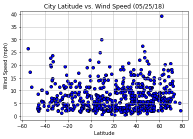

# WeatherPy

#### The below script explores the relationship between weather and latitude.

In this script, we retrieved and plotted data from the openweathermap to visualize the weather of 500+ cities across the world of varying distance from the equator to show the relationship of the following relationship:

* Temperature (F) vs. Latitude
* Humidity (%) vs. Latitude
* Cloudiness (%) vs. Latitude
* Wind Speed (mph) vs. Latitude


```python
# Dependencies
import matplotlib.pyplot as plt
import random
import requests
import urllib
import pandas as pd
import numpy as np
import openweathermapy.core as owm
from config import api_key
from citipy import citipy
```

## Generate Cities List


```python
# As latitudes ranged from -90 to 90, longitudes from -180 to 180,list the numbers in between them by o.1 difference.  

lat_range = list(np.arange(-90,90,0.1))
lon_range = list(np.arange(-180,180,0.2))
    #len(lat_range)

# select 1500 random samples to make sure my city samples > 500
latitude = random.sample(lat_range,1500)
longitude = random.sample(lon_range,1500)

coordinates = zip(latitude, longitude)

# use citypy to determine the name of the nearest city of the lat & lon provided
cities = []
for coordinate_pair in coordinates:
    lat, lon = coordinate_pair
    cities.append(citipy.nearest_city(lat, lon))
    
city_names = []
for city in cities:
    city_names.append(city.city_name)

# remove dublicate city names
city_names = list(set(city_names))

# make sure I have at least 500 city samples
len(city_names)
```


    620


## Perform API Calls


```python
settings = {"units": "imperial", "appid": api_key}
```


```python
# set up lists to hold reponse info
name = []
country = []
lat = []
lon = []
max_temp = []
humidity = []
clouds = []
wind_speed =[]

print("Beginning Data Retrieval")
print("-"*30)

# --------------------------------------------------------------------------
# Loop through the list of city names and perform requests on each city name
# ---------------------------------------------------------------------------

# set city number to count for the cities being requested
city_number = 0

for i in city_names:
    city_number +=1
    
    try:
        # print a log of each city as being processed with city number, city name and requested URL
        print(f"Processing Record {city_number} | {i}")
  
        query_url = f"http://api.openweathermap.org/data/2.5/weather?appid={api_key}&units=imperial&q="
        print(f"{query_url}{i.replace(' ', '%20')}")
        
        # try request response
        response = owm.get_current(i, **settings)
        
        name.append(response['name'])
        country.append(response['sys']['country'])
        lat.append(response['coord']['lat'])
        lon.append(response['coord']['lon'])
        max_temp.append(response['main']['temp_max'])
        humidity.append(response['main']['humidity'])
        clouds.append(response['clouds']['all'])
        wind_speed.append(response['wind']['speed'])
    
    except:
        
        # print out the city with HTTP error
        print(f"No record for city:{i}")
        continue
        
            
print("-"*30)        
print("Data Retrieval Complete")
print("-"*30)

```

    Beginning Data Retrieval
    ------------------------------
    Processing Record 1 | mildura
    http://api.openweathermap.org/data/2.5/weather?appid=a412e057dbaa5b5779d43d4e78580b64&units=imperial&q=mildura
    Processing Record 2 | tikhvin
    http://api.openweathermap.org/data/2.5/weather?appid=a412e057dbaa5b5779d43d4e78580b64&units=imperial&q=tikhvin
    Processing Record 3 | gonen
    http://api.openweathermap.org/data/2.5/weather?appid=a412e057dbaa5b5779d43d4e78580b64&units=imperial&q=gonen
    Processing Record 4 | port alfred
    http://api.openweathermap.org/data/2.5/weather?appid=a412e057dbaa5b5779d43d4e78580b64&units=imperial&q=port%20alfred
    Processing Record 5 | saint-philippe
    http://api.openweathermap.org/data/2.5/weather?appid=a412e057dbaa5b5779d43d4e78580b64&units=imperial&q=saint-philippe
    Processing Record 6 | topolovgrad
    http://api.openweathermap.org/data/2.5/weather?appid=a412e057dbaa5b5779d43d4e78580b64&units=imperial&q=topolovgrad
    Processing Record 7 | kinston
    http://api.openweathermap.org/data/2.5/weather?appid=a412e057dbaa5b5779d43d4e78580b64&units=imperial&q=kinston
    Processing Record 8 | belushya guba
    http://api.openweathermap.org/data/2.5/weather?appid=a412e057dbaa5b5779d43d4e78580b64&units=imperial&q=belushya%20guba
    No record for city:belushya guba
    Processing Record 9 | la ligua
    http://api.openweathermap.org/data/2.5/weather?appid=a412e057dbaa5b5779d43d4e78580b64&units=imperial&q=la%20ligua
    Processing Record 10 | taywarah
    http://api.openweathermap.org/data/2.5/weather?appid=a412e057dbaa5b5779d43d4e78580b64&units=imperial&q=taywarah
    Processing Record 11 | west bay
    http://api.openweathermap.org/data/2.5/weather?appid=a412e057dbaa5b5779d43d4e78580b64&units=imperial&q=west%20bay
    Processing Record 12 | ruatoria
    http://api.openweathermap.org/data/2.5/weather?appid=a412e057dbaa5b5779d43d4e78580b64&units=imperial&q=ruatoria
    No record for city:ruatoria
    Processing Record 13 | sibolga
    http://api.openweathermap.org/data/2.5/weather?appid=a412e057dbaa5b5779d43d4e78580b64&units=imperial&q=sibolga
    Processing Record 14 | forbes
    http://api.openweathermap.org/data/2.5/weather?appid=a412e057dbaa5b5779d43d4e78580b64&units=imperial&q=forbes
    Processing Record 15 | northam
    http://api.openweathermap.org/data/2.5/weather?appid=a412e057dbaa5b5779d43d4e78580b64&units=imperial&q=northam
    Processing Record 16 | santa cruz de tenerife
    http://api.openweathermap.org/data/2.5/weather?appid=a412e057dbaa5b5779d43d4e78580b64&units=imperial&q=santa%20cruz%20de%20tenerife
    Processing Record 17 | durres
    http://api.openweathermap.org/data/2.5/weather?appid=a412e057dbaa5b5779d43d4e78580b64&units=imperial&q=durres
    Processing Record 18 | mandan
    http://api.openweathermap.org/data/2.5/weather?appid=a412e057dbaa5b5779d43d4e78580b64&units=imperial&q=mandan
    Processing Record 19 | east london
    http://api.openweathermap.org/data/2.5/weather?appid=a412e057dbaa5b5779d43d4e78580b64&units=imperial&q=east%20london
    Processing Record 20 | qaanaaq
    http://api.openweathermap.org/data/2.5/weather?appid=a412e057dbaa5b5779d43d4e78580b64&units=imperial&q=qaanaaq
    Processing Record 21 | bukama
    http://api.openweathermap.org/data/2.5/weather?appid=a412e057dbaa5b5779d43d4e78580b64&units=imperial&q=bukama
    Processing Record 22 | alta floresta
    http://api.openweathermap.org/data/2.5/weather?appid=a412e057dbaa5b5779d43d4e78580b64&units=imperial&q=alta%20floresta
    Processing Record 23 | ponta do sol
    http://api.openweathermap.org/data/2.5/weather?appid=a412e057dbaa5b5779d43d4e78580b64&units=imperial&q=ponta%20do%20sol
    Processing Record 24 | tiksi
    http://api.openweathermap.org/data/2.5/weather?appid=a412e057dbaa5b5779d43d4e78580b64&units=imperial&q=tiksi
    Processing Record 25 | collie
    http://api.openweathermap.org/data/2.5/weather?appid=a412e057dbaa5b5779d43d4e78580b64&units=imperial&q=collie
    Processing Record 26 | dhidhdhoo
    http://api.openweathermap.org/data/2.5/weather?appid=a412e057dbaa5b5779d43d4e78580b64&units=imperial&q=dhidhdhoo
    Processing Record 27 | port augusta
    http://api.openweathermap.org/data/2.5/weather?appid=a412e057dbaa5b5779d43d4e78580b64&units=imperial&q=port%20augusta
    Processing Record 28 | carutapera
    http://api.openweathermap.org/data/2.5/weather?appid=a412e057dbaa5b5779d43d4e78580b64&units=imperial&q=carutapera
    Processing Record 29 | sabya
    http://api.openweathermap.org/data/2.5/weather?appid=a412e057dbaa5b5779d43d4e78580b64&units=imperial&q=sabya
    Processing Record 30 | coquimbo
    http://api.openweathermap.org/data/2.5/weather?appid=a412e057dbaa5b5779d43d4e78580b64&units=imperial&q=coquimbo
    Processing Record 31 | big spring
    http://api.openweathermap.org/data/2.5/weather?appid=a412e057dbaa5b5779d43d4e78580b64&units=imperial&q=big%20spring
    Processing Record 32 | punta arenas
    http://api.openweathermap.org/data/2.5/weather?appid=a412e057dbaa5b5779d43d4e78580b64&units=imperial&q=punta%20arenas
    Processing Record 33 | camacha
    http://api.openweathermap.org/data/2.5/weather?appid=a412e057dbaa5b5779d43d4e78580b64&units=imperial&q=camacha
    Processing Record 34 | anadyr
    http://api.openweathermap.org/data/2.5/weather?appid=a412e057dbaa5b5779d43d4e78580b64&units=imperial&q=anadyr
    Processing Record 35 | north bend
    http://api.openweathermap.org/data/2.5/weather?appid=a412e057dbaa5b5779d43d4e78580b64&units=imperial&q=north%20bend
    Processing Record 36 | awjilah
    http://api.openweathermap.org/data/2.5/weather?appid=a412e057dbaa5b5779d43d4e78580b64&units=imperial&q=awjilah
    Processing Record 37 | qinhuangdao
    http://api.openweathermap.org/data/2.5/weather?appid=a412e057dbaa5b5779d43d4e78580b64&units=imperial&q=qinhuangdao
    Processing Record 38 | vila
    http://api.openweathermap.org/data/2.5/weather?appid=a412e057dbaa5b5779d43d4e78580b64&units=imperial&q=vila
    Processing Record 39 | bridlington
    http://api.openweathermap.org/data/2.5/weather?appid=a412e057dbaa5b5779d43d4e78580b64&units=imperial&q=bridlington
    Processing Record 40 | mahanoro
    http://api.openweathermap.org/data/2.5/weather?appid=a412e057dbaa5b5779d43d4e78580b64&units=imperial&q=mahanoro
    Processing Record 41 | duba-yurt
    http://api.openweathermap.org/data/2.5/weather?appid=a412e057dbaa5b5779d43d4e78580b64&units=imperial&q=duba-yurt
    Processing Record 42 | kavieng
    http://api.openweathermap.org/data/2.5/weather?appid=a412e057dbaa5b5779d43d4e78580b64&units=imperial&q=kavieng
    Processing Record 43 | kinablangan
    http://api.openweathermap.org/data/2.5/weather?appid=a412e057dbaa5b5779d43d4e78580b64&units=imperial&q=kinablangan
    Processing Record 44 | iqaluit
    http://api.openweathermap.org/data/2.5/weather?appid=a412e057dbaa5b5779d43d4e78580b64&units=imperial&q=iqaluit
    Processing Record 45 | mehran
    http://api.openweathermap.org/data/2.5/weather?appid=a412e057dbaa5b5779d43d4e78580b64&units=imperial&q=mehran
    Processing Record 46 | reshetnikovo
    http://api.openweathermap.org/data/2.5/weather?appid=a412e057dbaa5b5779d43d4e78580b64&units=imperial&q=reshetnikovo
    Processing Record 47 | salinas
    http://api.openweathermap.org/data/2.5/weather?appid=a412e057dbaa5b5779d43d4e78580b64&units=imperial&q=salinas
    Processing Record 48 | clyde river
    http://api.openweathermap.org/data/2.5/weather?appid=a412e057dbaa5b5779d43d4e78580b64&units=imperial&q=clyde%20river
    Processing Record 49 | arkhangelsk
    http://api.openweathermap.org/data/2.5/weather?appid=a412e057dbaa5b5779d43d4e78580b64&units=imperial&q=arkhangelsk
    Processing Record 50 | pascagoula
    http://api.openweathermap.org/data/2.5/weather?appid=a412e057dbaa5b5779d43d4e78580b64&units=imperial&q=pascagoula
    Processing Record 51 | mys shmidta
    http://api.openweathermap.org/data/2.5/weather?appid=a412e057dbaa5b5779d43d4e78580b64&units=imperial&q=mys%20shmidta
    No record for city:mys shmidta
    Processing Record 52 | mezen
    http://api.openweathermap.org/data/2.5/weather?appid=a412e057dbaa5b5779d43d4e78580b64&units=imperial&q=mezen
    Processing Record 53 | ruwi
    http://api.openweathermap.org/data/2.5/weather?appid=a412e057dbaa5b5779d43d4e78580b64&units=imperial&q=ruwi
    Processing Record 54 | tabou
    http://api.openweathermap.org/data/2.5/weather?appid=a412e057dbaa5b5779d43d4e78580b64&units=imperial&q=tabou
    Processing Record 55 | copiapo
    http://api.openweathermap.org/data/2.5/weather?appid=a412e057dbaa5b5779d43d4e78580b64&units=imperial&q=copiapo
    Processing Record 56 | pandan
    http://api.openweathermap.org/data/2.5/weather?appid=a412e057dbaa5b5779d43d4e78580b64&units=imperial&q=pandan
    Processing Record 57 | pitimbu
    http://api.openweathermap.org/data/2.5/weather?appid=a412e057dbaa5b5779d43d4e78580b64&units=imperial&q=pitimbu
    Processing Record 58 | goderich
    http://api.openweathermap.org/data/2.5/weather?appid=a412e057dbaa5b5779d43d4e78580b64&units=imperial&q=goderich
    Processing Record 59 | ovruch
    http://api.openweathermap.org/data/2.5/weather?appid=a412e057dbaa5b5779d43d4e78580b64&units=imperial&q=ovruch
    Processing Record 60 | varzea da palma
    http://api.openweathermap.org/data/2.5/weather?appid=a412e057dbaa5b5779d43d4e78580b64&units=imperial&q=varzea%20da%20palma
    Processing Record 61 | hilo
    http://api.openweathermap.org/data/2.5/weather?appid=a412e057dbaa5b5779d43d4e78580b64&units=imperial&q=hilo
    Processing Record 62 | lata
    http://api.openweathermap.org/data/2.5/weather?appid=a412e057dbaa5b5779d43d4e78580b64&units=imperial&q=lata
    Processing Record 63 | spas-demensk
    http://api.openweathermap.org/data/2.5/weather?appid=a412e057dbaa5b5779d43d4e78580b64&units=imperial&q=spas-demensk
    Processing Record 64 | voh
    http://api.openweathermap.org/data/2.5/weather?appid=a412e057dbaa5b5779d43d4e78580b64&units=imperial&q=voh
    Processing Record 65 | marsh harbour
    http://api.openweathermap.org/data/2.5/weather?appid=a412e057dbaa5b5779d43d4e78580b64&units=imperial&q=marsh%20harbour
    Processing Record 66 | fairbanks
    http://api.openweathermap.org/data/2.5/weather?appid=a412e057dbaa5b5779d43d4e78580b64&units=imperial&q=fairbanks
    Processing Record 67 | uyuni
    http://api.openweathermap.org/data/2.5/weather?appid=a412e057dbaa5b5779d43d4e78580b64&units=imperial&q=uyuni
    Processing Record 68 | marcona
    http://api.openweathermap.org/data/2.5/weather?appid=a412e057dbaa5b5779d43d4e78580b64&units=imperial&q=marcona
    No record for city:marcona
    Processing Record 69 | selenice
    http://api.openweathermap.org/data/2.5/weather?appid=a412e057dbaa5b5779d43d4e78580b64&units=imperial&q=selenice
    Processing Record 70 | port-gentil
    http://api.openweathermap.org/data/2.5/weather?appid=a412e057dbaa5b5779d43d4e78580b64&units=imperial&q=port-gentil
    Processing Record 71 | bagaha
    http://api.openweathermap.org/data/2.5/weather?appid=a412e057dbaa5b5779d43d4e78580b64&units=imperial&q=bagaha
    Processing Record 72 | caravelas
    http://api.openweathermap.org/data/2.5/weather?appid=a412e057dbaa5b5779d43d4e78580b64&units=imperial&q=caravelas
    Processing Record 73 | manbij
    http://api.openweathermap.org/data/2.5/weather?appid=a412e057dbaa5b5779d43d4e78580b64&units=imperial&q=manbij
    Processing Record 74 | buraydah
    http://api.openweathermap.org/data/2.5/weather?appid=a412e057dbaa5b5779d43d4e78580b64&units=imperial&q=buraydah
    Processing Record 75 | nabire
    http://api.openweathermap.org/data/2.5/weather?appid=a412e057dbaa5b5779d43d4e78580b64&units=imperial&q=nabire
    Processing Record 76 | san cristobal
    http://api.openweathermap.org/data/2.5/weather?appid=a412e057dbaa5b5779d43d4e78580b64&units=imperial&q=san%20cristobal
    Processing Record 77 | san quintin
    http://api.openweathermap.org/data/2.5/weather?appid=a412e057dbaa5b5779d43d4e78580b64&units=imperial&q=san%20quintin
    Processing Record 78 | hami
    http://api.openweathermap.org/data/2.5/weather?appid=a412e057dbaa5b5779d43d4e78580b64&units=imperial&q=hami
    Processing Record 79 | quixada
    http://api.openweathermap.org/data/2.5/weather?appid=a412e057dbaa5b5779d43d4e78580b64&units=imperial&q=quixada
    No record for city:quixada
    Processing Record 80 | izumo
    http://api.openweathermap.org/data/2.5/weather?appid=a412e057dbaa5b5779d43d4e78580b64&units=imperial&q=izumo
    Processing Record 81 | jawhar
    http://api.openweathermap.org/data/2.5/weather?appid=a412e057dbaa5b5779d43d4e78580b64&units=imperial&q=jawhar
    Processing Record 82 | muyezerskiy
    http://api.openweathermap.org/data/2.5/weather?appid=a412e057dbaa5b5779d43d4e78580b64&units=imperial&q=muyezerskiy
    Processing Record 83 | tombouctou
    http://api.openweathermap.org/data/2.5/weather?appid=a412e057dbaa5b5779d43d4e78580b64&units=imperial&q=tombouctou
    Processing Record 84 | tari
    http://api.openweathermap.org/data/2.5/weather?appid=a412e057dbaa5b5779d43d4e78580b64&units=imperial&q=tari
    Processing Record 85 | provideniya
    http://api.openweathermap.org/data/2.5/weather?appid=a412e057dbaa5b5779d43d4e78580b64&units=imperial&q=provideniya
    Processing Record 86 | brownsville
    http://api.openweathermap.org/data/2.5/weather?appid=a412e057dbaa5b5779d43d4e78580b64&units=imperial&q=brownsville
    Processing Record 87 | kant
    http://api.openweathermap.org/data/2.5/weather?appid=a412e057dbaa5b5779d43d4e78580b64&units=imperial&q=kant
    Processing Record 88 | dzhusaly
    http://api.openweathermap.org/data/2.5/weather?appid=a412e057dbaa5b5779d43d4e78580b64&units=imperial&q=dzhusaly
    No record for city:dzhusaly
    Processing Record 89 | eureka
    http://api.openweathermap.org/data/2.5/weather?appid=a412e057dbaa5b5779d43d4e78580b64&units=imperial&q=eureka
    Processing Record 90 | boa vista
    http://api.openweathermap.org/data/2.5/weather?appid=a412e057dbaa5b5779d43d4e78580b64&units=imperial&q=boa%20vista
    Processing Record 91 | bulawayo
    http://api.openweathermap.org/data/2.5/weather?appid=a412e057dbaa5b5779d43d4e78580b64&units=imperial&q=bulawayo
    Processing Record 92 | kalabo
    http://api.openweathermap.org/data/2.5/weather?appid=a412e057dbaa5b5779d43d4e78580b64&units=imperial&q=kalabo
    Processing Record 93 | kajaani
    http://api.openweathermap.org/data/2.5/weather?appid=a412e057dbaa5b5779d43d4e78580b64&units=imperial&q=kajaani
    Processing Record 94 | koupela
    http://api.openweathermap.org/data/2.5/weather?appid=a412e057dbaa5b5779d43d4e78580b64&units=imperial&q=koupela
    Processing Record 95 | talnakh
    http://api.openweathermap.org/data/2.5/weather?appid=a412e057dbaa5b5779d43d4e78580b64&units=imperial&q=talnakh
    Processing Record 96 | pisco
    http://api.openweathermap.org/data/2.5/weather?appid=a412e057dbaa5b5779d43d4e78580b64&units=imperial&q=pisco
    Processing Record 97 | cairns
    http://api.openweathermap.org/data/2.5/weather?appid=a412e057dbaa5b5779d43d4e78580b64&units=imperial&q=cairns
    Processing Record 98 | markala
    http://api.openweathermap.org/data/2.5/weather?appid=a412e057dbaa5b5779d43d4e78580b64&units=imperial&q=markala
    Processing Record 99 | baykit
    http://api.openweathermap.org/data/2.5/weather?appid=a412e057dbaa5b5779d43d4e78580b64&units=imperial&q=baykit
    Processing Record 100 | moissala
    http://api.openweathermap.org/data/2.5/weather?appid=a412e057dbaa5b5779d43d4e78580b64&units=imperial&q=moissala
    Processing Record 101 | nemuro
    http://api.openweathermap.org/data/2.5/weather?appid=a412e057dbaa5b5779d43d4e78580b64&units=imperial&q=nemuro
    Processing Record 102 | nanortalik
    http://api.openweathermap.org/data/2.5/weather?appid=a412e057dbaa5b5779d43d4e78580b64&units=imperial&q=nanortalik
    Processing Record 103 | biloela
    http://api.openweathermap.org/data/2.5/weather?appid=a412e057dbaa5b5779d43d4e78580b64&units=imperial&q=biloela
    Processing Record 104 | atuona
    http://api.openweathermap.org/data/2.5/weather?appid=a412e057dbaa5b5779d43d4e78580b64&units=imperial&q=atuona
    Processing Record 105 | okha
    http://api.openweathermap.org/data/2.5/weather?appid=a412e057dbaa5b5779d43d4e78580b64&units=imperial&q=okha
    Processing Record 106 | ixcatepec
    http://api.openweathermap.org/data/2.5/weather?appid=a412e057dbaa5b5779d43d4e78580b64&units=imperial&q=ixcatepec
    Processing Record 107 | pemangkat
    http://api.openweathermap.org/data/2.5/weather?appid=a412e057dbaa5b5779d43d4e78580b64&units=imperial&q=pemangkat
    No record for city:pemangkat
    Processing Record 108 | bafq
    http://api.openweathermap.org/data/2.5/weather?appid=a412e057dbaa5b5779d43d4e78580b64&units=imperial&q=bafq
    Processing Record 109 | port moresby
    http://api.openweathermap.org/data/2.5/weather?appid=a412e057dbaa5b5779d43d4e78580b64&units=imperial&q=port%20moresby
    Processing Record 110 | amapa
    http://api.openweathermap.org/data/2.5/weather?appid=a412e057dbaa5b5779d43d4e78580b64&units=imperial&q=amapa
    Processing Record 111 | kjollefjord
    http://api.openweathermap.org/data/2.5/weather?appid=a412e057dbaa5b5779d43d4e78580b64&units=imperial&q=kjollefjord
    Processing Record 112 | chernyshevskiy
    http://api.openweathermap.org/data/2.5/weather?appid=a412e057dbaa5b5779d43d4e78580b64&units=imperial&q=chernyshevskiy
    Processing Record 113 | brae
    http://api.openweathermap.org/data/2.5/weather?appid=a412e057dbaa5b5779d43d4e78580b64&units=imperial&q=brae
    Processing Record 114 | sorochinsk
    http://api.openweathermap.org/data/2.5/weather?appid=a412e057dbaa5b5779d43d4e78580b64&units=imperial&q=sorochinsk
    Processing Record 115 | kirensk
    http://api.openweathermap.org/data/2.5/weather?appid=a412e057dbaa5b5779d43d4e78580b64&units=imperial&q=kirensk
    Processing Record 116 | avarua
    http://api.openweathermap.org/data/2.5/weather?appid=a412e057dbaa5b5779d43d4e78580b64&units=imperial&q=avarua
    Processing Record 117 | jiayuguan
    http://api.openweathermap.org/data/2.5/weather?appid=a412e057dbaa5b5779d43d4e78580b64&units=imperial&q=jiayuguan
    Processing Record 118 | bathsheba
    http://api.openweathermap.org/data/2.5/weather?appid=a412e057dbaa5b5779d43d4e78580b64&units=imperial&q=bathsheba
    Processing Record 119 | coihaique
    http://api.openweathermap.org/data/2.5/weather?appid=a412e057dbaa5b5779d43d4e78580b64&units=imperial&q=coihaique
    Processing Record 120 | norman wells
    http://api.openweathermap.org/data/2.5/weather?appid=a412e057dbaa5b5779d43d4e78580b64&units=imperial&q=norman%20wells
    Processing Record 121 | mecca
    http://api.openweathermap.org/data/2.5/weather?appid=a412e057dbaa5b5779d43d4e78580b64&units=imperial&q=mecca
    Processing Record 122 | bethel
    http://api.openweathermap.org/data/2.5/weather?appid=a412e057dbaa5b5779d43d4e78580b64&units=imperial&q=bethel
    Processing Record 123 | araouane
    http://api.openweathermap.org/data/2.5/weather?appid=a412e057dbaa5b5779d43d4e78580b64&units=imperial&q=araouane
    Processing Record 124 | port macquarie
    http://api.openweathermap.org/data/2.5/weather?appid=a412e057dbaa5b5779d43d4e78580b64&units=imperial&q=port%20macquarie
    Processing Record 125 | nizwa
    http://api.openweathermap.org/data/2.5/weather?appid=a412e057dbaa5b5779d43d4e78580b64&units=imperial&q=nizwa
    Processing Record 126 | guerrero negro
    http://api.openweathermap.org/data/2.5/weather?appid=a412e057dbaa5b5779d43d4e78580b64&units=imperial&q=guerrero%20negro
    Processing Record 127 | lagoa
    http://api.openweathermap.org/data/2.5/weather?appid=a412e057dbaa5b5779d43d4e78580b64&units=imperial&q=lagoa
    Processing Record 128 | kieta
    http://api.openweathermap.org/data/2.5/weather?appid=a412e057dbaa5b5779d43d4e78580b64&units=imperial&q=kieta
    Processing Record 129 | kaitangata
    http://api.openweathermap.org/data/2.5/weather?appid=a412e057dbaa5b5779d43d4e78580b64&units=imperial&q=kaitangata
    Processing Record 130 | lompoc
    http://api.openweathermap.org/data/2.5/weather?appid=a412e057dbaa5b5779d43d4e78580b64&units=imperial&q=lompoc
    Processing Record 131 | kamenskoye
    http://api.openweathermap.org/data/2.5/weather?appid=a412e057dbaa5b5779d43d4e78580b64&units=imperial&q=kamenskoye
    No record for city:kamenskoye
    Processing Record 132 | la ronge
    http://api.openweathermap.org/data/2.5/weather?appid=a412e057dbaa5b5779d43d4e78580b64&units=imperial&q=la%20ronge
    Processing Record 133 | camopi
    http://api.openweathermap.org/data/2.5/weather?appid=a412e057dbaa5b5779d43d4e78580b64&units=imperial&q=camopi
    Processing Record 134 | dingle
    http://api.openweathermap.org/data/2.5/weather?appid=a412e057dbaa5b5779d43d4e78580b64&units=imperial&q=dingle
    Processing Record 135 | havre-saint-pierre
    http://api.openweathermap.org/data/2.5/weather?appid=a412e057dbaa5b5779d43d4e78580b64&units=imperial&q=havre-saint-pierre
    Processing Record 136 | tamandare
    http://api.openweathermap.org/data/2.5/weather?appid=a412e057dbaa5b5779d43d4e78580b64&units=imperial&q=tamandare
    Processing Record 137 | la vergne
    http://api.openweathermap.org/data/2.5/weather?appid=a412e057dbaa5b5779d43d4e78580b64&units=imperial&q=la%20vergne
    Processing Record 138 | setermoen
    http://api.openweathermap.org/data/2.5/weather?appid=a412e057dbaa5b5779d43d4e78580b64&units=imperial&q=setermoen
    Processing Record 139 | joshimath
    http://api.openweathermap.org/data/2.5/weather?appid=a412e057dbaa5b5779d43d4e78580b64&units=imperial&q=joshimath
    Processing Record 140 | brandfort
    http://api.openweathermap.org/data/2.5/weather?appid=a412e057dbaa5b5779d43d4e78580b64&units=imperial&q=brandfort
    Processing Record 141 | whitehorse
    http://api.openweathermap.org/data/2.5/weather?appid=a412e057dbaa5b5779d43d4e78580b64&units=imperial&q=whitehorse
    Processing Record 142 | mogadishu
    http://api.openweathermap.org/data/2.5/weather?appid=a412e057dbaa5b5779d43d4e78580b64&units=imperial&q=mogadishu
    Processing Record 143 | isabela
    http://api.openweathermap.org/data/2.5/weather?appid=a412e057dbaa5b5779d43d4e78580b64&units=imperial&q=isabela
    Processing Record 144 | dibrugarh
    http://api.openweathermap.org/data/2.5/weather?appid=a412e057dbaa5b5779d43d4e78580b64&units=imperial&q=dibrugarh
    Processing Record 145 | owando
    http://api.openweathermap.org/data/2.5/weather?appid=a412e057dbaa5b5779d43d4e78580b64&units=imperial&q=owando
    Processing Record 146 | tumannyy
    http://api.openweathermap.org/data/2.5/weather?appid=a412e057dbaa5b5779d43d4e78580b64&units=imperial&q=tumannyy
    No record for city:tumannyy
    Processing Record 147 | alyangula
    http://api.openweathermap.org/data/2.5/weather?appid=a412e057dbaa5b5779d43d4e78580b64&units=imperial&q=alyangula
    Processing Record 148 | zykovo
    http://api.openweathermap.org/data/2.5/weather?appid=a412e057dbaa5b5779d43d4e78580b64&units=imperial&q=zykovo
    Processing Record 149 | sharjah
    http://api.openweathermap.org/data/2.5/weather?appid=a412e057dbaa5b5779d43d4e78580b64&units=imperial&q=sharjah
    Processing Record 150 | laguna
    http://api.openweathermap.org/data/2.5/weather?appid=a412e057dbaa5b5779d43d4e78580b64&units=imperial&q=laguna
    Processing Record 151 | mezhdurechensk
    http://api.openweathermap.org/data/2.5/weather?appid=a412e057dbaa5b5779d43d4e78580b64&units=imperial&q=mezhdurechensk
    Processing Record 152 | miquelon
    http://api.openweathermap.org/data/2.5/weather?appid=a412e057dbaa5b5779d43d4e78580b64&units=imperial&q=miquelon
    Processing Record 153 | ous
    http://api.openweathermap.org/data/2.5/weather?appid=a412e057dbaa5b5779d43d4e78580b64&units=imperial&q=ous
    Processing Record 154 | grand river south east
    http://api.openweathermap.org/data/2.5/weather?appid=a412e057dbaa5b5779d43d4e78580b64&units=imperial&q=grand%20river%20south%20east
    No record for city:grand river south east
    Processing Record 155 | lorengau
    http://api.openweathermap.org/data/2.5/weather?appid=a412e057dbaa5b5779d43d4e78580b64&units=imperial&q=lorengau
    Processing Record 156 | baiyin
    http://api.openweathermap.org/data/2.5/weather?appid=a412e057dbaa5b5779d43d4e78580b64&units=imperial&q=baiyin
    Processing Record 157 | gigant
    http://api.openweathermap.org/data/2.5/weather?appid=a412e057dbaa5b5779d43d4e78580b64&units=imperial&q=gigant
    Processing Record 158 | gigmoto
    http://api.openweathermap.org/data/2.5/weather?appid=a412e057dbaa5b5779d43d4e78580b64&units=imperial&q=gigmoto
    Processing Record 159 | clinton
    http://api.openweathermap.org/data/2.5/weather?appid=a412e057dbaa5b5779d43d4e78580b64&units=imperial&q=clinton
    Processing Record 160 | zhigansk
    http://api.openweathermap.org/data/2.5/weather?appid=a412e057dbaa5b5779d43d4e78580b64&units=imperial&q=zhigansk
    Processing Record 161 | airai
    http://api.openweathermap.org/data/2.5/weather?appid=a412e057dbaa5b5779d43d4e78580b64&units=imperial&q=airai
    Processing Record 162 | arkhangelos
    http://api.openweathermap.org/data/2.5/weather?appid=a412e057dbaa5b5779d43d4e78580b64&units=imperial&q=arkhangelos
    No record for city:arkhangelos
    Processing Record 163 | malwan
    http://api.openweathermap.org/data/2.5/weather?appid=a412e057dbaa5b5779d43d4e78580b64&units=imperial&q=malwan
    No record for city:malwan
    Processing Record 164 | omboue
    http://api.openweathermap.org/data/2.5/weather?appid=a412e057dbaa5b5779d43d4e78580b64&units=imperial&q=omboue
    Processing Record 165 | udachnyy
    http://api.openweathermap.org/data/2.5/weather?appid=a412e057dbaa5b5779d43d4e78580b64&units=imperial&q=udachnyy
    Processing Record 166 | tornio
    http://api.openweathermap.org/data/2.5/weather?appid=a412e057dbaa5b5779d43d4e78580b64&units=imperial&q=tornio
    Processing Record 167 | moose factory
    http://api.openweathermap.org/data/2.5/weather?appid=a412e057dbaa5b5779d43d4e78580b64&units=imperial&q=moose%20factory
    Processing Record 168 | sao felix do xingu
    http://api.openweathermap.org/data/2.5/weather?appid=a412e057dbaa5b5779d43d4e78580b64&units=imperial&q=sao%20felix%20do%20xingu
    Processing Record 169 | yining
    http://api.openweathermap.org/data/2.5/weather?appid=a412e057dbaa5b5779d43d4e78580b64&units=imperial&q=yining
    Processing Record 170 | atar
    http://api.openweathermap.org/data/2.5/weather?appid=a412e057dbaa5b5779d43d4e78580b64&units=imperial&q=atar
    Processing Record 171 | gopalpur
    http://api.openweathermap.org/data/2.5/weather?appid=a412e057dbaa5b5779d43d4e78580b64&units=imperial&q=gopalpur
    Processing Record 172 | ciudad bolivar
    http://api.openweathermap.org/data/2.5/weather?appid=a412e057dbaa5b5779d43d4e78580b64&units=imperial&q=ciudad%20bolivar
    Processing Record 173 | caconda
    http://api.openweathermap.org/data/2.5/weather?appid=a412e057dbaa5b5779d43d4e78580b64&units=imperial&q=caconda
    Processing Record 174 | bredasdorp
    http://api.openweathermap.org/data/2.5/weather?appid=a412e057dbaa5b5779d43d4e78580b64&units=imperial&q=bredasdorp
    Processing Record 175 | dikson
    http://api.openweathermap.org/data/2.5/weather?appid=a412e057dbaa5b5779d43d4e78580b64&units=imperial&q=dikson
    Processing Record 176 | rikitea
    http://api.openweathermap.org/data/2.5/weather?appid=a412e057dbaa5b5779d43d4e78580b64&units=imperial&q=rikitea
    Processing Record 177 | bhandaria
    http://api.openweathermap.org/data/2.5/weather?appid=a412e057dbaa5b5779d43d4e78580b64&units=imperial&q=bhandaria
    Processing Record 178 | viedma
    http://api.openweathermap.org/data/2.5/weather?appid=a412e057dbaa5b5779d43d4e78580b64&units=imperial&q=viedma
    Processing Record 179 | pozo colorado
    http://api.openweathermap.org/data/2.5/weather?appid=a412e057dbaa5b5779d43d4e78580b64&units=imperial&q=pozo%20colorado
    Processing Record 180 | wajima
    http://api.openweathermap.org/data/2.5/weather?appid=a412e057dbaa5b5779d43d4e78580b64&units=imperial&q=wajima
    Processing Record 181 | mutsamudu
    http://api.openweathermap.org/data/2.5/weather?appid=a412e057dbaa5b5779d43d4e78580b64&units=imperial&q=mutsamudu
    No record for city:mutsamudu
    Processing Record 182 | alfenas
    http://api.openweathermap.org/data/2.5/weather?appid=a412e057dbaa5b5779d43d4e78580b64&units=imperial&q=alfenas
    Processing Record 183 | poum
    http://api.openweathermap.org/data/2.5/weather?appid=a412e057dbaa5b5779d43d4e78580b64&units=imperial&q=poum
    Processing Record 184 | hasaki
    http://api.openweathermap.org/data/2.5/weather?appid=a412e057dbaa5b5779d43d4e78580b64&units=imperial&q=hasaki
    Processing Record 185 | alice springs
    http://api.openweathermap.org/data/2.5/weather?appid=a412e057dbaa5b5779d43d4e78580b64&units=imperial&q=alice%20springs
    Processing Record 186 | hervey bay
    http://api.openweathermap.org/data/2.5/weather?appid=a412e057dbaa5b5779d43d4e78580b64&units=imperial&q=hervey%20bay
    Processing Record 187 | sept-iles
    http://api.openweathermap.org/data/2.5/weather?appid=a412e057dbaa5b5779d43d4e78580b64&units=imperial&q=sept-iles
    Processing Record 188 | kottayam
    http://api.openweathermap.org/data/2.5/weather?appid=a412e057dbaa5b5779d43d4e78580b64&units=imperial&q=kottayam
    Processing Record 189 | taunggyi
    http://api.openweathermap.org/data/2.5/weather?appid=a412e057dbaa5b5779d43d4e78580b64&units=imperial&q=taunggyi
    Processing Record 190 | palabuhanratu
    http://api.openweathermap.org/data/2.5/weather?appid=a412e057dbaa5b5779d43d4e78580b64&units=imperial&q=palabuhanratu
    No record for city:palabuhanratu
    Processing Record 191 | inongo
    http://api.openweathermap.org/data/2.5/weather?appid=a412e057dbaa5b5779d43d4e78580b64&units=imperial&q=inongo
    Processing Record 192 | agadir
    http://api.openweathermap.org/data/2.5/weather?appid=a412e057dbaa5b5779d43d4e78580b64&units=imperial&q=agadir
    Processing Record 193 | nishihara
    http://api.openweathermap.org/data/2.5/weather?appid=a412e057dbaa5b5779d43d4e78580b64&units=imperial&q=nishihara
    Processing Record 194 | paamiut
    http://api.openweathermap.org/data/2.5/weather?appid=a412e057dbaa5b5779d43d4e78580b64&units=imperial&q=paamiut
    Processing Record 195 | kenai
    http://api.openweathermap.org/data/2.5/weather?appid=a412e057dbaa5b5779d43d4e78580b64&units=imperial&q=kenai
    Processing Record 196 | puerto ayora
    http://api.openweathermap.org/data/2.5/weather?appid=a412e057dbaa5b5779d43d4e78580b64&units=imperial&q=puerto%20ayora
    Processing Record 197 | vanavara
    http://api.openweathermap.org/data/2.5/weather?appid=a412e057dbaa5b5779d43d4e78580b64&units=imperial&q=vanavara
    Processing Record 198 | sao filipe
    http://api.openweathermap.org/data/2.5/weather?appid=a412e057dbaa5b5779d43d4e78580b64&units=imperial&q=sao%20filipe
    Processing Record 199 | deputatskiy
    http://api.openweathermap.org/data/2.5/weather?appid=a412e057dbaa5b5779d43d4e78580b64&units=imperial&q=deputatskiy
    Processing Record 200 | okandja
    http://api.openweathermap.org/data/2.5/weather?appid=a412e057dbaa5b5779d43d4e78580b64&units=imperial&q=okandja
    No record for city:okandja
    Processing Record 201 | corner brook
    http://api.openweathermap.org/data/2.5/weather?appid=a412e057dbaa5b5779d43d4e78580b64&units=imperial&q=corner%20brook
    Processing Record 202 | amderma
    http://api.openweathermap.org/data/2.5/weather?appid=a412e057dbaa5b5779d43d4e78580b64&units=imperial&q=amderma
    No record for city:amderma
    Processing Record 203 | moses lake
    http://api.openweathermap.org/data/2.5/weather?appid=a412e057dbaa5b5779d43d4e78580b64&units=imperial&q=moses%20lake
    Processing Record 204 | duluth
    http://api.openweathermap.org/data/2.5/weather?appid=a412e057dbaa5b5779d43d4e78580b64&units=imperial&q=duluth
    Processing Record 205 | nakapiripirit
    http://api.openweathermap.org/data/2.5/weather?appid=a412e057dbaa5b5779d43d4e78580b64&units=imperial&q=nakapiripirit
    Processing Record 206 | kirakira
    http://api.openweathermap.org/data/2.5/weather?appid=a412e057dbaa5b5779d43d4e78580b64&units=imperial&q=kirakira
    Processing Record 207 | bosaso
    http://api.openweathermap.org/data/2.5/weather?appid=a412e057dbaa5b5779d43d4e78580b64&units=imperial&q=bosaso
    Processing Record 208 | nampula
    http://api.openweathermap.org/data/2.5/weather?appid=a412e057dbaa5b5779d43d4e78580b64&units=imperial&q=nampula
    Processing Record 209 | nador
    http://api.openweathermap.org/data/2.5/weather?appid=a412e057dbaa5b5779d43d4e78580b64&units=imperial&q=nador
    Processing Record 210 | codrington
    http://api.openweathermap.org/data/2.5/weather?appid=a412e057dbaa5b5779d43d4e78580b64&units=imperial&q=codrington
    Processing Record 211 | sitka
    http://api.openweathermap.org/data/2.5/weather?appid=a412e057dbaa5b5779d43d4e78580b64&units=imperial&q=sitka
    Processing Record 212 | madang
    http://api.openweathermap.org/data/2.5/weather?appid=a412e057dbaa5b5779d43d4e78580b64&units=imperial&q=madang
    Processing Record 213 | inuvik
    http://api.openweathermap.org/data/2.5/weather?appid=a412e057dbaa5b5779d43d4e78580b64&units=imperial&q=inuvik
    Processing Record 214 | oranjemund
    http://api.openweathermap.org/data/2.5/weather?appid=a412e057dbaa5b5779d43d4e78580b64&units=imperial&q=oranjemund
    Processing Record 215 | butaritari
    http://api.openweathermap.org/data/2.5/weather?appid=a412e057dbaa5b5779d43d4e78580b64&units=imperial&q=butaritari
    Processing Record 216 | tawnat
    http://api.openweathermap.org/data/2.5/weather?appid=a412e057dbaa5b5779d43d4e78580b64&units=imperial&q=tawnat
    No record for city:tawnat
    Processing Record 217 | purpe
    http://api.openweathermap.org/data/2.5/weather?appid=a412e057dbaa5b5779d43d4e78580b64&units=imperial&q=purpe
    Processing Record 218 | sibu
    http://api.openweathermap.org/data/2.5/weather?appid=a412e057dbaa5b5779d43d4e78580b64&units=imperial&q=sibu
    Processing Record 219 | kashi
    http://api.openweathermap.org/data/2.5/weather?appid=a412e057dbaa5b5779d43d4e78580b64&units=imperial&q=kashi
    No record for city:kashi
    Processing Record 220 | madimba
    http://api.openweathermap.org/data/2.5/weather?appid=a412e057dbaa5b5779d43d4e78580b64&units=imperial&q=madimba
    Processing Record 221 | ketchikan
    http://api.openweathermap.org/data/2.5/weather?appid=a412e057dbaa5b5779d43d4e78580b64&units=imperial&q=ketchikan
    Processing Record 222 | faanui
    http://api.openweathermap.org/data/2.5/weather?appid=a412e057dbaa5b5779d43d4e78580b64&units=imperial&q=faanui
    Processing Record 223 | carnarvon
    http://api.openweathermap.org/data/2.5/weather?appid=a412e057dbaa5b5779d43d4e78580b64&units=imperial&q=carnarvon
    Processing Record 224 | winton
    http://api.openweathermap.org/data/2.5/weather?appid=a412e057dbaa5b5779d43d4e78580b64&units=imperial&q=winton
    Processing Record 225 | touros
    http://api.openweathermap.org/data/2.5/weather?appid=a412e057dbaa5b5779d43d4e78580b64&units=imperial&q=touros
    Processing Record 226 | nianzishan
    http://api.openweathermap.org/data/2.5/weather?appid=a412e057dbaa5b5779d43d4e78580b64&units=imperial&q=nianzishan
    Processing Record 227 | pangkalanbuun
    http://api.openweathermap.org/data/2.5/weather?appid=a412e057dbaa5b5779d43d4e78580b64&units=imperial&q=pangkalanbuun
    Processing Record 228 | tunduru
    http://api.openweathermap.org/data/2.5/weather?appid=a412e057dbaa5b5779d43d4e78580b64&units=imperial&q=tunduru
    No record for city:tunduru
    Processing Record 229 | wanaka
    http://api.openweathermap.org/data/2.5/weather?appid=a412e057dbaa5b5779d43d4e78580b64&units=imperial&q=wanaka
    Processing Record 230 | vallenar
    http://api.openweathermap.org/data/2.5/weather?appid=a412e057dbaa5b5779d43d4e78580b64&units=imperial&q=vallenar
    Processing Record 231 | xai-xai
    http://api.openweathermap.org/data/2.5/weather?appid=a412e057dbaa5b5779d43d4e78580b64&units=imperial&q=xai-xai
    Processing Record 232 | navoi
    http://api.openweathermap.org/data/2.5/weather?appid=a412e057dbaa5b5779d43d4e78580b64&units=imperial&q=navoi
    Processing Record 233 | berlevag
    http://api.openweathermap.org/data/2.5/weather?appid=a412e057dbaa5b5779d43d4e78580b64&units=imperial&q=berlevag
    Processing Record 234 | te anau
    http://api.openweathermap.org/data/2.5/weather?appid=a412e057dbaa5b5779d43d4e78580b64&units=imperial&q=te%20anau
    Processing Record 235 | cabo san lucas
    http://api.openweathermap.org/data/2.5/weather?appid=a412e057dbaa5b5779d43d4e78580b64&units=imperial&q=cabo%20san%20lucas
    Processing Record 236 | cayenne
    http://api.openweathermap.org/data/2.5/weather?appid=a412e057dbaa5b5779d43d4e78580b64&units=imperial&q=cayenne
    Processing Record 237 | saskylakh
    http://api.openweathermap.org/data/2.5/weather?appid=a412e057dbaa5b5779d43d4e78580b64&units=imperial&q=saskylakh
    Processing Record 238 | puerto carreno
    http://api.openweathermap.org/data/2.5/weather?appid=a412e057dbaa5b5779d43d4e78580b64&units=imperial&q=puerto%20carreno
    Processing Record 239 | sao joao da barra
    http://api.openweathermap.org/data/2.5/weather?appid=a412e057dbaa5b5779d43d4e78580b64&units=imperial&q=sao%20joao%20da%20barra
    Processing Record 240 | tazovskiy
    http://api.openweathermap.org/data/2.5/weather?appid=a412e057dbaa5b5779d43d4e78580b64&units=imperial&q=tazovskiy
    Processing Record 241 | san juan del sur
    http://api.openweathermap.org/data/2.5/weather?appid=a412e057dbaa5b5779d43d4e78580b64&units=imperial&q=san%20juan%20del%20sur
    Processing Record 242 | tymovskoye
    http://api.openweathermap.org/data/2.5/weather?appid=a412e057dbaa5b5779d43d4e78580b64&units=imperial&q=tymovskoye
    Processing Record 243 | picos
    http://api.openweathermap.org/data/2.5/weather?appid=a412e057dbaa5b5779d43d4e78580b64&units=imperial&q=picos
    Processing Record 244 | monrovia
    http://api.openweathermap.org/data/2.5/weather?appid=a412e057dbaa5b5779d43d4e78580b64&units=imperial&q=monrovia
    Processing Record 245 | barrow
    http://api.openweathermap.org/data/2.5/weather?appid=a412e057dbaa5b5779d43d4e78580b64&units=imperial&q=barrow
    Processing Record 246 | barentsburg
    http://api.openweathermap.org/data/2.5/weather?appid=a412e057dbaa5b5779d43d4e78580b64&units=imperial&q=barentsburg
    No record for city:barentsburg
    Processing Record 247 | palauig
    http://api.openweathermap.org/data/2.5/weather?appid=a412e057dbaa5b5779d43d4e78580b64&units=imperial&q=palauig
    Processing Record 248 | umzimvubu
    http://api.openweathermap.org/data/2.5/weather?appid=a412e057dbaa5b5779d43d4e78580b64&units=imperial&q=umzimvubu
    No record for city:umzimvubu
    Processing Record 249 | ossora
    http://api.openweathermap.org/data/2.5/weather?appid=a412e057dbaa5b5779d43d4e78580b64&units=imperial&q=ossora
    Processing Record 250 | tura
    http://api.openweathermap.org/data/2.5/weather?appid=a412e057dbaa5b5779d43d4e78580b64&units=imperial&q=tura
    Processing Record 251 | gamba
    http://api.openweathermap.org/data/2.5/weather?appid=a412e057dbaa5b5779d43d4e78580b64&units=imperial&q=gamba
    Processing Record 252 | vestmannaeyjar
    http://api.openweathermap.org/data/2.5/weather?appid=a412e057dbaa5b5779d43d4e78580b64&units=imperial&q=vestmannaeyjar
    Processing Record 253 | vila velha
    http://api.openweathermap.org/data/2.5/weather?appid=a412e057dbaa5b5779d43d4e78580b64&units=imperial&q=vila%20velha
    Processing Record 254 | otjiwarongo
    http://api.openweathermap.org/data/2.5/weather?appid=a412e057dbaa5b5779d43d4e78580b64&units=imperial&q=otjiwarongo
    Processing Record 255 | kuche
    http://api.openweathermap.org/data/2.5/weather?appid=a412e057dbaa5b5779d43d4e78580b64&units=imperial&q=kuche
    No record for city:kuche
    Processing Record 256 | ensenada
    http://api.openweathermap.org/data/2.5/weather?appid=a412e057dbaa5b5779d43d4e78580b64&units=imperial&q=ensenada
    Processing Record 257 | ostrovnoy
    http://api.openweathermap.org/data/2.5/weather?appid=a412e057dbaa5b5779d43d4e78580b64&units=imperial&q=ostrovnoy
    Processing Record 258 | iturama
    http://api.openweathermap.org/data/2.5/weather?appid=a412e057dbaa5b5779d43d4e78580b64&units=imperial&q=iturama
    Processing Record 259 | brookhaven
    http://api.openweathermap.org/data/2.5/weather?appid=a412e057dbaa5b5779d43d4e78580b64&units=imperial&q=brookhaven
    Processing Record 260 | chokurdakh
    http://api.openweathermap.org/data/2.5/weather?appid=a412e057dbaa5b5779d43d4e78580b64&units=imperial&q=chokurdakh
    Processing Record 261 | bossangoa
    http://api.openweathermap.org/data/2.5/weather?appid=a412e057dbaa5b5779d43d4e78580b64&units=imperial&q=bossangoa
    Processing Record 262 | havelock
    http://api.openweathermap.org/data/2.5/weather?appid=a412e057dbaa5b5779d43d4e78580b64&units=imperial&q=havelock
    Processing Record 263 | alofi
    http://api.openweathermap.org/data/2.5/weather?appid=a412e057dbaa5b5779d43d4e78580b64&units=imperial&q=alofi
    Processing Record 264 | college
    http://api.openweathermap.org/data/2.5/weather?appid=a412e057dbaa5b5779d43d4e78580b64&units=imperial&q=college
    Processing Record 265 | kavaratti
    http://api.openweathermap.org/data/2.5/weather?appid=a412e057dbaa5b5779d43d4e78580b64&units=imperial&q=kavaratti
    Processing Record 266 | nanjing
    http://api.openweathermap.org/data/2.5/weather?appid=a412e057dbaa5b5779d43d4e78580b64&units=imperial&q=nanjing
    Processing Record 267 | morehead
    http://api.openweathermap.org/data/2.5/weather?appid=a412e057dbaa5b5779d43d4e78580b64&units=imperial&q=morehead
    Processing Record 268 | pavino
    http://api.openweathermap.org/data/2.5/weather?appid=a412e057dbaa5b5779d43d4e78580b64&units=imperial&q=pavino
    Processing Record 269 | dongsheng
    http://api.openweathermap.org/data/2.5/weather?appid=a412e057dbaa5b5779d43d4e78580b64&units=imperial&q=dongsheng
    Processing Record 270 | muisne
    http://api.openweathermap.org/data/2.5/weather?appid=a412e057dbaa5b5779d43d4e78580b64&units=imperial&q=muisne
    Processing Record 271 | champerico
    http://api.openweathermap.org/data/2.5/weather?appid=a412e057dbaa5b5779d43d4e78580b64&units=imperial&q=champerico
    Processing Record 272 | poronaysk
    http://api.openweathermap.org/data/2.5/weather?appid=a412e057dbaa5b5779d43d4e78580b64&units=imperial&q=poronaysk
    Processing Record 273 | kapaa
    http://api.openweathermap.org/data/2.5/weather?appid=a412e057dbaa5b5779d43d4e78580b64&units=imperial&q=kapaa
    Processing Record 274 | jomalig
    http://api.openweathermap.org/data/2.5/weather?appid=a412e057dbaa5b5779d43d4e78580b64&units=imperial&q=jomalig
    No record for city:jomalig
    Processing Record 275 | salalah
    http://api.openweathermap.org/data/2.5/weather?appid=a412e057dbaa5b5779d43d4e78580b64&units=imperial&q=salalah
    Processing Record 276 | illoqqortoormiut
    http://api.openweathermap.org/data/2.5/weather?appid=a412e057dbaa5b5779d43d4e78580b64&units=imperial&q=illoqqortoormiut
    No record for city:illoqqortoormiut
    Processing Record 277 | mackay
    http://api.openweathermap.org/data/2.5/weather?appid=a412e057dbaa5b5779d43d4e78580b64&units=imperial&q=mackay
    Processing Record 278 | tenenkou
    http://api.openweathermap.org/data/2.5/weather?appid=a412e057dbaa5b5779d43d4e78580b64&units=imperial&q=tenenkou
    Processing Record 279 | lerwick
    http://api.openweathermap.org/data/2.5/weather?appid=a412e057dbaa5b5779d43d4e78580b64&units=imperial&q=lerwick
    Processing Record 280 | samarai
    http://api.openweathermap.org/data/2.5/weather?appid=a412e057dbaa5b5779d43d4e78580b64&units=imperial&q=samarai
    Processing Record 281 | mayo
    http://api.openweathermap.org/data/2.5/weather?appid=a412e057dbaa5b5779d43d4e78580b64&units=imperial&q=mayo
    Processing Record 282 | cockburn town
    http://api.openweathermap.org/data/2.5/weather?appid=a412e057dbaa5b5779d43d4e78580b64&units=imperial&q=cockburn%20town
    Processing Record 283 | aflu
    http://api.openweathermap.org/data/2.5/weather?appid=a412e057dbaa5b5779d43d4e78580b64&units=imperial&q=aflu
    No record for city:aflu
    Processing Record 284 | skibbereen
    http://api.openweathermap.org/data/2.5/weather?appid=a412e057dbaa5b5779d43d4e78580b64&units=imperial&q=skibbereen
    Processing Record 285 | leningradskiy
    http://api.openweathermap.org/data/2.5/weather?appid=a412e057dbaa5b5779d43d4e78580b64&units=imperial&q=leningradskiy
    Processing Record 286 | rayon
    http://api.openweathermap.org/data/2.5/weather?appid=a412e057dbaa5b5779d43d4e78580b64&units=imperial&q=rayon
    Processing Record 287 | ameca
    http://api.openweathermap.org/data/2.5/weather?appid=a412e057dbaa5b5779d43d4e78580b64&units=imperial&q=ameca
    Processing Record 288 | gilazi
    http://api.openweathermap.org/data/2.5/weather?appid=a412e057dbaa5b5779d43d4e78580b64&units=imperial&q=gilazi
    No record for city:gilazi
    Processing Record 289 | naze
    http://api.openweathermap.org/data/2.5/weather?appid=a412e057dbaa5b5779d43d4e78580b64&units=imperial&q=naze
    Processing Record 290 | vigrestad
    http://api.openweathermap.org/data/2.5/weather?appid=a412e057dbaa5b5779d43d4e78580b64&units=imperial&q=vigrestad
    Processing Record 291 | ahipara
    http://api.openweathermap.org/data/2.5/weather?appid=a412e057dbaa5b5779d43d4e78580b64&units=imperial&q=ahipara
    Processing Record 292 | koundara
    http://api.openweathermap.org/data/2.5/weather?appid=a412e057dbaa5b5779d43d4e78580b64&units=imperial&q=koundara
    Processing Record 293 | evensk
    http://api.openweathermap.org/data/2.5/weather?appid=a412e057dbaa5b5779d43d4e78580b64&units=imperial&q=evensk
    Processing Record 294 | qasigiannguit
    http://api.openweathermap.org/data/2.5/weather?appid=a412e057dbaa5b5779d43d4e78580b64&units=imperial&q=qasigiannguit
    Processing Record 295 | loubomo
    http://api.openweathermap.org/data/2.5/weather?appid=a412e057dbaa5b5779d43d4e78580b64&units=imperial&q=loubomo
    No record for city:loubomo
    Processing Record 296 | bubaque
    http://api.openweathermap.org/data/2.5/weather?appid=a412e057dbaa5b5779d43d4e78580b64&units=imperial&q=bubaque
    Processing Record 297 | tarudant
    http://api.openweathermap.org/data/2.5/weather?appid=a412e057dbaa5b5779d43d4e78580b64&units=imperial&q=tarudant
    No record for city:tarudant
    Processing Record 298 | husavik
    http://api.openweathermap.org/data/2.5/weather?appid=a412e057dbaa5b5779d43d4e78580b64&units=imperial&q=husavik
    Processing Record 299 | buqayq
    http://api.openweathermap.org/data/2.5/weather?appid=a412e057dbaa5b5779d43d4e78580b64&units=imperial&q=buqayq
    No record for city:buqayq
    Processing Record 300 | tasiilaq
    http://api.openweathermap.org/data/2.5/weather?appid=a412e057dbaa5b5779d43d4e78580b64&units=imperial&q=tasiilaq
    Processing Record 301 | balimo
    http://api.openweathermap.org/data/2.5/weather?appid=a412e057dbaa5b5779d43d4e78580b64&units=imperial&q=balimo
    No record for city:balimo
    Processing Record 302 | taltal
    http://api.openweathermap.org/data/2.5/weather?appid=a412e057dbaa5b5779d43d4e78580b64&units=imperial&q=taltal
    Processing Record 303 | nome
    http://api.openweathermap.org/data/2.5/weather?appid=a412e057dbaa5b5779d43d4e78580b64&units=imperial&q=nome
    Processing Record 304 | upernavik
    http://api.openweathermap.org/data/2.5/weather?appid=a412e057dbaa5b5779d43d4e78580b64&units=imperial&q=upernavik
    Processing Record 305 | takestan
    http://api.openweathermap.org/data/2.5/weather?appid=a412e057dbaa5b5779d43d4e78580b64&units=imperial&q=takestan
    Processing Record 306 | hithadhoo
    http://api.openweathermap.org/data/2.5/weather?appid=a412e057dbaa5b5779d43d4e78580b64&units=imperial&q=hithadhoo
    Processing Record 307 | hobart
    http://api.openweathermap.org/data/2.5/weather?appid=a412e057dbaa5b5779d43d4e78580b64&units=imperial&q=hobart
    Processing Record 308 | mbigou
    http://api.openweathermap.org/data/2.5/weather?appid=a412e057dbaa5b5779d43d4e78580b64&units=imperial&q=mbigou
    Processing Record 309 | busselton
    http://api.openweathermap.org/data/2.5/weather?appid=a412e057dbaa5b5779d43d4e78580b64&units=imperial&q=busselton
    Processing Record 310 | lolua
    http://api.openweathermap.org/data/2.5/weather?appid=a412e057dbaa5b5779d43d4e78580b64&units=imperial&q=lolua
    No record for city:lolua
    Processing Record 311 | warqla
    http://api.openweathermap.org/data/2.5/weather?appid=a412e057dbaa5b5779d43d4e78580b64&units=imperial&q=warqla
    No record for city:warqla
    Processing Record 312 | ponta delgada
    http://api.openweathermap.org/data/2.5/weather?appid=a412e057dbaa5b5779d43d4e78580b64&units=imperial&q=ponta%20delgada
    Processing Record 313 | vaitupu
    http://api.openweathermap.org/data/2.5/weather?appid=a412e057dbaa5b5779d43d4e78580b64&units=imperial&q=vaitupu
    No record for city:vaitupu
    Processing Record 314 | severo-kurilsk
    http://api.openweathermap.org/data/2.5/weather?appid=a412e057dbaa5b5779d43d4e78580b64&units=imperial&q=severo-kurilsk
    Processing Record 315 | dien bien
    http://api.openweathermap.org/data/2.5/weather?appid=a412e057dbaa5b5779d43d4e78580b64&units=imperial&q=dien%20bien
    No record for city:dien bien
    Processing Record 316 | saldanha
    http://api.openweathermap.org/data/2.5/weather?appid=a412e057dbaa5b5779d43d4e78580b64&units=imperial&q=saldanha
    Processing Record 317 | half moon bay
    http://api.openweathermap.org/data/2.5/weather?appid=a412e057dbaa5b5779d43d4e78580b64&units=imperial&q=half%20moon%20bay
    Processing Record 318 | karratha
    http://api.openweathermap.org/data/2.5/weather?appid=a412e057dbaa5b5779d43d4e78580b64&units=imperial&q=karratha
    Processing Record 319 | vikhorevka
    http://api.openweathermap.org/data/2.5/weather?appid=a412e057dbaa5b5779d43d4e78580b64&units=imperial&q=vikhorevka
    Processing Record 320 | trairi
    http://api.openweathermap.org/data/2.5/weather?appid=a412e057dbaa5b5779d43d4e78580b64&units=imperial&q=trairi
    Processing Record 321 | puri
    http://api.openweathermap.org/data/2.5/weather?appid=a412e057dbaa5b5779d43d4e78580b64&units=imperial&q=puri
    Processing Record 322 | faya
    http://api.openweathermap.org/data/2.5/weather?appid=a412e057dbaa5b5779d43d4e78580b64&units=imperial&q=faya
    Processing Record 323 | hudson bay
    http://api.openweathermap.org/data/2.5/weather?appid=a412e057dbaa5b5779d43d4e78580b64&units=imperial&q=hudson%20bay
    Processing Record 324 | sioux city
    http://api.openweathermap.org/data/2.5/weather?appid=a412e057dbaa5b5779d43d4e78580b64&units=imperial&q=sioux%20city
    Processing Record 325 | minden
    http://api.openweathermap.org/data/2.5/weather?appid=a412e057dbaa5b5779d43d4e78580b64&units=imperial&q=minden
    Processing Record 326 | vao
    http://api.openweathermap.org/data/2.5/weather?appid=a412e057dbaa5b5779d43d4e78580b64&units=imperial&q=vao
    Processing Record 327 | zlatoustovsk
    http://api.openweathermap.org/data/2.5/weather?appid=a412e057dbaa5b5779d43d4e78580b64&units=imperial&q=zlatoustovsk
    No record for city:zlatoustovsk
    Processing Record 328 | new norfolk
    http://api.openweathermap.org/data/2.5/weather?appid=a412e057dbaa5b5779d43d4e78580b64&units=imperial&q=new%20norfolk
    Processing Record 329 | pedernales
    http://api.openweathermap.org/data/2.5/weather?appid=a412e057dbaa5b5779d43d4e78580b64&units=imperial&q=pedernales
    Processing Record 330 | esperance
    http://api.openweathermap.org/data/2.5/weather?appid=a412e057dbaa5b5779d43d4e78580b64&units=imperial&q=esperance
    Processing Record 331 | birao
    http://api.openweathermap.org/data/2.5/weather?appid=a412e057dbaa5b5779d43d4e78580b64&units=imperial&q=birao
    Processing Record 332 | torbay
    http://api.openweathermap.org/data/2.5/weather?appid=a412e057dbaa5b5779d43d4e78580b64&units=imperial&q=torbay
    Processing Record 333 | boueni
    http://api.openweathermap.org/data/2.5/weather?appid=a412e057dbaa5b5779d43d4e78580b64&units=imperial&q=boueni
    Processing Record 334 | angicos
    http://api.openweathermap.org/data/2.5/weather?appid=a412e057dbaa5b5779d43d4e78580b64&units=imperial&q=angicos
    Processing Record 335 | mataura
    http://api.openweathermap.org/data/2.5/weather?appid=a412e057dbaa5b5779d43d4e78580b64&units=imperial&q=mataura
    Processing Record 336 | govardhan
    http://api.openweathermap.org/data/2.5/weather?appid=a412e057dbaa5b5779d43d4e78580b64&units=imperial&q=govardhan
    Processing Record 337 | wuchi
    http://api.openweathermap.org/data/2.5/weather?appid=a412e057dbaa5b5779d43d4e78580b64&units=imperial&q=wuchi
    Processing Record 338 | nouakchott
    http://api.openweathermap.org/data/2.5/weather?appid=a412e057dbaa5b5779d43d4e78580b64&units=imperial&q=nouakchott
    Processing Record 339 | mahishadal
    http://api.openweathermap.org/data/2.5/weather?appid=a412e057dbaa5b5779d43d4e78580b64&units=imperial&q=mahishadal
    Processing Record 340 | general pico
    http://api.openweathermap.org/data/2.5/weather?appid=a412e057dbaa5b5779d43d4e78580b64&units=imperial&q=general%20pico
    Processing Record 341 | ovsyanka
    http://api.openweathermap.org/data/2.5/weather?appid=a412e057dbaa5b5779d43d4e78580b64&units=imperial&q=ovsyanka
    Processing Record 342 | burnie
    http://api.openweathermap.org/data/2.5/weather?appid=a412e057dbaa5b5779d43d4e78580b64&units=imperial&q=burnie
    Processing Record 343 | winnemucca
    http://api.openweathermap.org/data/2.5/weather?appid=a412e057dbaa5b5779d43d4e78580b64&units=imperial&q=winnemucca
    Processing Record 344 | orlik
    http://api.openweathermap.org/data/2.5/weather?appid=a412e057dbaa5b5779d43d4e78580b64&units=imperial&q=orlik
    Processing Record 345 | handwara
    http://api.openweathermap.org/data/2.5/weather?appid=a412e057dbaa5b5779d43d4e78580b64&units=imperial&q=handwara
    No record for city:handwara
    Processing Record 346 | itoman
    http://api.openweathermap.org/data/2.5/weather?appid=a412e057dbaa5b5779d43d4e78580b64&units=imperial&q=itoman
    Processing Record 347 | praia
    http://api.openweathermap.org/data/2.5/weather?appid=a412e057dbaa5b5779d43d4e78580b64&units=imperial&q=praia
    Processing Record 348 | bangolo
    http://api.openweathermap.org/data/2.5/weather?appid=a412e057dbaa5b5779d43d4e78580b64&units=imperial&q=bangolo
    Processing Record 349 | kisaran
    http://api.openweathermap.org/data/2.5/weather?appid=a412e057dbaa5b5779d43d4e78580b64&units=imperial&q=kisaran
    Processing Record 350 | ust-kuyga
    http://api.openweathermap.org/data/2.5/weather?appid=a412e057dbaa5b5779d43d4e78580b64&units=imperial&q=ust-kuyga
    Processing Record 351 | kodiak
    http://api.openweathermap.org/data/2.5/weather?appid=a412e057dbaa5b5779d43d4e78580b64&units=imperial&q=kodiak
    Processing Record 352 | ayame
    http://api.openweathermap.org/data/2.5/weather?appid=a412e057dbaa5b5779d43d4e78580b64&units=imperial&q=ayame
    Processing Record 353 | saint george
    http://api.openweathermap.org/data/2.5/weather?appid=a412e057dbaa5b5779d43d4e78580b64&units=imperial&q=saint%20george
    Processing Record 354 | ilulissat
    http://api.openweathermap.org/data/2.5/weather?appid=a412e057dbaa5b5779d43d4e78580b64&units=imperial&q=ilulissat
    Processing Record 355 | yenagoa
    http://api.openweathermap.org/data/2.5/weather?appid=a412e057dbaa5b5779d43d4e78580b64&units=imperial&q=yenagoa
    Processing Record 356 | kumluca
    http://api.openweathermap.org/data/2.5/weather?appid=a412e057dbaa5b5779d43d4e78580b64&units=imperial&q=kumluca
    Processing Record 357 | taolanaro
    http://api.openweathermap.org/data/2.5/weather?appid=a412e057dbaa5b5779d43d4e78580b64&units=imperial&q=taolanaro
    No record for city:taolanaro
    Processing Record 358 | ust-tsilma
    http://api.openweathermap.org/data/2.5/weather?appid=a412e057dbaa5b5779d43d4e78580b64&units=imperial&q=ust-tsilma
    Processing Record 359 | ballitoville
    http://api.openweathermap.org/data/2.5/weather?appid=a412e057dbaa5b5779d43d4e78580b64&units=imperial&q=ballitoville
    Processing Record 360 | dakar
    http://api.openweathermap.org/data/2.5/weather?appid=a412e057dbaa5b5779d43d4e78580b64&units=imperial&q=dakar
    Processing Record 361 | mitsamiouli
    http://api.openweathermap.org/data/2.5/weather?appid=a412e057dbaa5b5779d43d4e78580b64&units=imperial&q=mitsamiouli
    Processing Record 362 | zhezkazgan
    http://api.openweathermap.org/data/2.5/weather?appid=a412e057dbaa5b5779d43d4e78580b64&units=imperial&q=zhezkazgan
    Processing Record 363 | livramento
    http://api.openweathermap.org/data/2.5/weather?appid=a412e057dbaa5b5779d43d4e78580b64&units=imperial&q=livramento
    Processing Record 364 | meulaboh
    http://api.openweathermap.org/data/2.5/weather?appid=a412e057dbaa5b5779d43d4e78580b64&units=imperial&q=meulaboh
    Processing Record 365 | waingapu
    http://api.openweathermap.org/data/2.5/weather?appid=a412e057dbaa5b5779d43d4e78580b64&units=imperial&q=waingapu
    Processing Record 366 | coruripe
    http://api.openweathermap.org/data/2.5/weather?appid=a412e057dbaa5b5779d43d4e78580b64&units=imperial&q=coruripe
    Processing Record 367 | sentyabrskiy
    http://api.openweathermap.org/data/2.5/weather?appid=a412e057dbaa5b5779d43d4e78580b64&units=imperial&q=sentyabrskiy
    No record for city:sentyabrskiy
    Processing Record 368 | rio rancho
    http://api.openweathermap.org/data/2.5/weather?appid=a412e057dbaa5b5779d43d4e78580b64&units=imperial&q=rio%20rancho
    Processing Record 369 | tandag
    http://api.openweathermap.org/data/2.5/weather?appid=a412e057dbaa5b5779d43d4e78580b64&units=imperial&q=tandag
    Processing Record 370 | luderitz
    http://api.openweathermap.org/data/2.5/weather?appid=a412e057dbaa5b5779d43d4e78580b64&units=imperial&q=luderitz
    Processing Record 371 | hammerfest
    http://api.openweathermap.org/data/2.5/weather?appid=a412e057dbaa5b5779d43d4e78580b64&units=imperial&q=hammerfest
    Processing Record 372 | port blair
    http://api.openweathermap.org/data/2.5/weather?appid=a412e057dbaa5b5779d43d4e78580b64&units=imperial&q=port%20blair
    Processing Record 373 | korostyshiv
    http://api.openweathermap.org/data/2.5/weather?appid=a412e057dbaa5b5779d43d4e78580b64&units=imperial&q=korostyshiv
    Processing Record 374 | taoudenni
    http://api.openweathermap.org/data/2.5/weather?appid=a412e057dbaa5b5779d43d4e78580b64&units=imperial&q=taoudenni
    Processing Record 375 | koksovyy
    http://api.openweathermap.org/data/2.5/weather?appid=a412e057dbaa5b5779d43d4e78580b64&units=imperial&q=koksovyy
    Processing Record 376 | souillac
    http://api.openweathermap.org/data/2.5/weather?appid=a412e057dbaa5b5779d43d4e78580b64&units=imperial&q=souillac
    Processing Record 377 | longyearbyen
    http://api.openweathermap.org/data/2.5/weather?appid=a412e057dbaa5b5779d43d4e78580b64&units=imperial&q=longyearbyen
    Processing Record 378 | khani
    http://api.openweathermap.org/data/2.5/weather?appid=a412e057dbaa5b5779d43d4e78580b64&units=imperial&q=khani
    Processing Record 379 | tautira
    http://api.openweathermap.org/data/2.5/weather?appid=a412e057dbaa5b5779d43d4e78580b64&units=imperial&q=tautira
    Processing Record 380 | nguiu
    http://api.openweathermap.org/data/2.5/weather?appid=a412e057dbaa5b5779d43d4e78580b64&units=imperial&q=nguiu
    No record for city:nguiu
    Processing Record 381 | nuevitas
    http://api.openweathermap.org/data/2.5/weather?appid=a412e057dbaa5b5779d43d4e78580b64&units=imperial&q=nuevitas
    Processing Record 382 | chumikan
    http://api.openweathermap.org/data/2.5/weather?appid=a412e057dbaa5b5779d43d4e78580b64&units=imperial&q=chumikan
    Processing Record 383 | nova olinda do norte
    http://api.openweathermap.org/data/2.5/weather?appid=a412e057dbaa5b5779d43d4e78580b64&units=imperial&q=nova%20olinda%20do%20norte
    Processing Record 384 | kirillov
    http://api.openweathermap.org/data/2.5/weather?appid=a412e057dbaa5b5779d43d4e78580b64&units=imperial&q=kirillov
    Processing Record 385 | port lincoln
    http://api.openweathermap.org/data/2.5/weather?appid=a412e057dbaa5b5779d43d4e78580b64&units=imperial&q=port%20lincoln
    Processing Record 386 | carnot
    http://api.openweathermap.org/data/2.5/weather?appid=a412e057dbaa5b5779d43d4e78580b64&units=imperial&q=carnot
    Processing Record 387 | calama
    http://api.openweathermap.org/data/2.5/weather?appid=a412e057dbaa5b5779d43d4e78580b64&units=imperial&q=calama
    Processing Record 388 | hailar
    http://api.openweathermap.org/data/2.5/weather?appid=a412e057dbaa5b5779d43d4e78580b64&units=imperial&q=hailar
    Processing Record 389 | umm lajj
    http://api.openweathermap.org/data/2.5/weather?appid=a412e057dbaa5b5779d43d4e78580b64&units=imperial&q=umm%20lajj
    Processing Record 390 | abong mbang
    http://api.openweathermap.org/data/2.5/weather?appid=a412e057dbaa5b5779d43d4e78580b64&units=imperial&q=abong%20mbang
    Processing Record 391 | kushmurun
    http://api.openweathermap.org/data/2.5/weather?appid=a412e057dbaa5b5779d43d4e78580b64&units=imperial&q=kushmurun
    No record for city:kushmurun
    Processing Record 392 | namatanai
    http://api.openweathermap.org/data/2.5/weather?appid=a412e057dbaa5b5779d43d4e78580b64&units=imperial&q=namatanai
    Processing Record 393 | melita
    http://api.openweathermap.org/data/2.5/weather?appid=a412e057dbaa5b5779d43d4e78580b64&units=imperial&q=melita
    Processing Record 394 | veraval
    http://api.openweathermap.org/data/2.5/weather?appid=a412e057dbaa5b5779d43d4e78580b64&units=imperial&q=veraval
    Processing Record 395 | moroceli
    http://api.openweathermap.org/data/2.5/weather?appid=a412e057dbaa5b5779d43d4e78580b64&units=imperial&q=moroceli
    Processing Record 396 | goure
    http://api.openweathermap.org/data/2.5/weather?appid=a412e057dbaa5b5779d43d4e78580b64&units=imperial&q=goure
    Processing Record 397 | wanning
    http://api.openweathermap.org/data/2.5/weather?appid=a412e057dbaa5b5779d43d4e78580b64&units=imperial&q=wanning
    Processing Record 398 | lamar
    http://api.openweathermap.org/data/2.5/weather?appid=a412e057dbaa5b5779d43d4e78580b64&units=imperial&q=lamar
    Processing Record 399 | mahebourg
    http://api.openweathermap.org/data/2.5/weather?appid=a412e057dbaa5b5779d43d4e78580b64&units=imperial&q=mahebourg
    Processing Record 400 | itarema
    http://api.openweathermap.org/data/2.5/weather?appid=a412e057dbaa5b5779d43d4e78580b64&units=imperial&q=itarema
    Processing Record 401 | avera
    http://api.openweathermap.org/data/2.5/weather?appid=a412e057dbaa5b5779d43d4e78580b64&units=imperial&q=avera
    Processing Record 402 | buala
    http://api.openweathermap.org/data/2.5/weather?appid=a412e057dbaa5b5779d43d4e78580b64&units=imperial&q=buala
    Processing Record 403 | wakkanai
    http://api.openweathermap.org/data/2.5/weather?appid=a412e057dbaa5b5779d43d4e78580b64&units=imperial&q=wakkanai
    Processing Record 404 | cherskiy
    http://api.openweathermap.org/data/2.5/weather?appid=a412e057dbaa5b5779d43d4e78580b64&units=imperial&q=cherskiy
    Processing Record 405 | khatanga
    http://api.openweathermap.org/data/2.5/weather?appid=a412e057dbaa5b5779d43d4e78580b64&units=imperial&q=khatanga
    Processing Record 406 | huangnihe
    http://api.openweathermap.org/data/2.5/weather?appid=a412e057dbaa5b5779d43d4e78580b64&units=imperial&q=huangnihe
    Processing Record 407 | geraldton
    http://api.openweathermap.org/data/2.5/weather?appid=a412e057dbaa5b5779d43d4e78580b64&units=imperial&q=geraldton
    Processing Record 408 | lebu
    http://api.openweathermap.org/data/2.5/weather?appid=a412e057dbaa5b5779d43d4e78580b64&units=imperial&q=lebu
    Processing Record 409 | tagusao
    http://api.openweathermap.org/data/2.5/weather?appid=a412e057dbaa5b5779d43d4e78580b64&units=imperial&q=tagusao
    Processing Record 410 | orange cove
    http://api.openweathermap.org/data/2.5/weather?appid=a412e057dbaa5b5779d43d4e78580b64&units=imperial&q=orange%20cove
    Processing Record 411 | ilhabela
    http://api.openweathermap.org/data/2.5/weather?appid=a412e057dbaa5b5779d43d4e78580b64&units=imperial&q=ilhabela
    Processing Record 412 | bluff
    http://api.openweathermap.org/data/2.5/weather?appid=a412e057dbaa5b5779d43d4e78580b64&units=imperial&q=bluff
    Processing Record 413 | hermanus
    http://api.openweathermap.org/data/2.5/weather?appid=a412e057dbaa5b5779d43d4e78580b64&units=imperial&q=hermanus
    Processing Record 414 | hire
    http://api.openweathermap.org/data/2.5/weather?appid=a412e057dbaa5b5779d43d4e78580b64&units=imperial&q=hire
    No record for city:hire
    Processing Record 415 | sumenep
    http://api.openweathermap.org/data/2.5/weather?appid=a412e057dbaa5b5779d43d4e78580b64&units=imperial&q=sumenep
    Processing Record 416 | hvide sande
    http://api.openweathermap.org/data/2.5/weather?appid=a412e057dbaa5b5779d43d4e78580b64&units=imperial&q=hvide%20sande
    Processing Record 417 | mar del plata
    http://api.openweathermap.org/data/2.5/weather?appid=a412e057dbaa5b5779d43d4e78580b64&units=imperial&q=mar%20del%20plata
    Processing Record 418 | mananjary
    http://api.openweathermap.org/data/2.5/weather?appid=a412e057dbaa5b5779d43d4e78580b64&units=imperial&q=mananjary
    Processing Record 419 | chihuahua
    http://api.openweathermap.org/data/2.5/weather?appid=a412e057dbaa5b5779d43d4e78580b64&units=imperial&q=chihuahua
    Processing Record 420 | obo
    http://api.openweathermap.org/data/2.5/weather?appid=a412e057dbaa5b5779d43d4e78580b64&units=imperial&q=obo
    Processing Record 421 | sarnia
    http://api.openweathermap.org/data/2.5/weather?appid=a412e057dbaa5b5779d43d4e78580b64&units=imperial&q=sarnia
    Processing Record 422 | malaya serdoba
    http://api.openweathermap.org/data/2.5/weather?appid=a412e057dbaa5b5779d43d4e78580b64&units=imperial&q=malaya%20serdoba
    Processing Record 423 | ziro
    http://api.openweathermap.org/data/2.5/weather?appid=a412e057dbaa5b5779d43d4e78580b64&units=imperial&q=ziro
    Processing Record 424 | albanel
    http://api.openweathermap.org/data/2.5/weather?appid=a412e057dbaa5b5779d43d4e78580b64&units=imperial&q=albanel
    Processing Record 425 | kerteh
    http://api.openweathermap.org/data/2.5/weather?appid=a412e057dbaa5b5779d43d4e78580b64&units=imperial&q=kerteh
    No record for city:kerteh
    Processing Record 426 | byron bay
    http://api.openweathermap.org/data/2.5/weather?appid=a412e057dbaa5b5779d43d4e78580b64&units=imperial&q=byron%20bay
    Processing Record 427 | bokspits
    http://api.openweathermap.org/data/2.5/weather?appid=a412e057dbaa5b5779d43d4e78580b64&units=imperial&q=bokspits
    No record for city:bokspits
    Processing Record 428 | puerto del rosario
    http://api.openweathermap.org/data/2.5/weather?appid=a412e057dbaa5b5779d43d4e78580b64&units=imperial&q=puerto%20del%20rosario
    Processing Record 429 | provost
    http://api.openweathermap.org/data/2.5/weather?appid=a412e057dbaa5b5779d43d4e78580b64&units=imperial&q=provost
    Processing Record 430 | cortez
    http://api.openweathermap.org/data/2.5/weather?appid=a412e057dbaa5b5779d43d4e78580b64&units=imperial&q=cortez
    Processing Record 431 | kiama
    http://api.openweathermap.org/data/2.5/weather?appid=a412e057dbaa5b5779d43d4e78580b64&units=imperial&q=kiama
    Processing Record 432 | paris
    http://api.openweathermap.org/data/2.5/weather?appid=a412e057dbaa5b5779d43d4e78580b64&units=imperial&q=paris
    Processing Record 433 | mae ramat
    http://api.openweathermap.org/data/2.5/weather?appid=a412e057dbaa5b5779d43d4e78580b64&units=imperial&q=mae%20ramat
    Processing Record 434 | gondanglegi
    http://api.openweathermap.org/data/2.5/weather?appid=a412e057dbaa5b5779d43d4e78580b64&units=imperial&q=gondanglegi
    Processing Record 435 | noumea
    http://api.openweathermap.org/data/2.5/weather?appid=a412e057dbaa5b5779d43d4e78580b64&units=imperial&q=noumea
    Processing Record 436 | gat
    http://api.openweathermap.org/data/2.5/weather?appid=a412e057dbaa5b5779d43d4e78580b64&units=imperial&q=gat
    Processing Record 437 | kurilsk
    http://api.openweathermap.org/data/2.5/weather?appid=a412e057dbaa5b5779d43d4e78580b64&units=imperial&q=kurilsk
    Processing Record 438 | kaeo
    http://api.openweathermap.org/data/2.5/weather?appid=a412e057dbaa5b5779d43d4e78580b64&units=imperial&q=kaeo
    Processing Record 439 | asfi
    http://api.openweathermap.org/data/2.5/weather?appid=a412e057dbaa5b5779d43d4e78580b64&units=imperial&q=asfi
    No record for city:asfi
    Processing Record 440 | mount gambier
    http://api.openweathermap.org/data/2.5/weather?appid=a412e057dbaa5b5779d43d4e78580b64&units=imperial&q=mount%20gambier
    Processing Record 441 | shar
    http://api.openweathermap.org/data/2.5/weather?appid=a412e057dbaa5b5779d43d4e78580b64&units=imperial&q=shar
    Processing Record 442 | makkaveyevo
    http://api.openweathermap.org/data/2.5/weather?appid=a412e057dbaa5b5779d43d4e78580b64&units=imperial&q=makkaveyevo
    Processing Record 443 | lagos
    http://api.openweathermap.org/data/2.5/weather?appid=a412e057dbaa5b5779d43d4e78580b64&units=imperial&q=lagos
    Processing Record 444 | klyuchi
    http://api.openweathermap.org/data/2.5/weather?appid=a412e057dbaa5b5779d43d4e78580b64&units=imperial&q=klyuchi
    Processing Record 445 | albany
    http://api.openweathermap.org/data/2.5/weather?appid=a412e057dbaa5b5779d43d4e78580b64&units=imperial&q=albany
    Processing Record 446 | constitucion
    http://api.openweathermap.org/data/2.5/weather?appid=a412e057dbaa5b5779d43d4e78580b64&units=imperial&q=constitucion
    Processing Record 447 | bolungarvik
    http://api.openweathermap.org/data/2.5/weather?appid=a412e057dbaa5b5779d43d4e78580b64&units=imperial&q=bolungarvik
    No record for city:bolungarvik
    Processing Record 448 | vaini
    http://api.openweathermap.org/data/2.5/weather?appid=a412e057dbaa5b5779d43d4e78580b64&units=imperial&q=vaini
    Processing Record 449 | rio gallegos
    http://api.openweathermap.org/data/2.5/weather?appid=a412e057dbaa5b5779d43d4e78580b64&units=imperial&q=rio%20gallegos
    Processing Record 450 | yerbogachen
    http://api.openweathermap.org/data/2.5/weather?appid=a412e057dbaa5b5779d43d4e78580b64&units=imperial&q=yerbogachen
    Processing Record 451 | victoria
    http://api.openweathermap.org/data/2.5/weather?appid=a412e057dbaa5b5779d43d4e78580b64&units=imperial&q=victoria
    Processing Record 452 | cabedelo
    http://api.openweathermap.org/data/2.5/weather?appid=a412e057dbaa5b5779d43d4e78580b64&units=imperial&q=cabedelo
    Processing Record 453 | olafsvik
    http://api.openweathermap.org/data/2.5/weather?appid=a412e057dbaa5b5779d43d4e78580b64&units=imperial&q=olafsvik
    No record for city:olafsvik
    Processing Record 454 | pemberton
    http://api.openweathermap.org/data/2.5/weather?appid=a412e057dbaa5b5779d43d4e78580b64&units=imperial&q=pemberton
    Processing Record 455 | oistins
    http://api.openweathermap.org/data/2.5/weather?appid=a412e057dbaa5b5779d43d4e78580b64&units=imperial&q=oistins
    Processing Record 456 | kununurra
    http://api.openweathermap.org/data/2.5/weather?appid=a412e057dbaa5b5779d43d4e78580b64&units=imperial&q=kununurra
    Processing Record 457 | bonavista
    http://api.openweathermap.org/data/2.5/weather?appid=a412e057dbaa5b5779d43d4e78580b64&units=imperial&q=bonavista
    Processing Record 458 | stratford-upon-avon
    http://api.openweathermap.org/data/2.5/weather?appid=a412e057dbaa5b5779d43d4e78580b64&units=imperial&q=stratford-upon-avon
    Processing Record 459 | mwinilunga
    http://api.openweathermap.org/data/2.5/weather?appid=a412e057dbaa5b5779d43d4e78580b64&units=imperial&q=mwinilunga
    Processing Record 460 | tuatapere
    http://api.openweathermap.org/data/2.5/weather?appid=a412e057dbaa5b5779d43d4e78580b64&units=imperial&q=tuatapere
    Processing Record 461 | sahuaripa
    http://api.openweathermap.org/data/2.5/weather?appid=a412e057dbaa5b5779d43d4e78580b64&units=imperial&q=sahuaripa
    Processing Record 462 | terrace
    http://api.openweathermap.org/data/2.5/weather?appid=a412e057dbaa5b5779d43d4e78580b64&units=imperial&q=terrace
    Processing Record 463 | fare
    http://api.openweathermap.org/data/2.5/weather?appid=a412e057dbaa5b5779d43d4e78580b64&units=imperial&q=fare
    Processing Record 464 | arraial do cabo
    http://api.openweathermap.org/data/2.5/weather?appid=a412e057dbaa5b5779d43d4e78580b64&units=imperial&q=arraial%20do%20cabo
    Processing Record 465 | cidreira
    http://api.openweathermap.org/data/2.5/weather?appid=a412e057dbaa5b5779d43d4e78580b64&units=imperial&q=cidreira
    Processing Record 466 | srandakan
    http://api.openweathermap.org/data/2.5/weather?appid=a412e057dbaa5b5779d43d4e78580b64&units=imperial&q=srandakan
    Processing Record 467 | kanye
    http://api.openweathermap.org/data/2.5/weather?appid=a412e057dbaa5b5779d43d4e78580b64&units=imperial&q=kanye
    Processing Record 468 | kefamenanu
    http://api.openweathermap.org/data/2.5/weather?appid=a412e057dbaa5b5779d43d4e78580b64&units=imperial&q=kefamenanu
    Processing Record 469 | narsaq
    http://api.openweathermap.org/data/2.5/weather?appid=a412e057dbaa5b5779d43d4e78580b64&units=imperial&q=narsaq
    Processing Record 470 | jumla
    http://api.openweathermap.org/data/2.5/weather?appid=a412e057dbaa5b5779d43d4e78580b64&units=imperial&q=jumla
    Processing Record 471 | yirol
    http://api.openweathermap.org/data/2.5/weather?appid=a412e057dbaa5b5779d43d4e78580b64&units=imperial&q=yirol
    No record for city:yirol
    Processing Record 472 | derzhavinsk
    http://api.openweathermap.org/data/2.5/weather?appid=a412e057dbaa5b5779d43d4e78580b64&units=imperial&q=derzhavinsk
    Processing Record 473 | cap malheureux
    http://api.openweathermap.org/data/2.5/weather?appid=a412e057dbaa5b5779d43d4e78580b64&units=imperial&q=cap%20malheureux
    Processing Record 474 | ancud
    http://api.openweathermap.org/data/2.5/weather?appid=a412e057dbaa5b5779d43d4e78580b64&units=imperial&q=ancud
    Processing Record 475 | portland
    http://api.openweathermap.org/data/2.5/weather?appid=a412e057dbaa5b5779d43d4e78580b64&units=imperial&q=portland
    Processing Record 476 | san patricio
    http://api.openweathermap.org/data/2.5/weather?appid=a412e057dbaa5b5779d43d4e78580b64&units=imperial&q=san%20patricio
    Processing Record 477 | san rafael del sur
    http://api.openweathermap.org/data/2.5/weather?appid=a412e057dbaa5b5779d43d4e78580b64&units=imperial&q=san%20rafael%20del%20sur
    Processing Record 478 | srednekolymsk
    http://api.openweathermap.org/data/2.5/weather?appid=a412e057dbaa5b5779d43d4e78580b64&units=imperial&q=srednekolymsk
    Processing Record 479 | arvi
    http://api.openweathermap.org/data/2.5/weather?appid=a412e057dbaa5b5779d43d4e78580b64&units=imperial&q=arvi
    Processing Record 480 | dunedin
    http://api.openweathermap.org/data/2.5/weather?appid=a412e057dbaa5b5779d43d4e78580b64&units=imperial&q=dunedin
    Processing Record 481 | maraa
    http://api.openweathermap.org/data/2.5/weather?appid=a412e057dbaa5b5779d43d4e78580b64&units=imperial&q=maraa
    Processing Record 482 | smithers
    http://api.openweathermap.org/data/2.5/weather?appid=a412e057dbaa5b5779d43d4e78580b64&units=imperial&q=smithers
    Processing Record 483 | port hedland
    http://api.openweathermap.org/data/2.5/weather?appid=a412e057dbaa5b5779d43d4e78580b64&units=imperial&q=port%20hedland
    Processing Record 484 | necochea
    http://api.openweathermap.org/data/2.5/weather?appid=a412e057dbaa5b5779d43d4e78580b64&units=imperial&q=necochea
    Processing Record 485 | sisimiut
    http://api.openweathermap.org/data/2.5/weather?appid=a412e057dbaa5b5779d43d4e78580b64&units=imperial&q=sisimiut
    Processing Record 486 | yaan
    http://api.openweathermap.org/data/2.5/weather?appid=a412e057dbaa5b5779d43d4e78580b64&units=imperial&q=yaan
    Processing Record 487 | komsomolskiy
    http://api.openweathermap.org/data/2.5/weather?appid=a412e057dbaa5b5779d43d4e78580b64&units=imperial&q=komsomolskiy
    Processing Record 488 | churapcha
    http://api.openweathermap.org/data/2.5/weather?appid=a412e057dbaa5b5779d43d4e78580b64&units=imperial&q=churapcha
    Processing Record 489 | olinda
    http://api.openweathermap.org/data/2.5/weather?appid=a412e057dbaa5b5779d43d4e78580b64&units=imperial&q=olinda
    Processing Record 490 | marzuq
    http://api.openweathermap.org/data/2.5/weather?appid=a412e057dbaa5b5779d43d4e78580b64&units=imperial&q=marzuq
    Processing Record 491 | kathmandu
    http://api.openweathermap.org/data/2.5/weather?appid=a412e057dbaa5b5779d43d4e78580b64&units=imperial&q=kathmandu
    Processing Record 492 | teguldet
    http://api.openweathermap.org/data/2.5/weather?appid=a412e057dbaa5b5779d43d4e78580b64&units=imperial&q=teguldet
    Processing Record 493 | sandwick
    http://api.openweathermap.org/data/2.5/weather?appid=a412e057dbaa5b5779d43d4e78580b64&units=imperial&q=sandwick
    Processing Record 494 | borovoy
    http://api.openweathermap.org/data/2.5/weather?appid=a412e057dbaa5b5779d43d4e78580b64&units=imperial&q=borovoy
    Processing Record 495 | klaksvik
    http://api.openweathermap.org/data/2.5/weather?appid=a412e057dbaa5b5779d43d4e78580b64&units=imperial&q=klaksvik
    Processing Record 496 | vardo
    http://api.openweathermap.org/data/2.5/weather?appid=a412e057dbaa5b5779d43d4e78580b64&units=imperial&q=vardo
    Processing Record 497 | tuensang
    http://api.openweathermap.org/data/2.5/weather?appid=a412e057dbaa5b5779d43d4e78580b64&units=imperial&q=tuensang
    Processing Record 498 | watertown
    http://api.openweathermap.org/data/2.5/weather?appid=a412e057dbaa5b5779d43d4e78580b64&units=imperial&q=watertown
    Processing Record 499 | tarakan
    http://api.openweathermap.org/data/2.5/weather?appid=a412e057dbaa5b5779d43d4e78580b64&units=imperial&q=tarakan
    Processing Record 500 | medea
    http://api.openweathermap.org/data/2.5/weather?appid=a412e057dbaa5b5779d43d4e78580b64&units=imperial&q=medea
    Processing Record 501 | tsihombe
    http://api.openweathermap.org/data/2.5/weather?appid=a412e057dbaa5b5779d43d4e78580b64&units=imperial&q=tsihombe
    No record for city:tsihombe
    Processing Record 502 | salaga
    http://api.openweathermap.org/data/2.5/weather?appid=a412e057dbaa5b5779d43d4e78580b64&units=imperial&q=salaga
    Processing Record 503 | katsuura
    http://api.openweathermap.org/data/2.5/weather?appid=a412e057dbaa5b5779d43d4e78580b64&units=imperial&q=katsuura
    Processing Record 504 | lukulu
    http://api.openweathermap.org/data/2.5/weather?appid=a412e057dbaa5b5779d43d4e78580b64&units=imperial&q=lukulu
    Processing Record 505 | bendigo
    http://api.openweathermap.org/data/2.5/weather?appid=a412e057dbaa5b5779d43d4e78580b64&units=imperial&q=bendigo
    Processing Record 506 | vaitape
    http://api.openweathermap.org/data/2.5/weather?appid=a412e057dbaa5b5779d43d4e78580b64&units=imperial&q=vaitape
    Processing Record 507 | troy
    http://api.openweathermap.org/data/2.5/weather?appid=a412e057dbaa5b5779d43d4e78580b64&units=imperial&q=troy
    Processing Record 508 | george town
    http://api.openweathermap.org/data/2.5/weather?appid=a412e057dbaa5b5779d43d4e78580b64&units=imperial&q=george%20town
    Processing Record 509 | nanakuli
    http://api.openweathermap.org/data/2.5/weather?appid=a412e057dbaa5b5779d43d4e78580b64&units=imperial&q=nanakuli
    Processing Record 510 | comodoro rivadavia
    http://api.openweathermap.org/data/2.5/weather?appid=a412e057dbaa5b5779d43d4e78580b64&units=imperial&q=comodoro%20rivadavia
    Processing Record 511 | umm kaddadah
    http://api.openweathermap.org/data/2.5/weather?appid=a412e057dbaa5b5779d43d4e78580b64&units=imperial&q=umm%20kaddadah
    Processing Record 512 | labuhan
    http://api.openweathermap.org/data/2.5/weather?appid=a412e057dbaa5b5779d43d4e78580b64&units=imperial&q=labuhan
    Processing Record 513 | port-cartier
    http://api.openweathermap.org/data/2.5/weather?appid=a412e057dbaa5b5779d43d4e78580b64&units=imperial&q=port-cartier
    Processing Record 514 | visnes
    http://api.openweathermap.org/data/2.5/weather?appid=a412e057dbaa5b5779d43d4e78580b64&units=imperial&q=visnes
    Processing Record 515 | vostok
    http://api.openweathermap.org/data/2.5/weather?appid=a412e057dbaa5b5779d43d4e78580b64&units=imperial&q=vostok
    Processing Record 516 | port hawkesbury
    http://api.openweathermap.org/data/2.5/weather?appid=a412e057dbaa5b5779d43d4e78580b64&units=imperial&q=port%20hawkesbury
    Processing Record 517 | yulara
    http://api.openweathermap.org/data/2.5/weather?appid=a412e057dbaa5b5779d43d4e78580b64&units=imperial&q=yulara
    Processing Record 518 | chuy
    http://api.openweathermap.org/data/2.5/weather?appid=a412e057dbaa5b5779d43d4e78580b64&units=imperial&q=chuy
    Processing Record 519 | nantucket
    http://api.openweathermap.org/data/2.5/weather?appid=a412e057dbaa5b5779d43d4e78580b64&units=imperial&q=nantucket
    Processing Record 520 | novyy urengoy
    http://api.openweathermap.org/data/2.5/weather?appid=a412e057dbaa5b5779d43d4e78580b64&units=imperial&q=novyy%20urengoy
    Processing Record 521 | cape town
    http://api.openweathermap.org/data/2.5/weather?appid=a412e057dbaa5b5779d43d4e78580b64&units=imperial&q=cape%20town
    Processing Record 522 | los llanos de aridane
    http://api.openweathermap.org/data/2.5/weather?appid=a412e057dbaa5b5779d43d4e78580b64&units=imperial&q=los%20llanos%20de%20aridane
    Processing Record 523 | yanam
    http://api.openweathermap.org/data/2.5/weather?appid=a412e057dbaa5b5779d43d4e78580b64&units=imperial&q=yanam
    Processing Record 524 | soure
    http://api.openweathermap.org/data/2.5/weather?appid=a412e057dbaa5b5779d43d4e78580b64&units=imperial&q=soure
    Processing Record 525 | blythe
    http://api.openweathermap.org/data/2.5/weather?appid=a412e057dbaa5b5779d43d4e78580b64&units=imperial&q=blythe
    Processing Record 526 | chuguyevka
    http://api.openweathermap.org/data/2.5/weather?appid=a412e057dbaa5b5779d43d4e78580b64&units=imperial&q=chuguyevka
    Processing Record 527 | jamestown
    http://api.openweathermap.org/data/2.5/weather?appid=a412e057dbaa5b5779d43d4e78580b64&units=imperial&q=jamestown
    Processing Record 528 | makakilo city
    http://api.openweathermap.org/data/2.5/weather?appid=a412e057dbaa5b5779d43d4e78580b64&units=imperial&q=makakilo%20city
    Processing Record 529 | saint-pierre
    http://api.openweathermap.org/data/2.5/weather?appid=a412e057dbaa5b5779d43d4e78580b64&units=imperial&q=saint-pierre
    Processing Record 530 | ibra
    http://api.openweathermap.org/data/2.5/weather?appid=a412e057dbaa5b5779d43d4e78580b64&units=imperial&q=ibra
    Processing Record 531 | bambous virieux
    http://api.openweathermap.org/data/2.5/weather?appid=a412e057dbaa5b5779d43d4e78580b64&units=imperial&q=bambous%20virieux
    Processing Record 532 | mingaora
    http://api.openweathermap.org/data/2.5/weather?appid=a412e057dbaa5b5779d43d4e78580b64&units=imperial&q=mingaora
    Processing Record 533 | nargana
    http://api.openweathermap.org/data/2.5/weather?appid=a412e057dbaa5b5779d43d4e78580b64&units=imperial&q=nargana
    Processing Record 534 | thompson
    http://api.openweathermap.org/data/2.5/weather?appid=a412e057dbaa5b5779d43d4e78580b64&units=imperial&q=thompson
    Processing Record 535 | bandarbeyla
    http://api.openweathermap.org/data/2.5/weather?appid=a412e057dbaa5b5779d43d4e78580b64&units=imperial&q=bandarbeyla
    Processing Record 536 | suez
    http://api.openweathermap.org/data/2.5/weather?appid=a412e057dbaa5b5779d43d4e78580b64&units=imperial&q=suez
    Processing Record 537 | raymondville
    http://api.openweathermap.org/data/2.5/weather?appid=a412e057dbaa5b5779d43d4e78580b64&units=imperial&q=raymondville
    Processing Record 538 | buncrana
    http://api.openweathermap.org/data/2.5/weather?appid=a412e057dbaa5b5779d43d4e78580b64&units=imperial&q=buncrana
    Processing Record 539 | samusu
    http://api.openweathermap.org/data/2.5/weather?appid=a412e057dbaa5b5779d43d4e78580b64&units=imperial&q=samusu
    No record for city:samusu
    Processing Record 540 | urucara
    http://api.openweathermap.org/data/2.5/weather?appid=a412e057dbaa5b5779d43d4e78580b64&units=imperial&q=urucara
    Processing Record 541 | rawson
    http://api.openweathermap.org/data/2.5/weather?appid=a412e057dbaa5b5779d43d4e78580b64&units=imperial&q=rawson
    Processing Record 542 | nikolskoye
    http://api.openweathermap.org/data/2.5/weather?appid=a412e057dbaa5b5779d43d4e78580b64&units=imperial&q=nikolskoye
    Processing Record 543 | sidi ali
    http://api.openweathermap.org/data/2.5/weather?appid=a412e057dbaa5b5779d43d4e78580b64&units=imperial&q=sidi%20ali
    Processing Record 544 | yellowknife
    http://api.openweathermap.org/data/2.5/weather?appid=a412e057dbaa5b5779d43d4e78580b64&units=imperial&q=yellowknife
    Processing Record 545 | ribeira grande
    http://api.openweathermap.org/data/2.5/weather?appid=a412e057dbaa5b5779d43d4e78580b64&units=imperial&q=ribeira%20grande
    Processing Record 546 | nakamura
    http://api.openweathermap.org/data/2.5/weather?appid=a412e057dbaa5b5779d43d4e78580b64&units=imperial&q=nakamura
    Processing Record 547 | venafro
    http://api.openweathermap.org/data/2.5/weather?appid=a412e057dbaa5b5779d43d4e78580b64&units=imperial&q=venafro
    Processing Record 548 | manggar
    http://api.openweathermap.org/data/2.5/weather?appid=a412e057dbaa5b5779d43d4e78580b64&units=imperial&q=manggar
    Processing Record 549 | susanville
    http://api.openweathermap.org/data/2.5/weather?appid=a412e057dbaa5b5779d43d4e78580b64&units=imperial&q=susanville
    Processing Record 550 | copalillo
    http://api.openweathermap.org/data/2.5/weather?appid=a412e057dbaa5b5779d43d4e78580b64&units=imperial&q=copalillo
    Processing Record 551 | maple creek
    http://api.openweathermap.org/data/2.5/weather?appid=a412e057dbaa5b5779d43d4e78580b64&units=imperial&q=maple%20creek
    Processing Record 552 | attawapiskat
    http://api.openweathermap.org/data/2.5/weather?appid=a412e057dbaa5b5779d43d4e78580b64&units=imperial&q=attawapiskat
    No record for city:attawapiskat
    Processing Record 553 | dera bugti
    http://api.openweathermap.org/data/2.5/weather?appid=a412e057dbaa5b5779d43d4e78580b64&units=imperial&q=dera%20bugti
    Processing Record 554 | pacific grove
    http://api.openweathermap.org/data/2.5/weather?appid=a412e057dbaa5b5779d43d4e78580b64&units=imperial&q=pacific%20grove
    Processing Record 555 | mayumba
    http://api.openweathermap.org/data/2.5/weather?appid=a412e057dbaa5b5779d43d4e78580b64&units=imperial&q=mayumba
    Processing Record 556 | baker city
    http://api.openweathermap.org/data/2.5/weather?appid=a412e057dbaa5b5779d43d4e78580b64&units=imperial&q=baker%20city
    Processing Record 557 | cumaribo
    http://api.openweathermap.org/data/2.5/weather?appid=a412e057dbaa5b5779d43d4e78580b64&units=imperial&q=cumaribo
    No record for city:cumaribo
    Processing Record 558 | ushuaia
    http://api.openweathermap.org/data/2.5/weather?appid=a412e057dbaa5b5779d43d4e78580b64&units=imperial&q=ushuaia
    Processing Record 559 | bengkulu
    http://api.openweathermap.org/data/2.5/weather?appid=a412e057dbaa5b5779d43d4e78580b64&units=imperial&q=bengkulu
    No record for city:bengkulu
    Processing Record 560 | ukiah
    http://api.openweathermap.org/data/2.5/weather?appid=a412e057dbaa5b5779d43d4e78580b64&units=imperial&q=ukiah
    Processing Record 561 | bilma
    http://api.openweathermap.org/data/2.5/weather?appid=a412e057dbaa5b5779d43d4e78580b64&units=imperial&q=bilma
    Processing Record 562 | lubao
    http://api.openweathermap.org/data/2.5/weather?appid=a412e057dbaa5b5779d43d4e78580b64&units=imperial&q=lubao
    Processing Record 563 | ndiekro
    http://api.openweathermap.org/data/2.5/weather?appid=a412e057dbaa5b5779d43d4e78580b64&units=imperial&q=ndiekro
    No record for city:ndiekro
    Processing Record 564 | mandalgovi
    http://api.openweathermap.org/data/2.5/weather?appid=a412e057dbaa5b5779d43d4e78580b64&units=imperial&q=mandalgovi
    Processing Record 565 | ampanihy
    http://api.openweathermap.org/data/2.5/weather?appid=a412e057dbaa5b5779d43d4e78580b64&units=imperial&q=ampanihy
    Processing Record 566 | gunnedah
    http://api.openweathermap.org/data/2.5/weather?appid=a412e057dbaa5b5779d43d4e78580b64&units=imperial&q=gunnedah
    Processing Record 567 | ubinskoye
    http://api.openweathermap.org/data/2.5/weather?appid=a412e057dbaa5b5779d43d4e78580b64&units=imperial&q=ubinskoye
    Processing Record 568 | boyolangu
    http://api.openweathermap.org/data/2.5/weather?appid=a412e057dbaa5b5779d43d4e78580b64&units=imperial&q=boyolangu
    Processing Record 569 | inirida
    http://api.openweathermap.org/data/2.5/weather?appid=a412e057dbaa5b5779d43d4e78580b64&units=imperial&q=inirida
    Processing Record 570 | aswan
    http://api.openweathermap.org/data/2.5/weather?appid=a412e057dbaa5b5779d43d4e78580b64&units=imperial&q=aswan
    Processing Record 571 | kidal
    http://api.openweathermap.org/data/2.5/weather?appid=a412e057dbaa5b5779d43d4e78580b64&units=imperial&q=kidal
    Processing Record 572 | thyolo
    http://api.openweathermap.org/data/2.5/weather?appid=a412e057dbaa5b5779d43d4e78580b64&units=imperial&q=thyolo
    Processing Record 573 | chinsali
    http://api.openweathermap.org/data/2.5/weather?appid=a412e057dbaa5b5779d43d4e78580b64&units=imperial&q=chinsali
    Processing Record 574 | upata
    http://api.openweathermap.org/data/2.5/weather?appid=a412e057dbaa5b5779d43d4e78580b64&units=imperial&q=upata
    Processing Record 575 | aklavik
    http://api.openweathermap.org/data/2.5/weather?appid=a412e057dbaa5b5779d43d4e78580b64&units=imperial&q=aklavik
    Processing Record 576 | hauterive
    http://api.openweathermap.org/data/2.5/weather?appid=a412e057dbaa5b5779d43d4e78580b64&units=imperial&q=hauterive
    Processing Record 577 | belmonte
    http://api.openweathermap.org/data/2.5/weather?appid=a412e057dbaa5b5779d43d4e78580b64&units=imperial&q=belmonte
    Processing Record 578 | sol-iletsk
    http://api.openweathermap.org/data/2.5/weather?appid=a412e057dbaa5b5779d43d4e78580b64&units=imperial&q=sol-iletsk
    Processing Record 579 | saint-augustin
    http://api.openweathermap.org/data/2.5/weather?appid=a412e057dbaa5b5779d43d4e78580b64&units=imperial&q=saint-augustin
    Processing Record 580 | union hidalgo
    http://api.openweathermap.org/data/2.5/weather?appid=a412e057dbaa5b5779d43d4e78580b64&units=imperial&q=union%20hidalgo
    Processing Record 581 | sun city west
    http://api.openweathermap.org/data/2.5/weather?appid=a412e057dbaa5b5779d43d4e78580b64&units=imperial&q=sun%20city%20west
    Processing Record 582 | port elizabeth
    http://api.openweathermap.org/data/2.5/weather?appid=a412e057dbaa5b5779d43d4e78580b64&units=imperial&q=port%20elizabeth
    Processing Record 583 | castro
    http://api.openweathermap.org/data/2.5/weather?appid=a412e057dbaa5b5779d43d4e78580b64&units=imperial&q=castro
    Processing Record 584 | georgetown
    http://api.openweathermap.org/data/2.5/weather?appid=a412e057dbaa5b5779d43d4e78580b64&units=imperial&q=georgetown
    Processing Record 585 | pevek
    http://api.openweathermap.org/data/2.5/weather?appid=a412e057dbaa5b5779d43d4e78580b64&units=imperial&q=pevek
    Processing Record 586 | ratnagiri
    http://api.openweathermap.org/data/2.5/weather?appid=a412e057dbaa5b5779d43d4e78580b64&units=imperial&q=ratnagiri
    Processing Record 587 | dhrangadhra
    http://api.openweathermap.org/data/2.5/weather?appid=a412e057dbaa5b5779d43d4e78580b64&units=imperial&q=dhrangadhra
    Processing Record 588 | kamaishi
    http://api.openweathermap.org/data/2.5/weather?appid=a412e057dbaa5b5779d43d4e78580b64&units=imperial&q=kamaishi
    Processing Record 589 | isangel
    http://api.openweathermap.org/data/2.5/weather?appid=a412e057dbaa5b5779d43d4e78580b64&units=imperial&q=isangel
    Processing Record 590 | kruisfontein
    http://api.openweathermap.org/data/2.5/weather?appid=a412e057dbaa5b5779d43d4e78580b64&units=imperial&q=kruisfontein
    Processing Record 591 | south charleston
    http://api.openweathermap.org/data/2.5/weather?appid=a412e057dbaa5b5779d43d4e78580b64&units=imperial&q=south%20charleston
    Processing Record 592 | fort wellington
    http://api.openweathermap.org/data/2.5/weather?appid=a412e057dbaa5b5779d43d4e78580b64&units=imperial&q=fort%20wellington
    Processing Record 593 | ballina
    http://api.openweathermap.org/data/2.5/weather?appid=a412e057dbaa5b5779d43d4e78580b64&units=imperial&q=ballina
    Processing Record 594 | lasa
    http://api.openweathermap.org/data/2.5/weather?appid=a412e057dbaa5b5779d43d4e78580b64&units=imperial&q=lasa
    Processing Record 595 | corpus christi
    http://api.openweathermap.org/data/2.5/weather?appid=a412e057dbaa5b5779d43d4e78580b64&units=imperial&q=corpus%20christi
    Processing Record 596 | zhangye
    http://api.openweathermap.org/data/2.5/weather?appid=a412e057dbaa5b5779d43d4e78580b64&units=imperial&q=zhangye
    Processing Record 597 | worland
    http://api.openweathermap.org/data/2.5/weather?appid=a412e057dbaa5b5779d43d4e78580b64&units=imperial&q=worland
    Processing Record 598 | saint anthony
    http://api.openweathermap.org/data/2.5/weather?appid=a412e057dbaa5b5779d43d4e78580b64&units=imperial&q=saint%20anthony
    Processing Record 599 | hofn
    http://api.openweathermap.org/data/2.5/weather?appid=a412e057dbaa5b5779d43d4e78580b64&units=imperial&q=hofn
    Processing Record 600 | takayama
    http://api.openweathermap.org/data/2.5/weather?appid=a412e057dbaa5b5779d43d4e78580b64&units=imperial&q=takayama
    Processing Record 601 | azare
    http://api.openweathermap.org/data/2.5/weather?appid=a412e057dbaa5b5779d43d4e78580b64&units=imperial&q=azare
    Processing Record 602 | lanzhou
    http://api.openweathermap.org/data/2.5/weather?appid=a412e057dbaa5b5779d43d4e78580b64&units=imperial&q=lanzhou
    Processing Record 603 | muros
    http://api.openweathermap.org/data/2.5/weather?appid=a412e057dbaa5b5779d43d4e78580b64&units=imperial&q=muros
    Processing Record 604 | adrar
    http://api.openweathermap.org/data/2.5/weather?appid=a412e057dbaa5b5779d43d4e78580b64&units=imperial&q=adrar
    Processing Record 605 | tuktoyaktuk
    http://api.openweathermap.org/data/2.5/weather?appid=a412e057dbaa5b5779d43d4e78580b64&units=imperial&q=tuktoyaktuk
    Processing Record 606 | fortuna
    http://api.openweathermap.org/data/2.5/weather?appid=a412e057dbaa5b5779d43d4e78580b64&units=imperial&q=fortuna
    Processing Record 607 | nizhneyansk
    http://api.openweathermap.org/data/2.5/weather?appid=a412e057dbaa5b5779d43d4e78580b64&units=imperial&q=nizhneyansk
    No record for city:nizhneyansk
    Processing Record 608 | ayr
    http://api.openweathermap.org/data/2.5/weather?appid=a412e057dbaa5b5779d43d4e78580b64&units=imperial&q=ayr
    Processing Record 609 | heihe
    http://api.openweathermap.org/data/2.5/weather?appid=a412e057dbaa5b5779d43d4e78580b64&units=imperial&q=heihe
    Processing Record 610 | malakal
    http://api.openweathermap.org/data/2.5/weather?appid=a412e057dbaa5b5779d43d4e78580b64&units=imperial&q=malakal
    No record for city:malakal
    Processing Record 611 | agadez
    http://api.openweathermap.org/data/2.5/weather?appid=a412e057dbaa5b5779d43d4e78580b64&units=imperial&q=agadez
    Processing Record 612 | broome
    http://api.openweathermap.org/data/2.5/weather?appid=a412e057dbaa5b5779d43d4e78580b64&units=imperial&q=broome
    Processing Record 613 | kysyl-syr
    http://api.openweathermap.org/data/2.5/weather?appid=a412e057dbaa5b5779d43d4e78580b64&units=imperial&q=kysyl-syr
    Processing Record 614 | berdigestyakh
    http://api.openweathermap.org/data/2.5/weather?appid=a412e057dbaa5b5779d43d4e78580b64&units=imperial&q=berdigestyakh
    Processing Record 615 | shache
    http://api.openweathermap.org/data/2.5/weather?appid=a412e057dbaa5b5779d43d4e78580b64&units=imperial&q=shache
    Processing Record 616 | santa maria
    http://api.openweathermap.org/data/2.5/weather?appid=a412e057dbaa5b5779d43d4e78580b64&units=imperial&q=santa%20maria
    Processing Record 617 | balabac
    http://api.openweathermap.org/data/2.5/weather?appid=a412e057dbaa5b5779d43d4e78580b64&units=imperial&q=balabac
    Processing Record 618 | nyurba
    http://api.openweathermap.org/data/2.5/weather?appid=a412e057dbaa5b5779d43d4e78580b64&units=imperial&q=nyurba
    Processing Record 619 | barbar
    http://api.openweathermap.org/data/2.5/weather?appid=a412e057dbaa5b5779d43d4e78580b64&units=imperial&q=barbar
    No record for city:barbar
    Processing Record 620 | wagar
    http://api.openweathermap.org/data/2.5/weather?appid=a412e057dbaa5b5779d43d4e78580b64&units=imperial&q=wagar
    ------------------------------
    Data Retrieval Complete
    ------------------------------
    


```python
# create a data frame of all data requested
weather_dict = {
    "City": name,
    "Country": country,
    "Latitude": lat,
    "Longitude":lon,
    "Temperature (F)": max_temp,
    "Humidity (%)": humidity,
    "Cloudiness (%)":clouds,
    "Wind Speed (mph)":wind_speed
}
weather_data = pd.DataFrame(weather_dict)
weather_data.count()
```


    City                564
    Cloudiness (%)      564
    Country             564
    Humidity (%)        564
    Latitude            564
    Longitude           564
    Temperature (F)     564
    Wind Speed (mph)    564
    dtype: int64


```python
weather_data.head()
```


<div>
<style scoped>
    .dataframe tbody tr th:only-of-type {
        vertical-align: middle;
    }

    .dataframe tbody tr th {
        vertical-align: top;
    }

    .dataframe thead th {
        text-align: right;
    }
</style>
<table border="1" class="dataframe">
  <thead>
    <tr style="text-align: right;">
      <th></th>
      <th>City</th>
      <th>Cloudiness (%)</th>
      <th>Country</th>
      <th>Humidity (%)</th>
      <th>Latitude</th>
      <th>Longitude</th>
      <th>Temperature (F)</th>
      <th>Wind Speed (mph)</th>
    </tr>
  </thead>
  <tbody>
    <tr>
      <th>0</th>
      <td>Mildura</td>
      <td>32</td>
      <td>AU</td>
      <td>81</td>
      <td>-34.18</td>
      <td>142.16</td>
      <td>34.36</td>
      <td>2.93</td>
    </tr>
    <tr>
      <th>1</th>
      <td>Tikhvin</td>
      <td>64</td>
      <td>RU</td>
      <td>53</td>
      <td>59.64</td>
      <td>33.53</td>
      <td>57.31</td>
      <td>6.51</td>
    </tr>
    <tr>
      <th>2</th>
      <td>Gonen</td>
      <td>24</td>
      <td>IL</td>
      <td>91</td>
      <td>33.12</td>
      <td>35.65</td>
      <td>58.57</td>
      <td>2.37</td>
    </tr>
    <tr>
      <th>3</th>
      <td>Port Alfred</td>
      <td>0</td>
      <td>ZA</td>
      <td>91</td>
      <td>-33.59</td>
      <td>26.89</td>
      <td>61.45</td>
      <td>14.67</td>
    </tr>
    <tr>
      <th>4</th>
      <td>Saint-Philippe</td>
      <td>75</td>
      <td>CA</td>
      <td>65</td>
      <td>45.36</td>
      <td>-73.48</td>
      <td>84.20</td>
      <td>11.41</td>
    </tr>
  </tbody>
</table>
</div>


```python
weather_data.to_csv('weather_data.csv', index=False)
```

## Latitude vs Temperature Plot


```python

plt.scatter(weather_data["Latitude"], weather_data["Temperature (F)"], marker="o", c="blue", edgecolors="black")


plt.title("City Latitude vs. Max Temperature (05/25/18)")
plt.ylabel("Max Temperature (F)")
plt.xlabel("Latitude")
plt.grid(True)

# Save the figure
plt.savefig("Latitude_Max Temperature.png")

plt.show()
```


##### Findings:
- Based on the weather data on May 25 2018, maximum temperatures of sample cities are at peak when cities' latitudes are around 20.
- The maximum temperature is about 115 F.
- Temperatures are warmmer as it approaches the Equator and cooler approaching the Poles.

## Latitude vs. Humidity Plot


```python

plt.scatter(weather_data["Latitude"], weather_data["Humidity (%)"], marker="o", c="blue", edgecolors="black")


plt.title("City Latitude vs. Humidity (05/25/18)")
plt.ylabel("Humidity (%)")
plt.xlabel("Latitude")
plt.grid(True)

plt.savefig("City Latitude_Humidity.png")

plt.show()
```


##### Findings:
- Humidity reaches 100% in large amount of cities with latitude between -20 and 20. However, cities with higher latitude (e.g.60) also can have high humidity.
- Cities have higher humidity counts more than cities with lower humidity.
- Humidity and Latitude do not have significant relationship.

## Latitude vs. Cloudiness Plot


```python

plt.scatter(weather_data["Latitude"], weather_data["Cloudiness (%)"], marker="o", c="blue", edgecolors="black")


plt.title("City Latitude vs. Cloudiness (05/25/18)")
plt.ylabel("Cloudiness (%)")
plt.xlabel("Latitude")
plt.grid(True)


plt.savefig("City Latitude_Cloudiness.png")

plt.show()
```


##### Findings:
- Cloudiness are evenly spread in sample cities. 
- Cloudiness and Latitude do not have significant relationship.


## Latitude vs. Wind Speed Plot


```python

plt.scatter(weather_data["Latitude"], weather_data["Wind Speed (mph)"], marker="o", c="blue", edgecolors="black")


plt.title("City Latitude vs. Wind Speed (05/25/18)")
plt.ylabel("Wind Speed (mph)")
plt.xlabel("Latitude")
plt.grid(True)

plt.savefig("City Latitude_Wind Speed.png")

plt.show()
```





##### Findings:
- Wind speed of sample cities mostly land on range 0 to 15. 
- No significant relation between Latitude and Wind Speed.
