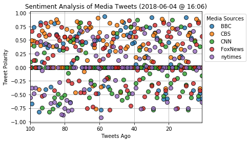
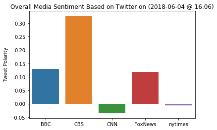

# News Mood

#### The below script perform a sentiment analysis of the Twitter activities of various news outlets.
In this script, a visualizaed summary is presented to show the sentiments expressed in Tweets by BBC, CBS, CNN, Fox, and New York times.


```python
# Dependencies
import tweepy
import numpy as np
import pandas as pd
import seaborn as sns
from datetime import datetime
import matplotlib.pyplot as plt


# Import and Initialize Sentiment Analyzer
from vaderSentiment.vaderSentiment import SentimentIntensityAnalyzer
analyzer = SentimentIntensityAnalyzer()

# Twitter API Keys
from config import (consumer_key, 
                    consumer_secret, 
                    access_token, 
                    access_token_secret)

# Setup Tweepy API Authentication
auth = tweepy.OAuthHandler(consumer_key, consumer_secret)
auth.set_access_token(access_token, access_token_secret)
api = tweepy.API(auth, parser=tweepy.parsers.JSONParser())
```


```python
# Target Account
target_users = ("@BBC", "@CBS", "@CNN", "@FoxNews", "@nytimes")

# List to hold sentiments
sentiments = []

# Loop through all target users
for user in target_users:
    
    counter = 1

    # Loop through 5 pages of tweets (total 100 tweets)
    for x in range(5):

        public_tweets = api.user_timeline(user, page = x)

        for tweet in public_tweets:

                # Run Vader Analysis on each tweet
                results = analyzer.polarity_scores(tweet["text"])
                compound = results["compound"]
                pos = results["pos"]
                neu = results["neu"]
                neg = results["neg"]

                sentiments.append({"User" : str(user).replace("@", ""),
                           "Date": tweet["created_at"],
                           "Compound" : compound,
                           "Positive" : pos,
                           "Negative" : neg,
                           "Neutral" : neu,
                           "Tweets Ago" : counter,
                           "Text": tweet["text"]})
                
                counter +=1
```


```python
# Convert sentiments to DataFrame
sentiments_pd = pd.DataFrame.from_dict(sentiments)
sentiments_pd.head()
```


<div>
<style scoped>
    .dataframe tbody tr th:only-of-type {
        vertical-align: middle;
    }

    .dataframe tbody tr th {
        vertical-align: top;
    }

    .dataframe thead th {
        text-align: right;
    }
</style>
<table border="1" class="dataframe">
  <thead>
    <tr style="text-align: right;">
      <th></th>
      <th>Compound</th>
      <th>Date</th>
      <th>Negative</th>
      <th>Neutral</th>
      <th>Positive</th>
      <th>Text</th>
      <th>Tweets Ago</th>
      <th>User</th>
    </tr>
  </thead>
  <tbody>
    <tr>
      <th>0</th>
      <td>-0.5707</td>
      <td>Mon Jun 04 19:03:02 +0000 2018</td>
      <td>0.178</td>
      <td>0.822</td>
      <td>0.0</td>
      <td>Versailles is back! Tonight, Madame de Montesp...</td>
      <td>1</td>
      <td>BBC</td>
    </tr>
    <tr>
      <th>1</th>
      <td>-0.4767</td>
      <td>Mon Jun 04 18:31:05 +0000 2018</td>
      <td>0.171</td>
      <td>0.829</td>
      <td>0.0</td>
      <td>The story of a group of working-class women co...</td>
      <td>2</td>
      <td>BBC</td>
    </tr>
    <tr>
      <th>2</th>
      <td>-0.5859</td>
      <td>Mon Jun 04 18:02:05 +0000 2018</td>
      <td>0.231</td>
      <td>0.769</td>
      <td>0.0</td>
      <td>The moment a dancing off-duty FBI agent drops ...</td>
      <td>3</td>
      <td>BBC</td>
    </tr>
    <tr>
      <th>3</th>
      <td>0.0000</td>
      <td>Mon Jun 04 17:01:13 +0000 2018</td>
      <td>0.000</td>
      <td>1.000</td>
      <td>0.0</td>
      <td>📸 From #Manhattanhenge to the world's largest ...</td>
      <td>4</td>
      <td>BBC</td>
    </tr>
    <tr>
      <th>4</th>
      <td>0.0000</td>
      <td>Mon Jun 04 16:01:04 +0000 2018</td>
      <td>0.000</td>
      <td>1.000</td>
      <td>0.0</td>
      <td>🤷‍♀️😂 When @CubaGoodingJr took over @BBCBreakf...</td>
      <td>5</td>
      <td>BBC</td>
    </tr>
  </tbody>
</table>
</div>


```python
# Export data in dataframe into a csv file
sentiments_pd.to_csv("News_Mood.csv", index=False)
```

## Tweet Sentiment Scatter Plot


```python
#Build Scatter plot
sentiments_pivot = sentiments_pd.pivot(index="Tweets Ago", values="Compound", columns="User")
sentiments_pivot.plot(marker="o", style= " ", markeredgecolor="black", alpha=0.8, grid = True, ms = 8)

plt.legend(title="Media Sources", bbox_to_anchor=(1, 1))

# Incorporate the other graph properties
now = datetime.now()
now = now.strftime("%Y-%m-%d @ %H:%M")
plt.title(f"Sentiment Analysis of Media Tweets ({now})")


plt.ylabel("Tweet Polarity")
plt.xlabel("Tweets Ago")

plt.xlim([sentiments_pd["Tweets Ago"].max(),sentiments_pd["Tweets Ago"].min()]) 

plt.savefig("Sentiment Analysis of Media Tweets")

plt.show()
```





#### Findings: 
- Tweet sentiment of the media organizations analysed are mostly neutral. 
- Positive tweets are more than negative tweets.
- The latest 100 tweets of CBS tend to be more postive.

# Overall Sentiment Bar Chart


```python
# Use Seaborn to generate bar chart
sentiment_bar = sns.barplot(x="User", y="Compound", data = sentiments_pd, ci=None)

now = datetime.now()
now = now.strftime("%Y-%m-%d @ %H:%M")
plt.title(f"Overall Media Sentiment Based on Twitter on ({now})")

plt.ylabel("Tweet Polarity")
plt.xlabel("")


plt.savefig("Tweeter Media Sentiment")
plt.show()
```





#### Findings: 
- Among the five media organizations analysed, CBS tweets overall is the most positive.
- New York Times Tweets are the most Neutral
- While CNN tweets are relatively negative, all five medias are generally in neutral tone.
